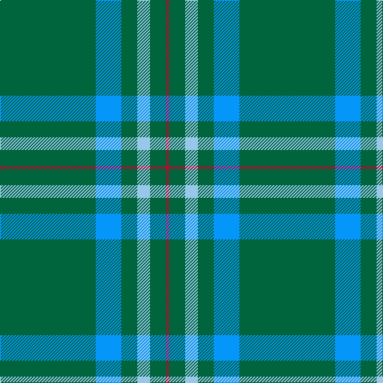

In pattern [GBGWGR](/patterns/gbgwgr/).

This was sourced from register-of-tartans.  It is a [6 stripes tartan](/stripes/stripes6/).

Original link https://www.tartanregister.gov.uk/tartanDetails.aspx?ref=11065

## Thread count
G/120 B32 G20 LB16 G20 R/4

## Palette
Each colour and its ΔE from the base-6 reference it is a variant of.

| Colour | Shade | Base | ΔE (OKLab) |
|---|---|---|---|
| B | <code style="background-color:#0596FA;">#0596FA</code> `#0596FA` | B <code style="background-color:#2A418A;">#2A418A</code> | 0.27 |
| G | <code style="background-color:#00643C;">#00643C</code> `#00643C` | G <code style="background-color:#006100;">#006100</code> | 0.05 |
| LB | <code style="background-color:#98C8E8;">#98C8E8</code> `#98C8E8` | W <code style="background-color:#F7F7F7;">#F7F7F7</code> | 0.18 |
| R | <code style="background-color:#C8002C;">#C8002C</code> `#C8002C` | R <code style="background-color:#CC0000;">#CC0000</code> | 0.03 |

# Sample pattern

## Nearest tartans

The nearest existing variants by ΔTartan distance.

1. [Annapolis Valley](/setts/s6/g30b8g5w4g5r2x4~b2888c4-g006818-rc80000-w98c8e8/) — ΔT 1.42
1. [Hastings-Stephenson (Personal)](/setts/s8/g44b11g5ba3g4b8g4w1x2~b000048-ba2888c4-g00643c-wf8f8f8/) — ΔT 1.48
1. [Tyrconnell (Personal)](/setts/s5/g44b9r2b9g2x2~b202060-g006818-rc80000/) — ΔT 1.66
1. [Marshall Fields Corporate Tartan Tartan Number: 747. Earliest known date: 1986 Long established and famous mail order company based in Chicago. For use in their production launch for the opening of the British production, Augst 1986 - Christmas 1986. See products available Copyright © Blair Urquhart, Comrie, 2015](/setts/s8/g40b2w2b2y2b23g32r2x2~b202060-g006818-rc80000-we0e0e0-ye8c000/) — ΔT 1.75
1. [Kinfauns Castle (Corporate)](/setts/s6/r4b12g2b2g46w1x2~b780078-g006818-rc80000-we0e0e0/) — ΔT 1.77
1. [Semper](/setts/s8/g16ga1y4ga41y1ga6gb2ga2x2~g408060-ga004028-gb649848-y86c67c/) — ΔT 1.83
1. [Scottish Scouts Corporate Tartan Tartan Number: 1463. Earliest known date: 1957 This tartan currently in use for Scottish Scouts is based upon the MacLaren, in honour of a MacLaren who gave an estate to the movement. On the blue and green base the strong red overcheck represents the Rover Scouts, the finer red lines, the Scouts and Senior Scouts and yellow the Wolf Cubs. See products available Copyright © Blair Urquhart, Comrie, 2015](/setts/s7/r3g22b16g14r2g6y1x2~b2c2c80-g006818-rc80000-ye8c000/) — ΔT 1.85
1. [Asher (Personal)](/setts/s8/g40y2b3r4b3y2g40w3x2~b1c0070-g007444-rc80000-we0e0e0-ye8c000/) — ΔT 1.85
1. [St Andrews Hotel, Golf Resort, and SPA](/setts/s6/g50b20k3b2r2b5x2~b304080-g008000-k000000-r806050/) — ΔT 1.86
1. [Inman (2016)](/setts/s7/r2g24k2g12y6k1r2x2~g005020-k101010-rdc0000-ye0a126/) — ΔT 1.88

## Neighbour map

Every grey dot is one of 15726 variants placed by the first two principal components of the ΔTartan feature space (44% of its variance). Red is this tartan; blue dots are its nearest — click one to open its page.

<svg viewBox="0 0 640 380" role="img" style="max-width:100%;height:auto;border:1px solid #e0e0e0;border-radius:4px;display:block" xmlns="http://www.w3.org/2000/svg"><image href="/nn/cloud.v1.png" width="640" height="380"/><a href="/setts/s6/g30b8g5w4g5r2x4~b2888c4-g006818-rc80000-w98c8e8/"><circle cx="476.4" cy="211.4" r="4" fill="#3465a4"><title>Annapolis Valley</title></circle></a><a href="/setts/s8/g44b11g5ba3g4b8g4w1x2~b000048-ba2888c4-g00643c-wf8f8f8/"><circle cx="499.7" cy="145.2" r="4" fill="#3465a4"><title>Hastings-Stephenson (Personal)</title></circle></a><a href="/setts/s5/g44b9r2b9g2x2~b202060-g006818-rc80000/"><circle cx="511.0" cy="219.1" r="4" fill="#3465a4"><title>Tyrconnell (Personal)</title></circle></a><a href="/setts/s8/g40b2w2b2y2b23g32r2x2~b202060-g006818-rc80000-we0e0e0-ye8c000/"><circle cx="426.6" cy="163.3" r="4" fill="#3465a4"><title>Marshall Fields Corporate Tartan Tartan Number: 747. Earliest known date: 1986 Long established and famous mail order company based in Chicago. For use in their production launch for the opening of the British production, Augst 1986 - Christmas 1986. See products available Copyright © Blair Urquhart, Comrie, 2015</title></circle></a><a href="/setts/s6/r4b12g2b2g46w1x2~b780078-g006818-rc80000-we0e0e0/"><circle cx="517.0" cy="141.6" r="4" fill="#3465a4"><title>Kinfauns Castle (Corporate)</title></circle></a><a href="/setts/s8/g16ga1y4ga41y1ga6gb2ga2x2~g408060-ga004028-gb649848-y86c67c/"><circle cx="501.6" cy="148.7" r="4" fill="#3465a4"><title>Semper</title></circle></a><a href="/setts/s7/r3g22b16g14r2g6y1x2~b2c2c80-g006818-rc80000-ye8c000/"><circle cx="413.1" cy="203.2" r="4" fill="#3465a4"><title>Scottish Scouts Corporate Tartan Tartan Number: 1463. Earliest known date: 1957 This tartan currently in use for Scottish Scouts is based upon the MacLaren, in honour of a MacLaren who gave an estate to the movement. On the blue and green base the strong red overcheck represents the Rover Scouts, the finer red lines, the Scouts and Senior Scouts and yellow the Wolf Cubs. See products available Copyright © Blair Urquhart, Comrie, 2015</title></circle></a><a href="/setts/s8/g40y2b3r4b3y2g40w3x2~b1c0070-g007444-rc80000-we0e0e0-ye8c000/"><circle cx="539.7" cy="157.2" r="4" fill="#3465a4"><title>Asher (Personal)</title></circle></a><a href="/setts/s6/g50b20k3b2r2b5x2~b304080-g008000-k000000-r806050/"><circle cx="414.0" cy="171.5" r="4" fill="#3465a4"><title>St Andrews Hotel, Golf Resort, and SPA</title></circle></a><a href="/setts/s7/r2g24k2g12y6k1r2x2~g005020-k101010-rdc0000-ye0a126/"><circle cx="471.2" cy="173.4" r="4" fill="#3465a4"><title>Inman (2016)</title></circle></a><circle cx="509.1" cy="182.9" r="5" fill="#c00000"/></svg>

ID: /setts/s6/g30b8g5w4g5r1x4~b0596fa-g00643c-rc8002c-w98c8e8/
