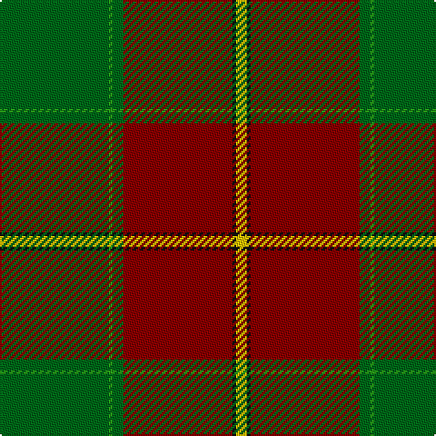

**Bands:** [YKRGGG](/stripes/ykrggg/) · **Stripes:** [LY K R G G G](/stripes/stripes6/) LY K R G G G

This was sourced from tartans-authority.  It is a [6 band tartan](/bands/bands6/).

Original link http://www.tartansauthority.com/tartan-ferret/display/7850/

## Attestations

This cloth appears in 2 source records; the oldest owns this page.

- Dec. 2008 — Abadia Da Cova (Corporate) (tartans-authority, [record](http://www.tartansauthority.com/tartan-ferret/display/7850/))
- undated — Abadia Da Cova (register-of-tartans, [record](https://www.tartanregister.gov.uk/tartanDetails.aspx?ref=5802))

## Register references

External register numbers recorded for this tartan.

- Scottish Register of Tartans: [5802](https://www.tartanregister.gov.uk/tartanDetails.aspx?ref=5802)
- Scottish Tartans Authority (ITI): 7850

## Thread count
Ga/60 G2 Ga6 DR60 K2 Y/6

## Palette
Each colour and its ΔE from the base-6 reference it is a variant of.

| Colour | Shade | Base | ΔE (OKLab) |
|---|---|---|---|
| DR | <code style="background-color:#880000;">#880000</code> `#880000` | R <code style="background-color:#CC0000;">#CC0000</code> | 0.15 |
| G | <code style="background-color:#289C18;">#289C18</code> `#289C18` | G <code style="background-color:#006100;">#006100</code> | 0.19 |
| Ga | <code style="background-color:#006818;">#006818</code> `#006818` | G <code style="background-color:#006100;">#006100</code> | 0.02 |
| K | <code style="background-color:#101010;">#101010</code> `#101010` | K <code style="background-color:#000000;">#000000</code> | 0.17 |
| Y | <code style="background-color:#E8C000;">#E8C000</code> `#E8C000` | Y <code style="background-color:#F2BF00;">#F2BF00</code> | 0.02 |

# Sample pattern

## Nearest tartans

The nearest existing variants by ΔTartan distance.

1. [Longmore (Name)](/setts/s9/g15ly3g27r2g2r33b2w1b4~x2/) — ΔT 1.16
1. [Gleneil (Spoof)](/setts/s8/k2o2k1o18g24k1g2lo2~x2/) — ΔT 1.29
1. [McNee (Name)](/setts/s7/k9w2r50g42r16g17k4/) — ΔT 1.38
1. [MacFie](/setts/s9/lr2r12dg2r1dg32r1dg2r12ly2/) — ΔT 1.42
1. [Wellmont Golf Tournament](/setts/s8/g24dr2w2dr2dt8o1dr24g4~x2/) — ΔT 1.49
1. [Princess Margaret Rose Tartan Tartan Number: 986. Earliest known date: 1930 Colours reversed from MacGregor See products available Copyright © Blair Urquhart, Comrie, 2015](/setts/s6/g36r18g4r6k1w2~x2/) — ΔT 1.51
1. [Crieff and Strathearn District Tartan Tartan Number: 664. Earliest known date: 1988 A branch of the Stewart clan from Galloway and the South West of Scotland. See products available Copyright © Blair Urquhart, Comrie, 2015](/setts/s7/g55dp7r24g12db4ly3db4~x2/) — ΔT 1.52
1. [Nolan Family, John J (Personal)](/setts/s5/do8g19dg42lo3o1~x2/) — ΔT 1.55
1. [Snelgrove Htg (Name)](/setts/s7/k3r12dy8lo2g36dy10t2~x2/) — ΔT 1.60
1. [Midpac Tissue (non woven)](/setts/s8/r5k2dg1k2r5k2dg18lo3~x2/) — ΔT 1.60

## Neighbour map

Every grey dot is one of 14299 variants placed by the first two principal components of the ΔTartan feature space (44% of its variance). Red is this tartan; blue dots are its nearest — click one to open its page.

<svg viewBox="0 0 640 380" role="img" style="max-width:100%;height:auto;border:1px solid #e0e0e0;border-radius:4px;display:block" xmlns="http://www.w3.org/2000/svg"><image href="/nn/cloud.v1.png" width="640" height="380"/><a href="/setts/s9/g15ly3g27r2g2r33b2w1b4~x2/"><circle cx="333.9" cy="114.4" r="4" fill="#3465a4"><title>Longmore (Name)</title></circle></a><a href="/setts/s8/k2o2k1o18g24k1g2lo2~x2/"><circle cx="376.9" cy="158.0" r="4" fill="#3465a4"><title>Gleneil (Spoof)</title></circle></a><a href="/setts/s7/k9w2r50g42r16g17k4/"><circle cx="339.6" cy="185.0" r="4" fill="#3465a4"><title>McNee (Name)</title></circle></a><a href="/setts/s9/lr2r12dg2r1dg32r1dg2r12ly2/"><circle cx="413.2" cy="136.3" r="4" fill="#3465a4"><title>MacFie</title></circle></a><a href="/setts/s8/g24dr2w2dr2dt8o1dr24g4~x2/"><circle cx="285.3" cy="147.4" r="4" fill="#3465a4"><title>Wellmont Golf Tournament</title></circle></a><a href="/setts/s6/g36r18g4r6k1w2~x2/"><circle cx="422.0" cy="152.1" r="4" fill="#3465a4"><title>Princess Margaret Rose Tartan Tartan Number: 986. Earliest known date: 1930 Colours reversed from MacGregor See products available Copyright © Blair Urquhart, Comrie, 2015</title></circle></a><a href="/setts/s7/g55dp7r24g12db4ly3db4~x2/"><circle cx="365.9" cy="158.0" r="4" fill="#3465a4"><title>Crieff and Strathearn District Tartan Tartan Number: 664. Earliest known date: 1988 A branch of the Stewart clan from Galloway and the South West of Scotland. See products available Copyright © Blair Urquhart, Comrie, 2015</title></circle></a><a href="/setts/s5/do8g19dg42lo3o1~x2/"><circle cx="378.3" cy="157.0" r="4" fill="#3465a4"><title>Nolan Family, John J (Personal)</title></circle></a><a href="/setts/s7/k3r12dy8lo2g36dy10t2~x2/"><circle cx="287.5" cy="153.8" r="4" fill="#3465a4"><title>Snelgrove Htg (Name)</title></circle></a><a href="/setts/s8/r5k2dg1k2r5k2dg18lo3~x2/"><circle cx="309.2" cy="163.9" r="4" fill="#3465a4"><title>Midpac Tissue (non woven)</title></circle></a><circle cx="362.5" cy="148.4" r="5" fill="#c00000"/></svg>

ID: /setts/s6/g30g1g3r30k1ly3~x2/
