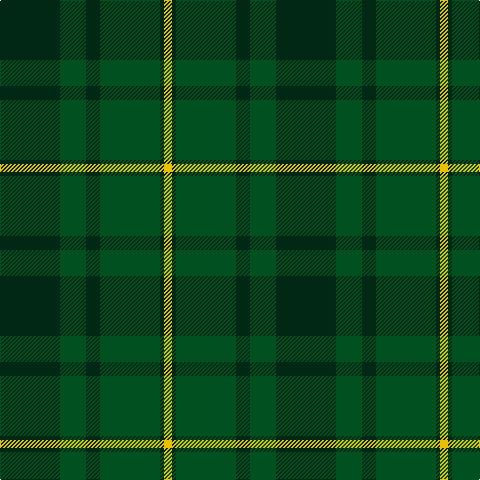

In pattern [GGGGGY](/patterns/gggggy/).

This was sourced from register-of-tartans.  It is a [6 stripes tartan](/stripes/stripes6/).

Original link https://www.tartanregister.gov.uk/tartanDetails.aspx?ref=2765

## Register references

External register numbers recorded for this tartan.

- Scottish Register of Tartans: [2765](https://www.tartanregister.gov.uk/tartanDetails.aspx?ref=2765)
- Scottish Tartans World Register: 762

## Thread count
DG/60 G26 DG14 G60 DG4 Y/8

## Palette
Each colour and its ΔE from the base-6 reference it is a variant of.

| Colour | Shade | Base | ΔE (OKLab) |
|---|---|---|---|
| DG | <code style="background-color:#002814;">#002814</code> `#002814` | G <code style="background-color:#006100;">#006100</code> | 0.20 |
| G | <code style="background-color:#005020;">#005020</code> `#005020` | G <code style="background-color:#006100;">#006100</code> | 0.07 |
| Y | <code style="background-color:#E8C000;">#E8C000</code> `#E8C000` | Y <code style="background-color:#F2BF00;">#F2BF00</code> | 0.02 |

# Sample pattern

## Nearest tartans

The nearest existing variants by ΔTartan distance.

1. [Dunbar Hunting](/setts/s6/g4k2g28k8ga21g3~g006818-ga003820-k101010~x2/) — ΔT 0.89
1. [John Telfar Dunbar/Hunting Tartan Tartan Number: 776. Earliest known date: pre 2003 Check this entry... See products available Copyright © Blair Urquhart, Comrie, 2015](/setts/s7/g5k2g28k10ga26b4g4~b2c2c80-g006818-ga604000-k101010~x2/) — ΔT 1.57
1. [Hunting Kenmore Trade Com. Tartan Tartan Number: 2234. Earliest known date: 1995 Designed by Polly Wittering of House of Edgar for a range of gifts produced for Macnaughtons of Pitlochry See products available Copyright © Blair Urquhart, Comrie, 2015](/setts/s7/k2g19ga2g2ga19g2k2~g003820-ga006818-k000000~x2/) — ΔT 1.62
1. [McGeorge (Personal)](/setts/s6/r4g3ga39g40r2y4~g002814-ga005020-rdc0000-yc89600~x2/) — ΔT 1.64
1. [Guildry of Stirling](/setts/s10/g18k3g3k3g3k21ga2k21g21k4~g005014-ga3c6838-k101010~x2/) — ΔT 1.69
1. [Campbell Simpson (Dalgliesh)](/setts/s6/g22k3g3ga16g6k4~g408060-ga006818-k101010~x2/) — ΔT 1.71
1. [Donachie of Brockloch Htg (Clan)](/setts/s10/g24r2g2ga40g25ga2g2r2g2ga20~g487048-ga003820-r880000~x2/) — ΔT 1.78
1. [Doyle](/setts/s7/g24r9g4ga19y2ga6g7~g006818-ga003820-rc80000-ye8c000~x2/) — ΔT 1.88
1. [St Andrews Links](/setts/s7/b16g4b3g3y2g24r2~b14283c-g006818-r880000-yd09800~x2/) — ΔT 1.91
1. [Unidentified Tweed](/setts/s6/b4w1b12g12b1g4~b2c4084-g005020-we0e0e0~x2/) — ΔT 1.93

## Neighbour map

Every grey dot is one of 15726 variants placed by the first two principal components of the ΔTartan feature space (44% of its variance). Red is this tartan; blue dots are its nearest — click one to open its page.

<svg viewBox="0 0 640 380" role="img" style="max-width:100%;height:auto;border:1px solid #e0e0e0;border-radius:4px;display:block" xmlns="http://www.w3.org/2000/svg"><image href="/nn/cloud.v1.png" width="640" height="380"/><a href="/setts/s6/g4k2g28k8ga21g3~g006818-ga003820-k101010~x2/"><circle cx="400.0" cy="260.1" r="4" fill="#3465a4"><title>Dunbar Hunting</title></circle></a><a href="/setts/s7/g5k2g28k10ga26b4g4~b2c2c80-g006818-ga604000-k101010~x2/"><circle cx="331.6" cy="224.3" r="4" fill="#3465a4"><title>John Telfar Dunbar/Hunting Tartan Tartan Number: 776. Earliest known date: pre 2003 Check this entry... See products available Copyright © Blair Urquhart, Comrie, 2015</title></circle></a><a href="/setts/s7/k2g19ga2g2ga19g2k2~g003820-ga006818-k000000~x2/"><circle cx="348.4" cy="228.3" r="4" fill="#3465a4"><title>Hunting Kenmore Trade Com. Tartan Tartan Number: 2234. Earliest known date: 1995 Designed by Polly Wittering of House of Edgar for a range of gifts produced for Macnaughtons of Pitlochry See products available Copyright © Blair Urquhart, Comrie, 2015</title></circle></a><a href="/setts/s6/r4g3ga39g40r2y4~g002814-ga005020-rdc0000-yc89600~x2/"><circle cx="365.5" cy="202.6" r="4" fill="#3465a4"><title>McGeorge (Personal)</title></circle></a><a href="/setts/s10/g18k3g3k3g3k21ga2k21g21k4~g005014-ga3c6838-k101010~x2/"><circle cx="399.8" cy="251.2" r="4" fill="#3465a4"><title>Guildry of Stirling</title></circle></a><a href="/setts/s6/g22k3g3ga16g6k4~g408060-ga006818-k101010~x2/"><circle cx="371.9" cy="277.9" r="4" fill="#3465a4"><title>Campbell Simpson (Dalgliesh)</title></circle></a><a href="/setts/s10/g24r2g2ga40g25ga2g2r2g2ga20~g487048-ga003820-r880000~x2/"><circle cx="444.3" cy="212.8" r="4" fill="#3465a4"><title>Donachie of Brockloch Htg (Clan)</title></circle></a><a href="/setts/s7/g24r9g4ga19y2ga6g7~g006818-ga003820-rc80000-ye8c000~x2/"><circle cx="301.5" cy="231.2" r="4" fill="#3465a4"><title>Doyle</title></circle></a><a href="/setts/s7/b16g4b3g3y2g24r2~b14283c-g006818-r880000-yd09800~x2/"><circle cx="381.6" cy="215.6" r="4" fill="#3465a4"><title>St Andrews Links</title></circle></a><a href="/setts/s6/b4w1b12g12b1g4~b2c4084-g005020-we0e0e0~x2/"><circle cx="383.3" cy="262.2" r="4" fill="#3465a4"><title>Unidentified Tweed</title></circle></a><circle cx="394.1" cy="263.5" r="5" fill="#c00000"/></svg>

ID: /setts/s6/g30ga13g7ga30g2y4~g002814-ga005020-ye8c000~x2/
