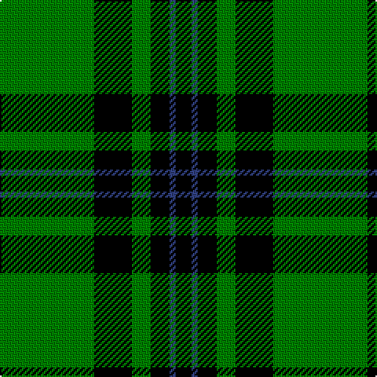

In pattern [GKGKBK](/patterns/gkgkbk/).

This was sourced from weddslist.  It is a [6 stripes tartan](/stripes/stripes6/).

Original link http://www.weddslist.com/cgi-bin/tartans/pg.pl?source=sts

## Thread count
G/60 K24 G12 K12 B4 K/10

## Palette
Each colour and its ΔE from the base-6 reference it is a variant of.

| Colour | Shade | Base | ΔE (OKLab) |
|---|---|---|---|
| B | <code style="background-color:#304080;">#304080</code> `#304080` | B <code style="background-color:#2A418A;">#2A418A</code> | 0.02 |
| G | <code style="background-color:#008000;">#008000</code> `#008000` | G <code style="background-color:#006100;">#006100</code> | 0.10 |
| K | <code style="background-color:#000000;">#000000</code> `#000000` | K <code style="background-color:#000000;">#000000</code> | 0.00 |

# Sample pattern

## Nearest tartans

The nearest existing variants by ΔTartan distance.

1. [Duchess of Fife](/setts/s6/g70k26g12k14b3k16~b1474b4-g007800-k000000~x2/) — ΔT 0.70
1. [MacLean of Duart, hunting](/setts/s8/g3k6w1k6g2k2g16k1~g008000-k000000-we0e0e0~x2/) — ΔT 0.70
1. [Forbes](/setts/s6/r1g16k8g4k4y1~g008000-k000000-rc00000-yf0c000~x2/) — ΔT 0.93
1. [MacArthur-Fox](/setts/s5/k19g8k10g31r3~g008000-k000000-rc00000/) — ΔT 1.15
1. [MacArthur](/setts/s6/g18y2g18k4g2k15~g008000-k000000-yf0c000~x2/) — ΔT 1.21
1. [MacArthur, ?](/setts/s6/r3g30k12g6k16y2~g008000-k000000-rc00000-yf0c000~x2/) — ΔT 1.22
1. [Northcroft](/setts/s7/g24r4g3k14g5r2g10~g008000-k000000-rc00000~x2/) — ΔT 1.26
1. [MacArthur](/setts/s5/k32g6k12g30y3~g008000-k000000-yf0c000/) — ΔT 1.29
1. [MacIver hunting](/setts/s9/w3g27k5g5k32g5k5g27y3~g008000-k000000-we0e0e0-yf0c000~x2/) — ΔT 1.35
1. [Innes](/setts/s6/g7k1g7b1k6b1~b5480b0-g008000-k000000~x2/) — ΔT 1.38

## Neighbour map

Every grey dot is one of 15726 variants placed by the first two principal components of the ΔTartan feature space (44% of its variance). Red is this tartan; blue dots are its nearest — click one to open its page.

<svg viewBox="0 0 640 380" role="img" style="max-width:100%;height:auto;border:1px solid #e0e0e0;border-radius:4px;display:block" xmlns="http://www.w3.org/2000/svg"><image href="/nn/cloud.v1.png" width="640" height="380"/><a href="/setts/s6/g70k26g12k14b3k16~b1474b4-g007800-k000000~x2/"><circle cx="360.3" cy="200.6" r="4" fill="#3465a4"><title>Duchess of Fife</title></circle></a><a href="/setts/s8/g3k6w1k6g2k2g16k1~g008000-k000000-we0e0e0~x2/"><circle cx="331.3" cy="191.4" r="4" fill="#3465a4"><title>MacLean of Duart, hunting</title></circle></a><a href="/setts/s6/r1g16k8g4k4y1~g008000-k000000-rc00000-yf0c000~x2/"><circle cx="315.5" cy="193.1" r="4" fill="#3465a4"><title>Forbes</title></circle></a><a href="/setts/s5/k19g8k10g31r3~g008000-k000000-rc00000/"><circle cx="291.4" cy="252.8" r="4" fill="#3465a4"><title>MacArthur-Fox</title></circle></a><a href="/setts/s6/g18y2g18k4g2k15~g008000-k000000-yf0c000~x2/"><circle cx="331.6" cy="247.2" r="4" fill="#3465a4"><title>MacArthur</title></circle></a><a href="/setts/s6/r3g30k12g6k16y2~g008000-k000000-rc00000-yf0c000~x2/"><circle cx="274.3" cy="199.8" r="4" fill="#3465a4"><title>MacArthur, ?</title></circle></a><a href="/setts/s7/g24r4g3k14g5r2g10~g008000-k000000-rc00000~x2/"><circle cx="365.3" cy="221.6" r="4" fill="#3465a4"><title>Northcroft</title></circle></a><a href="/setts/s5/k32g6k12g30y3~g008000-k000000-yf0c000/"><circle cx="289.2" cy="249.4" r="4" fill="#3465a4"><title>MacArthur</title></circle></a><a href="/setts/s9/w3g27k5g5k32g5k5g27y3~g008000-k000000-we0e0e0-yf0c000~x2/"><circle cx="283.3" cy="188.0" r="4" fill="#3465a4"><title>MacIver hunting</title></circle></a><a href="/setts/s6/g7k1g7b1k6b1~b5480b0-g008000-k000000~x2/"><circle cx="295.1" cy="254.0" r="4" fill="#3465a4"><title>Innes</title></circle></a><circle cx="340.8" cy="215.1" r="5" fill="#c00000"/></svg>

ID: /setts/s6/g30k12g6k6b2k5~b304080-g008000-k000000~x2/
