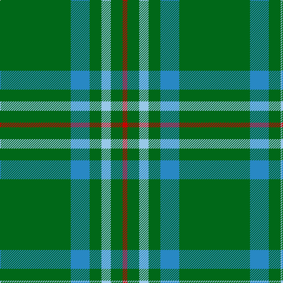

This page is one **sett** — a single exact thread-count. It belongs to the [tartan](/tartans/g30t8g5lb4g5r2/)
(the same proportion at any scale), whose colour order is pattern [GBGWGR](/stripes/gbgwgr/).

Sourced from tartans-authority.  It is a [6 stripe tartan](/stripes/stripes6/).

Original link http://www.tartansauthority.com/tartan-ferret/display/11065/

## Register references

External register numbers recorded for this tartan.

- Scottish Register of Tartans: [11065](https://www.tartanregister.gov.uk/tartanDetails?ref=11065)
- Scottish Tartans Authority (ITI): 11065

## Thread count
G/120 B32 G20 LB16 G20 R/8

## Palette

Palette: <strong>Tartan Register</strong>
<table><thead><tr><th>Colour</th><th>Threads</th><th>Shade</th><th>Base</th><th>OKLCh</th></tr></thead><tbody><tr><td>G/</td><td style="text-align:right;font-variant-numeric:tabular-nums">120</td><td><code style="background-color:#006818;">#006818</code> <small style="color:#888">#006818</small></td><td>G <code style="background-color:#006100;">#006100</code></td><td><small style="color:#888">oklch(45.0% 0.142 145.0)</small></td></tr><tr><td>B</td><td style="text-align:right;font-variant-numeric:tabular-nums">32</td><td><code style="background-color:#2888C4;">#2888C4</code> <small style="color:#888">#2888C4</small></td><td>B <code style="background-color:#2A418A;">#2A418A</code></td><td><small style="color:#888">oklch(60.1% 0.125 241.5)</small></td></tr><tr><td>G</td><td style="text-align:right;font-variant-numeric:tabular-nums">20</td><td><code style="background-color:#006818;">#006818</code> <small style="color:#888">#006818</small></td><td>G <code style="background-color:#006100;">#006100</code></td><td><small style="color:#888">oklch(45.0% 0.142 145.0)</small></td></tr><tr><td>LB</td><td style="text-align:right;font-variant-numeric:tabular-nums">16</td><td><code style="background-color:#98C8E8;">#98C8E8</code> <small style="color:#888">#98C8E8</small></td><td>W <code style="background-color:#F7F7F7;">#F7F7F7</code></td><td><small style="color:#888">oklch(81.0% 0.068 237.9)</small></td></tr><tr><td>G</td><td style="text-align:right;font-variant-numeric:tabular-nums">20</td><td><code style="background-color:#006818;">#006818</code> <small style="color:#888">#006818</small></td><td>G <code style="background-color:#006100;">#006100</code></td><td><small style="color:#888">oklch(45.0% 0.142 145.0)</small></td></tr><tr><td>R/</td><td style="text-align:right;font-variant-numeric:tabular-nums">8</td><td><code style="background-color:#C80000;">#C80000</code> <small style="color:#888">#C80000</small></td><td>R <code style="background-color:#CC0000;">#CC0000</code></td><td><small style="color:#888">oklch(52.3% 0.215 29.2)</small></td></tr></tbody></table>

# Sample pattern

## Nearest tartans

The nearest existing variants by ΔTartan distance, with this tartan at the top so the swatches line up against it.

ΔTartan

Tartan

Sett

—

<a href="/ttd/edit/#slug=g30t8g5lb4g5r2~x4">Annapolis Valley</a> <a class="nn-out" href="/setts/s6/g30t8g5lb4g5r2~x4/" title="open its dictionary page">↗</a>

1.13

<a href="/ttd/edit/#slug=g18r6g75b6g13dy35g12b6">Glenlivet</a> <a class="nn-out" href="/setts/s8/g18r6g75b6g13dy35g12b6/" title="open its dictionary page">↗</a>

1.18

<a href="/ttd/edit/#slug=g5o9g4w5g30r2g4r2~x2">Welsh Assembly (Fashion)</a> <a class="nn-out" href="/setts/s8/g5o9g4w5g30r2g4r2~x2/" title="open its dictionary page">↗</a>

1.28

<a href="/ttd/edit/#slug=g5y9g4w5g30r2g4r2~x2">Welsh Assembly</a> <a class="nn-out" href="/setts/s8/g5y9g4w5g30r2g4r2~x2/" title="open its dictionary page">↗</a>

1.42

<a href="/ttd/edit/#slug=g30b8g5lb4g5r1~x4">Annapolis Valley</a> <a class="nn-out" href="/setts/s6/g30b8g5lb4g5r1~x4/" title="open its dictionary page">↗</a>

1.46

<a href="/ttd/edit/#slug=r3g22db16g14r2g6ly1~x2">Scottish Scouts</a> <a class="nn-out" href="/setts/s7/r3g22db16g14r2g6ly1~x2/" title="open its dictionary page">↗</a>

1.52

<a href="/ttd/edit/#slug=g2db2g6db4g3db4g18ly2~x4">Crow (Name)</a> <a class="nn-out" href="/setts/s8/g2db2g6db4g3db4g18ly2~x4/" title="open its dictionary page">↗</a>

1.53

<a href="/ttd/edit/#slug=g44db9r2db9g2~x2">Tyrconnell (Personal)</a> <a class="nn-out" href="/setts/s5/g44db9r2db9g2~x2/" title="open its dictionary page">↗</a>

1.57

<a href="/ttd/edit/#slug=dg6do2m1dg15m3do1dg15g6m1~x2">McCall, F W (Personal)</a> <a class="nn-out" href="/setts/s9/dg6do2m1dg15m3do1dg15g6m1~x2/" title="open its dictionary page">↗</a>

1.59

<a href="/ttd/edit/#slug=r1k2dg16k2ly1~x2">Skene or Tribe of Mar</a> <a class="nn-out" href="/setts/s5/r1k2dg16k2ly1~x2/" title="open its dictionary page">↗</a>

1.61

<a href="/ttd/edit/#slug=dg10o1dg1o1lr2dg1o1~x4">Green Watch</a> <a class="nn-out" href="/setts/s7/dg10o1dg1o1lr2dg1o1~x4/" title="open its dictionary page">↗</a>

## Neighbour map

Every grey dot is one of 14359 variants placed by the first two principal components of the ΔTartan feature space (44% of its variance). Red is this tartan; blue dots are its nearest — click one to open its page.

<svg viewBox="0 0 640 380" role="img" style="max-width:100%;height:auto;border:1px solid #e0e0e0;border-radius:4px;display:block" xmlns="http://www.w3.org/2000/svg"><image href="/nn/cloud.v1.png" width="640" height="380"/><a href="/setts/s8/g18r6g75b6g13dy35g12b6/"><circle cx="418.6" cy="200.3" r="4" fill="#3465a4"><title>Glenlivet</title></circle></a><a href="/setts/s8/g5o9g4w5g30r2g4r2~x2/"><circle cx="433.2" cy="182.2" r="4" fill="#3465a4"><title>Welsh Assembly (Fashion)</title></circle></a><a href="/setts/s8/g5y9g4w5g30r2g4r2~x2/"><circle cx="441.2" cy="187.0" r="4" fill="#3465a4"><title>Welsh Assembly</title></circle></a><a href="/setts/s6/g30b8g5lb4g5r1~x4/"><circle cx="510.4" cy="183.7" r="4" fill="#3465a4"><title>Annapolis Valley</title></circle></a><a href="/setts/s7/r3g22db16g14r2g6ly1~x2/"><circle cx="407.9" cy="202.6" r="4" fill="#3465a4"><title>Scottish Scouts</title></circle></a><a href="/setts/s8/g2db2g6db4g3db4g18ly2~x4/"><circle cx="438.9" cy="235.6" r="4" fill="#3465a4"><title>Crow (Name)</title></circle></a><a href="/setts/s5/g44db9r2db9g2~x2/"><circle cx="512.3" cy="221.4" r="4" fill="#3465a4"><title>Tyrconnell (Personal)</title></circle></a><a href="/setts/s9/dg6do2m1dg15m3do1dg15g6m1~x2/"><circle cx="452.6" cy="206.2" r="4" fill="#3465a4"><title>McCall, F W (Personal)</title></circle></a><a href="/setts/s5/r1k2dg16k2ly1~x2/"><circle cx="488.8" cy="201.6" r="4" fill="#3465a4"><title>Skene or Tribe of Mar</title></circle></a><a href="/setts/s7/dg10o1dg1o1lr2dg1o1~x4/"><circle cx="458.6" cy="214.9" r="4" fill="#3465a4"><title>Green Watch</title></circle></a><circle cx="477.5" cy="213.3" r="5" fill="#c00000"/></svg>

ID: /setts/s6/g30t8g5lb4g5r2~x4/
