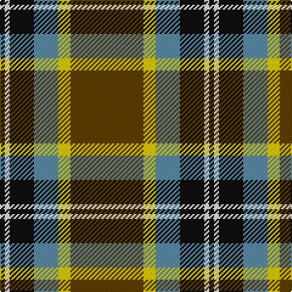

In pattern [GYBKWK](/patterns/gybkwk/).

This was sourced from tartans-authority.  It is a [6 stripes tartan](/stripes/stripes6/).

Original link http://www.tartansauthority.com/tartan-ferret/display/10502/

## Thread count
K/4 W4 K20 B20 Y10 T/60

## Palette
Each colour and its ΔE from the base-6 reference it is a variant of.

| Colour | Shade | Base | ΔE (OKLab) |
|---|---|---|---|
| B | <code style="background-color:#5C8CA8;">#5C8CA8</code> `#5C8CA8` | B <code style="background-color:#2A418A;">#2A418A</code> | 0.23 |
| K | <code style="background-color:#101010;">#101010</code> `#101010` | K <code style="background-color:#000000;">#000000</code> | 0.17 |
| T | <code style="background-color:#604000;">#604000</code> `#604000` | G <code style="background-color:#006100;">#006100</code> | 0.14 |
| W | <code style="background-color:#FCFCFC;">#FCFCFC</code> `#FCFCFC` | W <code style="background-color:#F7F7F7;">#F7F7F7</code> | 0.01 |
| Y | <code style="background-color:#FCCC00;">#FCCC00</code> `#FCCC00` | Y <code style="background-color:#F2BF00;">#F2BF00</code> | 0.04 |

# Sample pattern

## Nearest tartans

The nearest existing variants by ΔTartan distance.

1. [Bryan Wedding (Personal)](/setts/s6/g30y5b10k10w2k2~b486c9c-g58442c-k101010-we8e8e8-ydcbc1c~x2/) — ΔT 0.78
1. [Asheville Firefighters, The](/setts/s6/k17g48y4r10w12g4~g004028-k101010-rc80000-wa8ace8-yffe600/) — ΔT 0.94
1. [Clyde Valley HOG](/setts/s8/k54y6k6y6r20ya40k6yb3~k101010-r888888-ya0a0a0-yad87c00-ybe8c000/) — ΔT 0.96
1. [Hamilton of Brandon (Fashion)](/setts/s6/y16k7w1g7k1ya3~g006818-k101010-we0e0e0-ya08858-yae8c000~x4/) — ΔT 1.00
1. [Thomson Camel (Jedburgh Mill)](/setts/s6/r4k2w10k10g28k3~g8c7038-k101010-rc80000-wc0c0c0~x2/) — ΔT 1.03
1. [Afternoon Tea / Afternoon Tea](/setts/s6/w15k8r25k72g98y15~g408060-k1c1714-r781638-we0e0e0-yc89800/) — ΔT 1.04
1. [Drambuie Dress](/setts/s6/w6g36k48r4k5y6~g604000-k101010-rc80000-we0e0e0-ye8c000/) — ΔT 1.07
1. [Highlands of Durham (Corporate)](/setts/s6/r6b4w2g27b37y2~b1c1c1c-g408060-rc80000-wfcfcfc-ye8c000~x2/) — ΔT 1.09
1. [New York State Troopers (Corporate)](/setts/s7/r6b4r2w2r24k25y4~b780078-k101010-r888888-we0e0e0-ybc8c00~x2/) — ΔT 1.14
1. [Manitoba Red](/setts/s8/b2g1b1g12r2g1ra6y2~b3c82af-g005020-rdc0000-ra960028-ye8c000~x2/) — ΔT 1.15

## Neighbour map

Every grey dot is one of 15726 variants placed by the first two principal components of the ΔTartan feature space (44% of its variance). Red is this tartan; blue dots are its nearest — click one to open its page.

<svg viewBox="0 0 640 380" role="img" style="max-width:100%;height:auto;border:1px solid #e0e0e0;border-radius:4px;display:block" xmlns="http://www.w3.org/2000/svg"><image href="/nn/cloud.v1.png" width="640" height="380"/><a href="/setts/s6/g30y5b10k10w2k2~b486c9c-g58442c-k101010-we8e8e8-ydcbc1c~x2/"><circle cx="265.8" cy="170.9" r="4" fill="#3465a4"><title>Bryan Wedding (Personal)</title></circle></a><a href="/setts/s6/k17g48y4r10w12g4~g004028-k101010-rc80000-wa8ace8-yffe600/"><circle cx="259.4" cy="178.9" r="4" fill="#3465a4"><title>Asheville Firefighters, The</title></circle></a><a href="/setts/s8/k54y6k6y6r20ya40k6yb3~k101010-r888888-ya0a0a0-yad87c00-ybe8c000/"><circle cx="227.1" cy="133.7" r="4" fill="#3465a4"><title>Clyde Valley HOG</title></circle></a><a href="/setts/s6/y16k7w1g7k1ya3~g006818-k101010-we0e0e0-ya08858-yae8c000~x4/"><circle cx="213.8" cy="163.5" r="4" fill="#3465a4"><title>Hamilton of Brandon (Fashion)</title></circle></a><a href="/setts/s6/r4k2w10k10g28k3~g8c7038-k101010-rc80000-wc0c0c0~x2/"><circle cx="259.6" cy="179.5" r="4" fill="#3465a4"><title>Thomson Camel (Jedburgh Mill)</title></circle></a><a href="/setts/s6/w15k8r25k72g98y15~g408060-k1c1714-r781638-we0e0e0-yc89800/"><circle cx="198.8" cy="180.2" r="4" fill="#3465a4"><title>Afternoon Tea / Afternoon Tea</title></circle></a><a href="/setts/s6/w6g36k48r4k5y6~g604000-k101010-rc80000-we0e0e0-ye8c000/"><circle cx="264.7" cy="175.2" r="4" fill="#3465a4"><title>Drambuie Dress</title></circle></a><a href="/setts/s6/r6b4w2g27b37y2~b1c1c1c-g408060-rc80000-wfcfcfc-ye8c000~x2/"><circle cx="299.2" cy="159.8" r="4" fill="#3465a4"><title>Highlands of Durham (Corporate)</title></circle></a><a href="/setts/s7/r6b4r2w2r24k25y4~b780078-k101010-r888888-we0e0e0-ybc8c00~x2/"><circle cx="240.0" cy="160.1" r="4" fill="#3465a4"><title>New York State Troopers (Corporate)</title></circle></a><a href="/setts/s8/b2g1b1g12r2g1ra6y2~b3c82af-g005020-rdc0000-ra960028-ye8c000~x2/"><circle cx="272.4" cy="162.1" r="4" fill="#3465a4"><title>Manitoba Red</title></circle></a><circle cx="250.7" cy="162.7" r="5" fill="#c00000"/></svg>

ID: /setts/s6/g30y5b10k10w2k2~b5c8ca8-g604000-k101010-wfcfcfc-yfccc00~x2/
