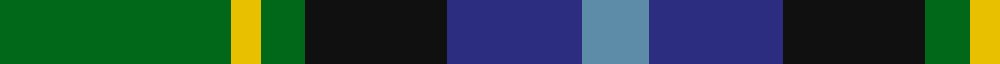
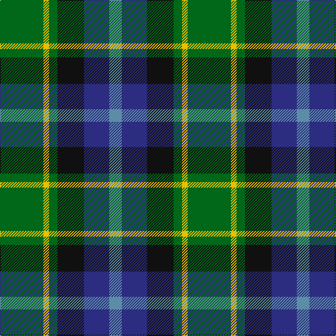

In pattern [BBKGYG](/stripes/bbkgyg/).

This was sourced from register-of-tartans.  It is a [6 stripe tartan](/stripes/stripes6/).

Original link https://www.tartanregister.gov.uk/tartanDetails.aspx?ref=2039

## Register references

External register numbers recorded for this tartan.

- Scottish Register of Tartans: [2039](https://www.tartanregister.gov.uk/tartanDetails.aspx?ref=2039)
- Scottish Tartans World Register: 2502

## Thread count
G/62 Y8 G12 K38 DB36 B/18

## Palette
Each colour and its ΔE from the base-6 reference it is a variant of.

| Colour | Shade | Base | ΔE (OKLab) |
|---|---|---|---|
| B | <code style="background-color:#5C8CA8;">#5C8CA8</code> `#5C8CA8` | B <code style="background-color:#2A418A;">#2A418A</code> | 0.23 |
| DB | <code style="background-color:#2C2C80;">#2C2C80</code> `#2C2C80` | B <code style="background-color:#2A418A;">#2A418A</code> | 0.06 |
| G | <code style="background-color:#006818;">#006818</code> `#006818` | G <code style="background-color:#006100;">#006100</code> | 0.02 |
| K | <code style="background-color:#101010;">#101010</code> `#101010` | K <code style="background-color:#000000;">#000000</code> | 0.17 |
| Y | <code style="background-color:#E8C000;">#E8C000</code> `#E8C000` | Y <code style="background-color:#F2BF00;">#F2BF00</code> | 0.02 |

# Sample pattern

## Nearest tartans

The nearest existing variants by ΔTartan distance.

1. [Disciples of Christ Motorcycle Ministry (Switzerland)](/setts/s7/k22g21k5g12t12o3w4~x2/) — ΔT 0.73
1. [Scottish Odyssey Commemorative Tartan Tartan Number: 4071. Earliest known date: 01/01/2002 The Scottish Odyssey tartan from Lochcarron is a 'celebration of the wonderful experiences to be gained' from a visit to Scotland and some of the most spectacularly contrasting landscapes to be seen in Europe. See products available Copyright © Blair Urquhart, Comrie, 2015](/setts/s7/k7db11k3db11dy11g22db3~x2/) — ΔT 0.75
1. [MPS Emerald Society](/setts/s6/ly4dg30g15db5b10ly4~x2/) — ΔT 0.86
1. [MPS Emerald Society NCLEES 2012](/setts/s6/ly4dg30g15db5t10ly4~x2/) — ΔT 0.93
1. [Royal College of Physicians (Corp)](/setts/s6/db18r3k9r3g23ly3~x2/) — ΔT 0.95
1. [Lanark](/setts/s6/dg31ly4dg6k19db18t9~x2/) — ΔT 0.97
1. [MacLean, Donald (Personal)](/setts/s7/g16lb3g3k10db12r2db3~x2/) — ΔT 1.02
1. [Dyce #3](/setts/s6/k2ly1dg6k6db6w1~x4/) — ΔT 1.02
1. [Cultoquhey Hotel](/setts/s5/r3db22k11g32ly3~x2/) — ΔT 1.03
1. [Dunfermline Bank of Scotland (Corp)](/setts/s8/dg24k5dg6r6dg6k20b20w2~x2/) — ΔT 1.04

## Neighbour map

Every grey dot is one of 14299 variants placed by the first two principal components of the ΔTartan feature space (44% of its variance). Red is this tartan; blue dots are its nearest — click one to open its page.

<svg viewBox="0 0 640 380" role="img" style="max-width:100%;height:auto;border:1px solid #e0e0e0;border-radius:4px;display:block" xmlns="http://www.w3.org/2000/svg"><image href="/nn/cloud.v1.png" width="640" height="380"/><a href="/setts/s7/k22g21k5g12t12o3w4~x2/"><circle cx="156.2" cy="221.1" r="4" fill="#3465a4"><title>Disciples of Christ Motorcycle Ministry (Switzerland)</title></circle></a><a href="/setts/s7/k7db11k3db11dy11g22db3~x2/"><circle cx="127.9" cy="223.8" r="4" fill="#3465a4"><title>Scottish Odyssey Commemorative Tartan Tartan Number: 4071. Earliest known date: 01/01/2002 The Scottish Odyssey tartan from Lochcarron is a 'celebration of the wonderful experiences to be gained' from a visit to Scotland and some of the most spectacularly contrasting landscapes to be seen in Europe. See products available Copyright © Blair Urquhart, Comrie, 2015</title></circle></a><a href="/setts/s6/ly4dg30g15db5b10ly4~x2/"><circle cx="178.5" cy="213.8" r="4" fill="#3465a4"><title>MPS Emerald Society</title></circle></a><a href="/setts/s6/ly4dg30g15db5t10ly4~x2/"><circle cx="174.7" cy="212.8" r="4" fill="#3465a4"><title>MPS Emerald Society NCLEES 2012</title></circle></a><a href="/setts/s6/db18r3k9r3g23ly3~x2/"><circle cx="168.7" cy="210.9" r="4" fill="#3465a4"><title>Royal College of Physicians (Corp)</title></circle></a><a href="/setts/s6/dg31ly4dg6k19db18t9~x2/"><circle cx="154.1" cy="228.0" r="4" fill="#3465a4"><title>Lanark</title></circle></a><a href="/setts/s7/g16lb3g3k10db12r2db3~x2/"><circle cx="164.3" cy="215.2" r="4" fill="#3465a4"><title>MacLean, Donald (Personal)</title></circle></a><a href="/setts/s6/k2ly1dg6k6db6w1~x4/"><circle cx="135.4" cy="239.1" r="4" fill="#3465a4"><title>Dyce #3</title></circle></a><a href="/setts/s5/r3db22k11g32ly3~x2/"><circle cx="226.5" cy="217.8" r="4" fill="#3465a4"><title>Cultoquhey Hotel</title></circle></a><a href="/setts/s8/dg24k5dg6r6dg6k20b20w2~x2/"><circle cx="182.1" cy="193.7" r="4" fill="#3465a4"><title>Dunfermline Bank of Scotland (Corp)</title></circle></a><circle cx="165.2" cy="232.1" r="5" fill="#c00000"/></svg>

ID: /setts/s6/g31ly4g6k19db18t9~x2/
