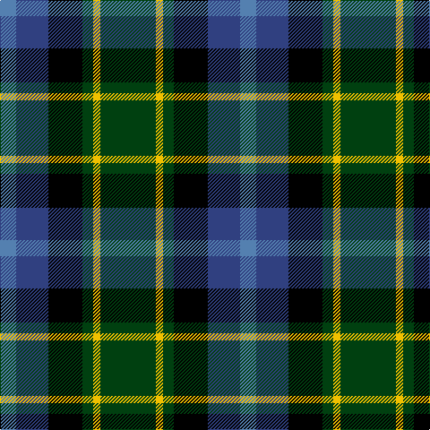

In pattern [BBKGYG](/patterns/bbkgyg/).

This was sourced from weddslist.  It is a [6 stripes tartan](/stripes/stripes6/).

Original link http://www.weddslist.com/cgi-bin/tartans/pg.pl?source=sts

## Thread count
Ba/18 B36 K38 DG12 Y8 DG/62

## Palette
Each colour and its ΔE from the base-6 reference it is a variant of.

| Colour | Shade | Base | ΔE (OKLab) |
|---|---|---|---|
| B | <code style="background-color:#304080;">#304080</code> `#304080` | B <code style="background-color:#2A418A;">#2A418A</code> | 0.02 |
| Ba | <code style="background-color:#5480B0;">#5480B0</code> `#5480B0` | B <code style="background-color:#2A418A;">#2A418A</code> | 0.19 |
| DG | <code style="background-color:#004010;">#004010</code> `#004010` | G <code style="background-color:#006100;">#006100</code> | 0.11 |
| K | <code style="background-color:#000000;">#000000</code> `#000000` | K <code style="background-color:#000000;">#000000</code> | 0.00 |
| Y | <code style="background-color:#F0C000;">#F0C000</code> `#F0C000` | Y <code style="background-color:#F2BF00;">#F2BF00</code> | 0.00 |

# Sample pattern

## Nearest tartans

The nearest existing variants by ΔTartan distance.

1. [Brodie Hunting](/setts/s7/r2b8g8k8y1g8r2~b00004c-g004c00-k000000-rc80000-yffc800/) — ΔT 0.74
1. [Dyce Family Tartan Tartan Number: 1266. Earliest known date: 1880 From Ross-Craven research. Black guards on the white. See products available Copyright © Blair Urquhart, Comrie, 2015](/setts/s6/k2y1g6k6b6w1x4~b2c2c80-g006818-k101010-we0e0e0-ye8c000/) — ΔT 0.75
1. [Scottish Odyssey Commemorative Tartan Tartan Number: 4071. Earliest known date: 01/01/2002 The Scottish Odyssey tartan from Lochcarron is a 'celebration of the wonderful experiences to be gained' from a visit to Scotland and some of the most spectacularly contrasting landscapes to be seen in Europe. See products available Copyright © Blair Urquhart, Comrie, 2015](/setts/s7/k7b11k3b11g11ga22b3x2~b2c4084-g663300-ga008800-k000000/) — ΔT 0.81
1. [Dyce #3](/setts/s6/k2y1g6k6b6w1x4~b2c4084-g005020-k101010-we0e0e0-ye8c000/) — ΔT 0.84
1. [Midlothian](/setts/s6/b31ba4b5k19g20y4x2~b304080-ba8080d0-g008000-k000000-yf0c000/) — ΔT 0.86
1. [Rose Hunting](/setts/s6/k4w1g10k10b10r2x4~b2c2c80-g006818-k101010-rc80000-wfcfcfc/) — ΔT 0.86
1. [Rose Hunting](/setts/s6/g4w1g10k10b10r2~b00004c-g004c00-k000000-rc80000-wd0d0d0/) — ΔT 0.87
1. [MacLean, Donald (Personal)](/setts/s7/g16w3g3k10b12r2b3x2~b1c0070-g006818-k101010-r880000-wa8ace8/) — ΔT 0.90
1. [Forbo Nairn](/setts/s5/b2g8k7ba12r2x4~b5480b0-ba000050-g008000-k000000-r800000/) — ΔT 0.94
1. [Rose Hunting Clan Tartan Tartan Number: 1226. Earliest known date: 1831 First recorded in James Logan's, 'The Scottish Gael' in 1831. See products available Copyright © Blair Urquhart, Comrie, 2015](/setts/s6/k4w1g10k10b10r2x2~b2c2c80-g006818-k101010-rc80000-we0e0e0/) — ΔT 0.94

## Neighbour map

Every grey dot is one of 15726 variants placed by the first two principal components of the ΔTartan feature space (44% of its variance). Red is this tartan; blue dots are its nearest — click one to open its page.

<svg viewBox="0 0 640 380" role="img" style="max-width:100%;height:auto;border:1px solid #e0e0e0;border-radius:4px;display:block" xmlns="http://www.w3.org/2000/svg"><image href="/nn/cloud.v1.png" width="640" height="380"/><a href="/setts/s7/r2b8g8k8y1g8r2~b00004c-g004c00-k000000-rc80000-yffc800/"><circle cx="150.7" cy="222.8" r="4" fill="#3465a4"><title>Brodie Hunting</title></circle></a><a href="/setts/s6/k2y1g6k6b6w1x4~b2c2c80-g006818-k101010-we0e0e0-ye8c000/"><circle cx="122.6" cy="231.7" r="4" fill="#3465a4"><title>Dyce Family Tartan Tartan Number: 1266. Earliest known date: 1880 From Ross-Craven research. Black guards on the white. See products available Copyright © Blair Urquhart, Comrie, 2015</title></circle></a><a href="/setts/s7/k7b11k3b11g11ga22b3x2~b2c4084-g663300-ga008800-k000000/"><circle cx="124.3" cy="221.1" r="4" fill="#3465a4"><title>Scottish Odyssey Commemorative Tartan Tartan Number: 4071. Earliest known date: 01/01/2002 The Scottish Odyssey tartan from Lochcarron is a 'celebration of the wonderful experiences to be gained' from a visit to Scotland and some of the most spectacularly contrasting landscapes to be seen in Europe. See products available Copyright © Blair Urquhart, Comrie, 2015</title></circle></a><a href="/setts/s6/k2y1g6k6b6w1x4~b2c4084-g005020-k101010-we0e0e0-ye8c000/"><circle cx="131.9" cy="235.8" r="4" fill="#3465a4"><title>Dyce #3</title></circle></a><a href="/setts/s6/b31ba4b5k19g20y4x2~b304080-ba8080d0-g008000-k000000-yf0c000/"><circle cx="155.2" cy="208.7" r="4" fill="#3465a4"><title>Midlothian</title></circle></a><a href="/setts/s6/k4w1g10k10b10r2x4~b2c2c80-g006818-k101010-rc80000-wfcfcfc/"><circle cx="163.2" cy="219.9" r="4" fill="#3465a4"><title>Rose Hunting</title></circle></a><a href="/setts/s6/g4w1g10k10b10r2~b00004c-g004c00-k000000-rc80000-wd0d0d0/"><circle cx="153.3" cy="221.9" r="4" fill="#3465a4"><title>Rose Hunting</title></circle></a><a href="/setts/s7/g16w3g3k10b12r2b3x2~b1c0070-g006818-k101010-r880000-wa8ace8/"><circle cx="160.7" cy="211.6" r="4" fill="#3465a4"><title>MacLean, Donald (Personal)</title></circle></a><a href="/setts/s5/b2g8k7ba12r2x4~b5480b0-ba000050-g008000-k000000-r800000/"><circle cx="120.1" cy="244.6" r="4" fill="#3465a4"><title>Forbo Nairn</title></circle></a><a href="/setts/s6/k4w1g10k10b10r2x2~b2c2c80-g006818-k101010-rc80000-we0e0e0/"><circle cx="167.4" cy="221.6" r="4" fill="#3465a4"><title>Rose Hunting Clan Tartan Tartan Number: 1226. Earliest known date: 1831 First recorded in James Logan's, 'The Scottish Gael' in 1831. See products available Copyright © Blair Urquhart, Comrie, 2015</title></circle></a><circle cx="150.4" cy="226.0" r="5" fill="#c00000"/></svg>

ID: /setts/s6/g31y4g6k19b18ba9x2~b304080-ba5480b0-g004010-k000000-yf0c000/
