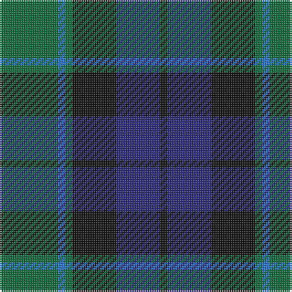

In pattern [GBGKBK](/patterns/gbgkbk/).

This was sourced from register-of-tartans.  It is a [6 stripes tartan](/stripes/stripes6/).

Original link https://www.tartanregister.gov.uk/tartanDetails.aspx?ref=1482

## Thread count
G/32 B4 G4 K24 DB24 K/4

## Palette
Each colour and its ΔE from the base-6 reference it is a variant of.

| Colour | Shade | Base | ΔE (OKLab) |
|---|---|---|---|
| B | <code style="background-color:#2474E8;">#2474E8</code> `#2474E8` | B <code style="background-color:#2A418A;">#2A418A</code> | 0.19 |
| DB | <code style="background-color:#28287C;">#28287C</code> `#28287C` | B <code style="background-color:#2A418A;">#2A418A</code> | 0.07 |
| G | <code style="background-color:#006C3C;">#006C3C</code> `#006C3C` | G <code style="background-color:#006100;">#006100</code> | 0.06 |
| K | <code style="background-color:#101010;">#101010</code> `#101010` | K <code style="background-color:#000000;">#000000</code> | 0.17 |

# Sample pattern

## Nearest tartans

The nearest existing variants by ΔTartan distance.

1. [Graham of Menteith (Clan)](/setts/s6/g32b4g4k24ba24k4-b5c8ca8-ba2c2c80-g006818-k101010/) — ΔT 0.41
1. [Blaylock Annandale (Name)](/setts/s7/g48b12ba6k12b24k30g8-b2c2c80-ba5c8ca8-g006818-k101010/) — ΔT 0.59
1. [Ferguson of Balquhidder #2](/setts/s6/g8b48r6k48g50k8-b2c2c80-g006818-k101010-rc80000/) — ΔT 0.59
1. [Graham of Montrose](/setts/s6/g8b30w4k32g38k8-b2c4084-g005020-k101010-we0e0e0/) — ΔT 0.60
1. [Renfrew](/setts/s7/b12k4b36k36g36k6r4-b2c2c80-g006818-k101010-rc80000/) — ΔT 0.65
1. [Blair Clan Tartan Tartan Number: 416. Earliest known date: pre 1963 Described by MacKinlay as a "Modern family sett". See products available Copyright © Blair Urquhart, Comrie, 2015](/setts/s7/b12r4b40k32g40r4g12-b2c2c80-g006818-k101010-rc80000/) — ΔT 0.65
1. [Murray (Variation) Clan Tartan Tartan Number: 271. Earliest known date: 1810-15 A simplified version of the Murray of Atholl. The Cockburn collection housed in the Mitchell Library in Glasgow, is one of the earliest references for clan tartans. James Logan, in his book, The Scottish Gael (1831), wrote concerning the Black Watch, that "...a red stripe is often introduced", and this by Lord Murray who commanded the regiment. See products available Copyright © Blair Urquhart, Comrie, 2015](/setts/s6/b4k4b24k16g22r4-b2c2c80-g006818-k101010-rc80000/) — ΔT 0.68
1. [Gallamore](/setts/s6/k6b28r4k28g28k6-b2c2c80-g006818-k101010-rc80000/) — ΔT 0.68
1. [Graham of Menteith Clan Tartan Tartan Number: 698. Earliest known date: 1831 Logan describes the broad blue stripe as 'smalt', in his book, 'The Scottish Gael' published in 1831. Smibert also records this sett in 1850. However, in the text for McIan's Costume of the Clans (1845-47), Logan admits that this sett's antiquity is questionable. Menteith is the name given to the western branch of the Graham family. The Menteith District tartan is similar but the azure stripe is white. (See also Montrose, Menteith.) See products available Copyright © Blair Urquhart, Comrie, 2015](/setts/s6/g36b4g8k28ba24k6-b5c8ca8-ba2c2c80-g006818-k101010/) — ΔT 0.68
1. [Callum Beg (Fashion)](/setts/s6/g6b36k36g36r6g6-b2c2c80-g006818-k101010-rc80000/) — ΔT 0.70

## Neighbour map

Every grey dot is one of 15726 variants placed by the first two principal components of the ΔTartan feature space (44% of its variance). Red is this tartan; blue dots are its nearest — click one to open its page.

<svg viewBox="0 0 640 380" role="img" style="max-width:100%;height:auto;border:1px solid #e0e0e0;border-radius:4px;display:block" xmlns="http://www.w3.org/2000/svg"><image href="/nn/cloud.v1.png" width="640" height="380"/><a href="/setts/s6/g32b4g4k24ba24k4-b5c8ca8-ba2c2c80-g006818-k101010/"><circle cx="214.3" cy="243.9" r="4" fill="#3465a4"><title>Graham of Menteith (Clan)</title></circle></a><a href="/setts/s7/g48b12ba6k12b24k30g8-b2c2c80-ba5c8ca8-g006818-k101010/"><circle cx="209.2" cy="243.2" r="4" fill="#3465a4"><title>Blaylock Annandale (Name)</title></circle></a><a href="/setts/s6/g8b48r6k48g50k8-b2c2c80-g006818-k101010-rc80000/"><circle cx="200.7" cy="243.5" r="4" fill="#3465a4"><title>Ferguson of Balquhidder #2</title></circle></a><a href="/setts/s6/g8b30w4k32g38k8-b2c4084-g005020-k101010-we0e0e0/"><circle cx="219.3" cy="248.7" r="4" fill="#3465a4"><title>Graham of Montrose</title></circle></a><a href="/setts/s7/b12k4b36k36g36k6r4-b2c2c80-g006818-k101010-rc80000/"><circle cx="215.3" cy="233.5" r="4" fill="#3465a4"><title>Renfrew</title></circle></a><a href="/setts/s7/b12r4b40k32g40r4g12-b2c2c80-g006818-k101010-rc80000/"><circle cx="206.9" cy="229.5" r="4" fill="#3465a4"><title>Blair Clan Tartan Tartan Number: 416. Earliest known date: pre 1963 Described by MacKinlay as a &quot;Modern family sett&quot;. See products available Copyright © Blair Urquhart, Comrie, 2015</title></circle></a><a href="/setts/s6/b4k4b24k16g22r4-b2c2c80-g006818-k101010-rc80000/"><circle cx="194.7" cy="257.1" r="4" fill="#3465a4"><title>Murray (Variation) Clan Tartan Tartan Number: 271. Earliest known date: 1810-15 A simplified version of the Murray of Atholl. The Cockburn collection housed in the Mitchell Library in Glasgow, is one of the earliest references for clan tartans. James Logan, in his book, The Scottish Gael (1831), wrote concerning the Black Watch, that &quot;...a red stripe is often introduced&quot;, and this by Lord Murray who commanded the regiment. See products available Copyright © Blair Urquhart, Comrie, 2015</title></circle></a><a href="/setts/s6/k6b28r4k28g28k6-b2c2c80-g006818-k101010-rc80000/"><circle cx="211.1" cy="256.0" r="4" fill="#3465a4"><title>Gallamore</title></circle></a><a href="/setts/s6/g36b4g8k28ba24k6-b5c8ca8-ba2c2c80-g006818-k101010/"><circle cx="224.7" cy="246.7" r="4" fill="#3465a4"><title>Graham of Menteith Clan Tartan Tartan Number: 698. Earliest known date: 1831 Logan describes the broad blue stripe as 'smalt', in his book, 'The Scottish Gael' published in 1831. Smibert also records this sett in 1850. However, in the text for McIan's Costume of the Clans (1845-47), Logan admits that this sett's antiquity is questionable. Menteith is the name given to the western branch of the Graham family. The Menteith District tartan is similar but the azure stripe is white. (See also Montrose, Menteith.) See products available Copyright © Blair Urquhart, Comrie, 2015</title></circle></a><a href="/setts/s6/g6b36k36g36r6g6-b2c2c80-g006818-k101010-rc80000/"><circle cx="194.5" cy="255.7" r="4" fill="#3465a4"><title>Callum Beg (Fashion)</title></circle></a><circle cx="216.5" cy="245.0" r="5" fill="#c00000"/></svg>

ID: /setts/s6/g32b4g4k24ba24k4-b2474e8-ba28287c-g006c3c-k101010/
