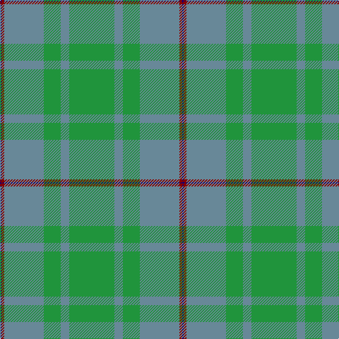

In pattern [BRBGBG](/patterns/brbgbg/).

This was sourced from register-of-tartans.  It is a [6 stripes tartan](/stripes/stripes6/).

Original link https://www.tartanregister.gov.uk/tartanDetails.aspx?ref=3286

## Attestations

This cloth appears in 2 source records; the oldest owns this page.

- 01/01/1994 — Palm Beach Gardens Police (register-of-tartans, [record](https://www.tartanregister.gov.uk/tartanDetails.aspx?ref=3286))
- 1994 — Palm Beach Gardens Police (Corporate (tartans-authority, [record](http://www.tartansauthority.com/tartan-ferret/display/5521/))

## Register references

External register numbers recorded for this tartan.

- Scottish Register of Tartans: [3286](https://www.tartanregister.gov.uk/tartanDetails.aspx?ref=3286)
- Scottish Tartans Authority (ITI): 5521

## Thread count
DB/2 DR4 B56 G24 B12 G/64

## Palette
Each colour and its ΔE from the base-6 reference it is a variant of.

| Colour | Shade | Base | ΔE (OKLab) |
|---|---|---|---|
| B | <code style="background-color:#688898;">#688898</code> `#688898` | B <code style="background-color:#2A418A;">#2A418A</code> | 0.23 |
| DB | <code style="background-color:#1C0070;">#1C0070</code> `#1C0070` | B <code style="background-color:#2A418A;">#2A418A</code> | 0.14 |
| DR | <code style="background-color:#880000;">#880000</code> `#880000` | R <code style="background-color:#CC0000;">#CC0000</code> | 0.15 |
| G | <code style="background-color:#20943C;">#20943C</code> `#20943C` | G <code style="background-color:#006100;">#006100</code> | 0.16 |

# Sample pattern

## Nearest tartans

The nearest existing variants by ΔTartan distance.

1. [Castle Bay (Fashion)](/setts/s5/g40w2ga5gb5ga15~g50a47c-ga5c6428-gb048888-we0e0e0~x2/) — ΔT 1.04
1. [Gordon Cumming (Artefact)](/setts/s6/y10g30ga25g30k2g3~g009468-ga007460-k101010-ye8c000~x2/) — ΔT 1.67
1. [Irving of Bonshaw](/setts/s5/g27ga14b2ga2y2~b003c64-g006818-ga048888-ye8c000~x4/) — ΔT 1.78
1. [O'Brien (Scotch Corner)](/setts/s9/g36ga19g4ga31b2r3b2r3ga12~b1474b4-g5c6428-ga289c18-ra00000~x2/) — ΔT 1.89
1. [Irvine of Drum (Clan)](/setts/s5/g49b21k3b3w3~b5c8ca8-g408060-k101010-wfcfcfc~x2/) — ΔT 1.90
1. [Del Forno Wolf (Personal)](/setts/s8/g38b8ba3bb4b12y1g4b1~b5c5c5c-ba1474b4-bb2c2c80-g006818-ybc8c00~x2/) — ΔT 1.98
1. [Exabyte](/setts/s5/r3b34ba4g47w3~b5c5c5c-ba1c0070-g006818-r880000-wc0c0c0~x2/) — ΔT 2.12
1. [Farooq (Personal)](/setts/s4/b8g20w4r1~b506880-g609070-rc80000-we0e0e0~x5/) — ΔT 2.22
1. [Orkney Slate (Fashion)](/setts/s8/b8r74w8b42r11ba2r16b4~b5c5c5c-ba440044-r888888-wc0c0c0/) — ΔT 2.27
1. [Irvine of Drum](/setts/s8/b3k3b21g49b21k3b3w3~b5c8ca8-g408060-k101010-wfcfcfc~x2/) — ΔT 2.27

## Neighbour map

Every grey dot is one of 15726 variants placed by the first two principal components of the ΔTartan feature space (44% of its variance). Red is this tartan; blue dots are its nearest — click one to open its page.

<svg viewBox="0 0 640 380" role="img" style="max-width:100%;height:auto;border:1px solid #e0e0e0;border-radius:4px;display:block" xmlns="http://www.w3.org/2000/svg"><image href="/nn/cloud.v1.png" width="640" height="380"/><a href="/setts/s5/g40w2ga5gb5ga15~g50a47c-ga5c6428-gb048888-we0e0e0~x2/"><circle cx="462.7" cy="226.6" r="4" fill="#3465a4"><title>Castle Bay (Fashion)</title></circle></a><a href="/setts/s6/y10g30ga25g30k2g3~g009468-ga007460-k101010-ye8c000~x2/"><circle cx="417.0" cy="251.6" r="4" fill="#3465a4"><title>Gordon Cumming (Artefact)</title></circle></a><a href="/setts/s5/g27ga14b2ga2y2~b003c64-g006818-ga048888-ye8c000~x4/"><circle cx="422.8" cy="239.9" r="4" fill="#3465a4"><title>Irving of Bonshaw</title></circle></a><a href="/setts/s9/g36ga19g4ga31b2r3b2r3ga12~b1474b4-g5c6428-ga289c18-ra00000~x2/"><circle cx="409.5" cy="202.4" r="4" fill="#3465a4"><title>O'Brien (Scotch Corner)</title></circle></a><a href="/setts/s5/g49b21k3b3w3~b5c8ca8-g408060-k101010-wfcfcfc~x2/"><circle cx="450.6" cy="218.6" r="4" fill="#3465a4"><title>Irvine of Drum (Clan)</title></circle></a><a href="/setts/s8/g38b8ba3bb4b12y1g4b1~b5c5c5c-ba1474b4-bb2c2c80-g006818-ybc8c00~x2/"><circle cx="487.7" cy="165.5" r="4" fill="#3465a4"><title>Del Forno Wolf (Personal)</title></circle></a><a href="/setts/s5/r3b34ba4g47w3~b5c5c5c-ba1c0070-g006818-r880000-wc0c0c0~x2/"><circle cx="379.1" cy="215.2" r="4" fill="#3465a4"><title>Exabyte</title></circle></a><a href="/setts/s4/b8g20w4r1~b506880-g609070-rc80000-we0e0e0~x5/"><circle cx="414.3" cy="225.9" r="4" fill="#3465a4"><title>Farooq (Personal)</title></circle></a><a href="/setts/s8/b8r74w8b42r11ba2r16b4~b5c5c5c-ba440044-r888888-wc0c0c0/"><circle cx="524.7" cy="181.9" r="4" fill="#3465a4"><title>Orkney Slate (Fashion)</title></circle></a><a href="/setts/s8/b3k3b21g49b21k3b3w3~b5c8ca8-g408060-k101010-wfcfcfc~x2/"><circle cx="365.5" cy="190.9" r="4" fill="#3465a4"><title>Irvine of Drum</title></circle></a><circle cx="454.9" cy="213.9" r="5" fill="#c00000"/></svg>

ID: /setts/s6/g32b6g12b28r2ba1~b688898-ba1c0070-g20943c-r880000~x2/
