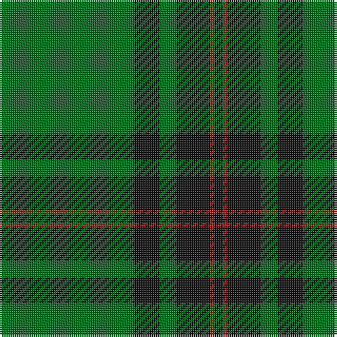

In pattern [GKGKRK](/patterns/gkgkrk/).

This was sourced from house-of-tartan.  It is a [6 stripes tartan](/stripes/stripes6/).

Original link http://www.house-of-tartan.scotland.net/house/TartanViewjs.asp?colr=Def&tnam=790

## Thread count
G/64 K12 G8 K16 R2 K/4

## Palette
Each colour and its ΔE from the base-6 reference it is a variant of.

| Colour | Shade | Base | ΔE (OKLab) |
|---|---|---|---|
| G | <code style="background-color:#006818;">#006818</code> `#006818` | G <code style="background-color:#006100;">#006100</code> | 0.02 |
| K | <code style="background-color:#101010;">#101010</code> `#101010` | K <code style="background-color:#000000;">#000000</code> | 0.17 |
| R | <code style="background-color:#C80000;">#C80000</code> `#C80000` | R <code style="background-color:#CC0000;">#CC0000</code> | 0.01 |

# Sample pattern

## Nearest tartans

The nearest existing variants by ΔTartan distance.

1. [Fife, Duke Of](/setts/s6/g32k6g4k8r1k2x4~g005814-k101010-rc80000/) — ΔT 0.97
1. [Tyrconnell (Personal)](/setts/s5/g44b9r2b9g2x2~b202060-g006818-rc80000/) — ΔT 1.08
1. [Duchess of Fife #2](/setts/s6/g70k26g12k14b3k16x2~b2c2c80-g006818-k101010/) — ΔT 1.35
1. [MacBeorn](/setts/s7/g55ga6g7ga17y1ga2y2x2~g007800-ga002814-yffff00/) — ΔT 1.43
1. [Inman (2016)](/setts/s7/r2g24k2g12y6k1r2x2~g005020-k101010-rdc0000-ye0a126/) — ΔT 1.51
1. [Skene or Tribe of Mar](/setts/s5/r1k2g16k2y1x2~g005020-k101010-rdc0000-ye8c000/) — ΔT 1.53
1. [Royal and Ancient, The](/setts/s6/g49b16r3b2r2b6x2~b304080-g008000-r806050/) — ΔT 1.54
1. [Semper](/setts/s8/g16ga1y4ga41y1ga6gb2ga2x2~g408060-ga004028-gb649848-y86c67c/) — ΔT 1.55
1. [Tyrconnell](/setts/s5/g44b9r2b9g2x2~b000050-g008000-rc00000/) — ΔT 1.60
1. [Kinfauns Castle (Corporate)](/setts/s6/r4b12g2b2g46w1x2~b780078-g006818-rc80000-we0e0e0/) — ΔT 1.61

## Neighbour map

Every grey dot is one of 15726 variants placed by the first two principal components of the ΔTartan feature space (44% of its variance). Red is this tartan; blue dots are its nearest — click one to open its page.

<svg viewBox="0 0 640 380" role="img" style="max-width:100%;height:auto;border:1px solid #e0e0e0;border-radius:4px;display:block" xmlns="http://www.w3.org/2000/svg"><image href="/nn/cloud.v1.png" width="640" height="380"/><a href="/setts/s6/g32k6g4k8r1k2x4~g005814-k101010-rc80000/"><circle cx="528.6" cy="205.0" r="4" fill="#3465a4"><title>Fife, Duke Of</title></circle></a><a href="/setts/s5/g44b9r2b9g2x2~b202060-g006818-rc80000/"><circle cx="511.0" cy="219.1" r="4" fill="#3465a4"><title>Tyrconnell (Personal)</title></circle></a><a href="/setts/s6/g70k26g12k14b3k16x2~b2c2c80-g006818-k101010/"><circle cx="417.5" cy="219.7" r="4" fill="#3465a4"><title>Duchess of Fife #2</title></circle></a><a href="/setts/s7/g55ga6g7ga17y1ga2y2x2~g007800-ga002814-yffff00/"><circle cx="511.9" cy="156.4" r="4" fill="#3465a4"><title>MacBeorn</title></circle></a><a href="/setts/s7/r2g24k2g12y6k1r2x2~g005020-k101010-rdc0000-ye0a126/"><circle cx="471.2" cy="173.4" r="4" fill="#3465a4"><title>Inman (2016)</title></circle></a><a href="/setts/s5/r1k2g16k2y1x2~g005020-k101010-rdc0000-ye8c000/"><circle cx="487.6" cy="201.0" r="4" fill="#3465a4"><title>Skene or Tribe of Mar</title></circle></a><a href="/setts/s6/g49b16r3b2r2b6x2~b304080-g008000-r806050/"><circle cx="468.6" cy="197.5" r="4" fill="#3465a4"><title>Royal and Ancient, The</title></circle></a><a href="/setts/s8/g16ga1y4ga41y1ga6gb2ga2x2~g408060-ga004028-gb649848-y86c67c/"><circle cx="501.6" cy="148.7" r="4" fill="#3465a4"><title>Semper</title></circle></a><a href="/setts/s5/g44b9r2b9g2x2~b000050-g008000-rc00000/"><circle cx="456.5" cy="200.2" r="4" fill="#3465a4"><title>Tyrconnell</title></circle></a><a href="/setts/s6/r4b12g2b2g46w1x2~b780078-g006818-rc80000-we0e0e0/"><circle cx="517.0" cy="141.6" r="4" fill="#3465a4"><title>Kinfauns Castle (Corporate)</title></circle></a><circle cx="500.5" cy="193.3" r="5" fill="#c00000"/></svg>

ID: /setts/s6/g32k6g4k8r1k2x2~g006818-k101010-rc80000/
