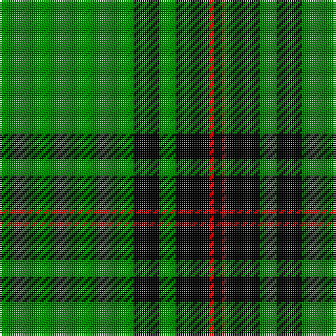

This page is one **sett** — a single exact thread-count. It belongs to the [tartan](/tartans/g32k6g4k8r1k2/)
(the same proportion at any scale), whose colour order is pattern [GKGKRK](/stripes/gkgkrk/).

Sourced from weddslist.  It is a [6 stripe tartan](/stripes/stripes6/).

Original link http://www.weddslist.com/cgi-bin/tartans/pg.pl?source=sts

## Also known as

This cloth is also recorded under:

- Fife, Duke of..

2 attestations — the source records this cloth was collapsed from (oldest owns this page)

<ul>
<li>undated — Fife, Duke of.. (weddslist, <a href="http://www.weddslist.com/cgi-bin/tartans/pg.pl?source=sts">record</a>)</li>
<li>undated — Fife Duke of.. District Tartan Tartan Number: 790. Earliest known date: 1889 Designed for the celebration of the wedding of Louise, the Princess Royal, daughter of Edward VII, and grand daughter of Queen Victoria, to Alexander Duff, the first Duke of Fife. The sett differs slightly from the modern district tartan. See products available Copyright © Blair Urquhart, Comrie, 2015 (house-of-tartan, <a href="http://www.house-of-tartan.scotland.net/house/TartanViewjs.asp?colr=Def&tnam=790">record</a>)</li>
</ul>

## Thread count
G/64 K12 G8 K16 R2 K/4

## Palette

Palette: <strong>Ingles Buchan</strong> <small style="color:#888">(1 of 3 colours)</small>
<table><thead><tr><th>Colour</th><th>Threads</th><th>Shade</th><th>Base</th><th>OKLCh</th></tr></thead><tbody><tr><td>G/</td><td style="text-align:right;font-variant-numeric:tabular-nums">64</td><td><code style="background-color:#008000;">#008000</code> <small style="color:#888">#008000</small></td><td>G <code style="background-color:#006100;">#006100</code></td><td><small style="color:#888">oklch(52.0% 0.177 142.5)</small></td></tr><tr><td>K</td><td style="text-align:right;font-variant-numeric:tabular-nums">12</td><td><code style="background-color:#000000;">#000000</code> <small style="color:#888">#000000</small></td><td>K <code style="background-color:#000000;">#000000</code></td><td><small style="color:#888">oklch(0.0% 0.000 0.0)</small></td></tr><tr><td>G</td><td style="text-align:right;font-variant-numeric:tabular-nums">8</td><td><code style="background-color:#008000;">#008000</code> <small style="color:#888">#008000</small></td><td>G <code style="background-color:#006100;">#006100</code></td><td><small style="color:#888">oklch(52.0% 0.177 142.5)</small></td></tr><tr><td>K</td><td style="text-align:right;font-variant-numeric:tabular-nums">16</td><td><code style="background-color:#000000;">#000000</code> <small style="color:#888">#000000</small></td><td>K <code style="background-color:#000000;">#000000</code></td><td><small style="color:#888">oklch(0.0% 0.000 0.0)</small></td></tr><tr><td>R</td><td style="text-align:right;font-variant-numeric:tabular-nums">2</td><td><code style="background-color:#C00000;">#C00000</code> <small style="color:#888">#C00000</small></td><td>R <code style="background-color:#CC0000;">#CC0000</code></td><td><small style="color:#888">oklch(50.7% 0.208 29.2)</small></td></tr><tr><td>K/</td><td style="text-align:right;font-variant-numeric:tabular-nums">4</td><td><code style="background-color:#000000;">#000000</code> <small style="color:#888">#000000</small></td><td>K <code style="background-color:#000000;">#000000</code></td><td><small style="color:#888">oklch(0.0% 0.000 0.0)</small></td></tr></tbody></table>

# Sample pattern

## Nearest tartans

The nearest existing variants by ΔTartan distance, with this tartan at the top so the swatches line up against it.

ΔTartan

Tartan

Sett

—

<a href="/ttd/edit/#slug=g32k6g4k8r1k2~x2">Fife, Duke of..</a> <a class="nn-out" href="/setts/s6/g32k6g4k8r1k2~x2/" title="open its dictionary page">↗</a>

1.45

<a href="/ttd/edit/#slug=g70k26g12k14b3k16~x2">Duchess of Fife</a> <a class="nn-out" href="/setts/s6/g70k26g12k14b3k16~x2/" title="open its dictionary page">↗</a>

1.65

<a href="/ttd/edit/#slug=r1k2g16k2ly1~x2">Skene, or Tribe of Mar</a> <a class="nn-out" href="/setts/s5/r1k2g16k2ly1~x2/" title="open its dictionary page">↗</a>

1.72

<a href="/ttd/edit/#slug=g30k12g6k6db2k5~x2">Fife, Duchess of..</a> <a class="nn-out" href="/setts/s6/g30k12g6k6db2k5~x2/" title="open its dictionary page">↗</a>

1.77

<a href="/ttd/edit/#slug=g3k6w1k6g2k2g16k1~x2">MacLean of Duart, hunting</a> <a class="nn-out" href="/setts/s8/g3k6w1k6g2k2g16k1~x2/" title="open its dictionary page">↗</a>

1.85

<a href="/ttd/edit/#slug=g25w1dg2w1g6k2w2dg3~x2">Marshall University</a> <a class="nn-out" href="/setts/s8/g25w1dg2w1g6k2w2dg3~x2/" title="open its dictionary page">↗</a>

1.87

<a href="/ttd/edit/#slug=k3r1g32k12w1k12r1g3~x2">MacHardy</a> <a class="nn-out" href="/setts/s8/k3r1g32k12w1k12r1g3~x2/" title="open its dictionary page">↗</a>

1.90

<a href="/ttd/edit/#slug=dg48lo3k6w4dg3k15lo3dg4~x2">Birmingham Irish Pipes &amp; Drums</a> <a class="nn-out" href="/setts/s8/dg48lo3k6w4dg3k15lo3dg4~x2/" title="open its dictionary page">↗</a>

1.91

<a href="/ttd/edit/#slug=r1g16k8g4k4ly1~x2">Forbes</a> <a class="nn-out" href="/setts/s6/r1g16k8g4k4ly1~x2/" title="open its dictionary page">↗</a>

1.93

<a href="/ttd/edit/#slug=g3r16g4k6g28r1g3~x2">Maxwell, hunting</a> <a class="nn-out" href="/setts/s7/g3r16g4k6g28r1g3~x2/" title="open its dictionary page">↗</a>

1.95

<a href="/ttd/edit/#slug=dg78dt13ly6r3ly5dg6dt9ly6~x2">Walterström (2014)</a> <a class="nn-out" href="/setts/s8/dg78dt13ly6r3ly5dg6dt9ly6~x2/" title="open its dictionary page">↗</a>

## Neighbour map

Every grey dot is one of 14359 variants placed by the first two principal components of the ΔTartan feature space (44% of its variance). Red is this tartan; blue dots are its nearest — click one to open its page.

<svg viewBox="0 0 640 380" role="img" style="max-width:100%;height:auto;border:1px solid #e0e0e0;border-radius:4px;display:block" xmlns="http://www.w3.org/2000/svg"><image href="/nn/cloud.v1.png" width="640" height="380"/><a href="/setts/s6/g70k26g12k14b3k16~x2/"><circle cx="363.0" cy="197.6" r="4" fill="#3465a4"><title>Duchess of Fife</title></circle></a><a href="/setts/s5/r1k2g16k2ly1~x2/"><circle cx="431.7" cy="175.2" r="4" fill="#3465a4"><title>Skene, or Tribe of Mar</title></circle></a><a href="/setts/s6/g30k12g6k6db2k5~x2/"><circle cx="343.6" cy="211.8" r="4" fill="#3465a4"><title>Fife, Duchess of..</title></circle></a><a href="/setts/s8/g3k6w1k6g2k2g16k1~x2/"><circle cx="334.2" cy="188.2" r="4" fill="#3465a4"><title>MacLean of Duart, hunting</title></circle></a><a href="/setts/s8/g25w1dg2w1g6k2w2dg3~x2/"><circle cx="471.3" cy="144.1" r="4" fill="#3465a4"><title>Marshall University</title></circle></a><a href="/setts/s8/k3r1g32k12w1k12r1g3~x2/"><circle cx="340.5" cy="133.6" r="4" fill="#3465a4"><title>MacHardy</title></circle></a><a href="/setts/s8/dg48lo3k6w4dg3k15lo3dg4~x2/"><circle cx="366.9" cy="150.8" r="4" fill="#3465a4"><title>Birmingham Irish Pipes &amp; Drums</title></circle></a><a href="/setts/s6/r1g16k8g4k4ly1~x2/"><circle cx="318.1" cy="190.0" r="4" fill="#3465a4"><title>Forbes</title></circle></a><a href="/setts/s7/g3r16g4k6g28r1g3~x2/"><circle cx="396.9" cy="167.0" r="4" fill="#3465a4"><title>Maxwell, hunting</title></circle></a><a href="/setts/s8/dg78dt13ly6r3ly5dg6dt9ly6~x2/"><circle cx="426.6" cy="136.8" r="4" fill="#3465a4"><title>Walterström (2014)</title></circle></a><circle cx="441.1" cy="167.3" r="5" fill="#c00000"/></svg>

ID: /setts/s6/g32k6g4k8r1k2~x2/
