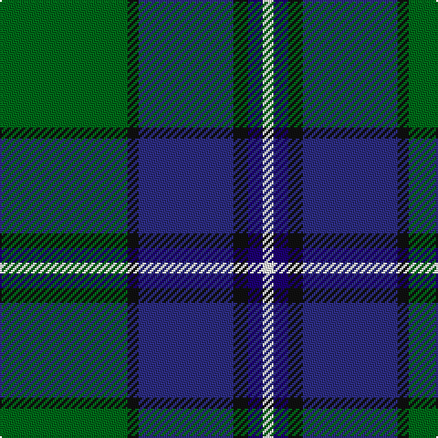

In pattern [GKBKBW](/patterns/gkbkbw/).

This was sourced from tartans-authority.  It is a [6 stripes tartan](/stripes/stripes6/).

Original link http://www.tartansauthority.com/tartan-ferret/display/3813/

## Attestations

This cloth appears in 2 source records; the oldest owns this page.

- 2002 — Pride of Yorkland (Fashion) (tartans-authority, [record](http://www.tartansauthority.com/tartan-ferret/display/3813/))
- undated — Pride of Yorkland (register-of-tartans, [record](https://www.tartanregister.gov.uk/tartanDetails.aspx?ref=5084))

## Register references

External register numbers recorded for this tartan.

- Scottish Register of Tartans: [5084](https://www.tartanregister.gov.uk/tartanDetails.aspx?ref=5084)
- Scottish Tartans Authority (ITI): 3813

## Thread count
G/70 K6 DB52 K8 DBa8 W/6

## Palette
Each colour and its ΔE from the base-6 reference it is a variant of.

| Colour | Shade | Base | ΔE (OKLab) |
|---|---|---|---|
| DB | <code style="background-color:#2C2C80;">#2C2C80</code> `#2C2C80` | B <code style="background-color:#2A418A;">#2A418A</code> | 0.06 |
| DBa | <code style="background-color:#1C0070;">#1C0070</code> `#1C0070` | B <code style="background-color:#2A418A;">#2A418A</code> | 0.14 |
| G | <code style="background-color:#006818;">#006818</code> `#006818` | G <code style="background-color:#006100;">#006100</code> | 0.02 |
| K | <code style="background-color:#101010;">#101010</code> `#101010` | K <code style="background-color:#000000;">#000000</code> | 0.17 |
| W | <code style="background-color:#FCFCFC;">#FCFCFC</code> `#FCFCFC` | W <code style="background-color:#F7F7F7;">#F7F7F7</code> | 0.01 |

# Sample pattern

## Nearest tartans

The nearest existing variants by ΔTartan distance.

1. [Carmichael](/setts/s6/k5g32b32r3b3y3~b2c2c80-g006818-k000000-rc80000-ye8c000~x2/) — ΔT 0.50
1. [Irving of Glentulchan Family Tartan Tartan Number: 1460. Earliest known date: 1987 Glentulchan is situated north of Perth on the river Almond. The sett combines elements of the Irvine and the Malcolm tartans. The design by John Irving, Glenalmond, was accredited by the Scottish Tartans Society in 1987. See products available Copyright © Blair Urquhart, Comrie, 2015](/setts/s6/r1g9b9k1b1w1~b2c2c80-g006818-k101010-rc80000-we0e0e0~x6/) — ΔT 0.64
1. [Gamba (Commemorative)](/setts/s5/g5r3ga30b30w3~b2c2c80-g003820-ga006818-rc80000-wfcfcfc~x2/) — ΔT 0.74
1. [Douglas Clan Tartan Tartan Number: 1032. Earliest known date: 1831 Wilson's sent a list of tartans to Logan about 1830 stating that 'No 148' had been sold as Douglas for a 'considerable' time. Logan included the Douglas tartan even though he said that no family tartans appeared in his book. The distinction between clans and families is obscure. There are many historic references to the 'Border Clans' which would certainly describe the Douglas'. There is also a black and grey sett for the clan which first appeared in the Vestiarium Scoticum in 1842. The present chiefship is vacant on account of the compound surnames of the eligible claimants. Lord Lyon will not recognise 'double barrel' names. See products available Copyright © Blair Urquhart, Comrie, 2015](/setts/s5/k3b3g23b21w2~b2c2c80-g006818-k101010-we0e0e0~x2/) — ΔT 0.77
1. [Snodgrass Family Tartan Tartan Number: 1216. Earliest known date: 1978 Designed for the Snodgrass Clan Association. It is based on the Cunningham tartan, and the colours chosen were, Black, Green and Gold - of the Snodgrass Coat of Arms, Green - for the 'grasy place' (sic) alluded to in the name, and Blue - representing the traditional Highland 'Blue Bonnet'. See products available Copyright © Blair Urquhart, Comrie, 2015](/setts/s8/k3r1y1b11g13b5r1y1~b2c2c80-g006818-k101010-rc80000-ye8c000~x2/) — ΔT 0.81
1. [Irving of Glentulchan](/setts/s6/r1g9b9k1b1w1~b304080-g008000-k000000-rc00000-we0e0e0~x6/) — ΔT 0.84
1. [Wishart Htg (Clan)](/setts/s7/k7b4g31b3y2b27w4~b2c2c80-g004c00-k000000-wc8c8c8-ye8c000~x2/) — ΔT 0.85
1. [MX-5 Owners' Club](/setts/s7/r6b27ba2g2ba2g30w4~b2c2c80-ba2888c4-g006818-rc80000-wfcfcfc~x2/) — ΔT 0.86
1. [Turnbull Hunting (1983) #2](/setts/s5/k2y1g10b10w1~b2c2c80-g006818-k101010-wfcfcfc-ye8c000~x6/) — ΔT 0.87
1. [Ednie (Personal)](/setts/s7/b11k4g4r1g4k1ra1~b1474b4-g006818-k101010-rb468ac-rac80000~x4/) — ΔT 0.87

## Neighbour map

Every grey dot is one of 15726 variants placed by the first two principal components of the ΔTartan feature space (44% of its variance). Red is this tartan; blue dots are its nearest — click one to open its page.

<svg viewBox="0 0 640 380" role="img" style="max-width:100%;height:auto;border:1px solid #e0e0e0;border-radius:4px;display:block" xmlns="http://www.w3.org/2000/svg"><image href="/nn/cloud.v1.png" width="640" height="380"/><a href="/setts/s6/k5g32b32r3b3y3~b2c2c80-g006818-k000000-rc80000-ye8c000~x2/"><circle cx="247.5" cy="186.4" r="4" fill="#3465a4"><title>Carmichael</title></circle></a><a href="/setts/s6/r1g9b9k1b1w1~b2c2c80-g006818-k101010-rc80000-we0e0e0~x6/"><circle cx="250.3" cy="194.5" r="4" fill="#3465a4"><title>Irving of Glentulchan Family Tartan Tartan Number: 1460. Earliest known date: 1987 Glentulchan is situated north of Perth on the river Almond. The sett combines elements of the Irvine and the Malcolm tartans. The design by John Irving, Glenalmond, was accredited by the Scottish Tartans Society in 1987. See products available Copyright © Blair Urquhart, Comrie, 2015</title></circle></a><a href="/setts/s5/g5r3ga30b30w3~b2c2c80-g003820-ga006818-rc80000-wfcfcfc~x2/"><circle cx="233.1" cy="207.1" r="4" fill="#3465a4"><title>Gamba (Commemorative)</title></circle></a><a href="/setts/s5/k3b3g23b21w2~b2c2c80-g006818-k101010-we0e0e0~x2/"><circle cx="255.4" cy="208.2" r="4" fill="#3465a4"><title>Douglas Clan Tartan Tartan Number: 1032. Earliest known date: 1831 Wilson's sent a list of tartans to Logan about 1830 stating that 'No 148' had been sold as Douglas for a 'considerable' time. Logan included the Douglas tartan even though he said that no family tartans appeared in his book. The distinction between clans and families is obscure. There are many historic references to the 'Border Clans' which would certainly describe the Douglas'. There is also a black and grey sett for the clan which first appeared in the Vestiarium Scoticum in 1842. The present chiefship is vacant on account of the compound surnames of the eligible claimants. Lord Lyon will not recognise 'double barrel' names. See products available Copyright © Blair Urquhart, Comrie, 2015</title></circle></a><a href="/setts/s8/k3r1y1b11g13b5r1y1~b2c2c80-g006818-k101010-rc80000-ye8c000~x2/"><circle cx="237.9" cy="167.3" r="4" fill="#3465a4"><title>Snodgrass Family Tartan Tartan Number: 1216. Earliest known date: 1978 Designed for the Snodgrass Clan Association. It is based on the Cunningham tartan, and the colours chosen were, Black, Green and Gold - of the Snodgrass Coat of Arms, Green - for the 'grasy place' (sic) alluded to in the name, and Blue - representing the traditional Highland 'Blue Bonnet'. See products available Copyright © Blair Urquhart, Comrie, 2015</title></circle></a><a href="/setts/s6/r1g9b9k1b1w1~b304080-g008000-k000000-rc00000-we0e0e0~x6/"><circle cx="236.1" cy="188.9" r="4" fill="#3465a4"><title>Irving of Glentulchan</title></circle></a><a href="/setts/s7/k7b4g31b3y2b27w4~b2c2c80-g004c00-k000000-wc8c8c8-ye8c000~x2/"><circle cx="243.3" cy="166.8" r="4" fill="#3465a4"><title>Wishart Htg (Clan)</title></circle></a><a href="/setts/s7/r6b27ba2g2ba2g30w4~b2c2c80-ba2888c4-g006818-rc80000-wfcfcfc~x2/"><circle cx="239.7" cy="156.5" r="4" fill="#3465a4"><title>MX-5 Owners' Club</title></circle></a><a href="/setts/s5/k2y1g10b10w1~b2c2c80-g006818-k101010-wfcfcfc-ye8c000~x6/"><circle cx="212.1" cy="203.0" r="4" fill="#3465a4"><title>Turnbull Hunting (1983) #2</title></circle></a><a href="/setts/s7/b11k4g4r1g4k1ra1~b1474b4-g006818-k101010-rb468ac-rac80000~x4/"><circle cx="209.7" cy="190.0" r="4" fill="#3465a4"><title>Ednie (Personal)</title></circle></a><circle cx="249.3" cy="185.0" r="5" fill="#c00000"/></svg>

ID: /setts/s6/g35k3b26k4ba4w3~b2c2c80-ba1c0070-g006818-k101010-wfcfcfc~x2/
