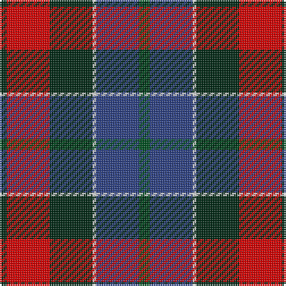

In pattern [GBWGRG](/patterns/gbwgrg/).

This was sourced from register-of-tartans.  It is a [6 stripes tartan](/stripes/stripes6/).

Original link https://www.tartanregister.gov.uk/tartanDetails.aspx?ref=3303

## Thread count
DG/4 R24 DG24 LN2 B24 G/6

## Palette
Each colour and its ΔE from the base-6 reference it is a variant of.

| Colour | Shade | Base | ΔE (OKLab) |
|---|---|---|---|
| B | <code style="background-color:#2C4084;">#2C4084</code> `#2C4084` | B <code style="background-color:#2A418A;">#2A418A</code> | 0.01 |
| DG | <code style="background-color:#002814;">#002814</code> `#002814` | G <code style="background-color:#006100;">#006100</code> | 0.20 |
| G | <code style="background-color:#005020;">#005020</code> `#005020` | G <code style="background-color:#006100;">#006100</code> | 0.07 |
| LN | <code style="background-color:#E0E0E0;">#E0E0E0</code> `#E0E0E0` | W <code style="background-color:#F7F7F7;">#F7F7F7</code> | 0.07 |
| R | <code style="background-color:#DC0000;">#DC0000</code> `#DC0000` | R <code style="background-color:#CC0000;">#CC0000</code> | 0.03 |

# Sample pattern

## Nearest tartans

The nearest existing variants by ΔTartan distance.

1. [Patterson, John (Personal)](/setts/s6/g3b12w1ga12r12ga2x2~b2c2c80-g006818-ga003820-rc80000-wfcfcfc/) — ΔT 0.28
1. [Patterson, John](/setts/s6/g3b12w1ga12r12ga2x2~b304080-g008000-ga003000-rc00000-we0e0e0/) — ΔT 0.50
1. [St. Clement of Rome (Corporate)](/setts/s8/b18k5r26k5g25k5b18y2x2~b202060-g006818-k101010-rc80000-ye8c000/) — ΔT 0.70
1. [Canine All Dogs (Fashion)](/setts/s6/r10b6g24ba24r6y3~b2c2c80-ba1c1c50-g006818-rc80000-ye8c000/) — ΔT 0.82
1. [Commonwealth Games Council (Corp.)](/setts/s6/r3k17b11r2ra20w2x2~b484848-k101010-rb468ac-ra888888-we0e0e0/) — ΔT 0.88
1. [Kilgour (Asymmetrical)](/setts/s8/b6k3r14k3g14k3b6y1x4~b2c2c80-g006818-k101010-rc80000-ye8c000/) — ΔT 0.89
1. [Kilgour (Cant)](/setts/s8/b6y1b6k3r14k3g14k3x4~b2c2c80-g006818-k101010-rc80000-ye8c000/) — ΔT 0.89
1. [Kilgour (Symmetrical)](/setts/s8/b6k3g14k3r14k3b6y1x4~b2c2c80-g006818-k101010-rc80000-ye8c000/) — ΔT 0.89
1. [Gold Brothers](/setts/s6/b6g27b3k19ba27w3x2~b2c2c80-ba780078-g006818-k101010-wf8f8f8/) — ΔT 0.89
1. [Dunbog Primary School Corporate Tartan Tartan Number: 954. Earliest known date: 1985 C. Armstrong is a pupil at the school. See products available Copyright © Blair Urquhart, Comrie, 2015](/setts/s6/r12b3g5ba16y2g2x2~b2c2c80-ba202060-g006818-rc80000-ye8c000/) — ΔT 0.93

## Neighbour map

Every grey dot is one of 15726 variants placed by the first two principal components of the ΔTartan feature space (44% of its variance). Red is this tartan; blue dots are its nearest — click one to open its page.

<svg viewBox="0 0 640 380" role="img" style="max-width:100%;height:auto;border:1px solid #e0e0e0;border-radius:4px;display:block" xmlns="http://www.w3.org/2000/svg"><image href="/nn/cloud.v1.png" width="640" height="380"/><a href="/setts/s6/g3b12w1ga12r12ga2x2~b2c2c80-g006818-ga003820-rc80000-wfcfcfc/"><circle cx="166.8" cy="197.2" r="4" fill="#3465a4"><title>Patterson, John (Personal)</title></circle></a><a href="/setts/s6/g3b12w1ga12r12ga2x2~b304080-g008000-ga003000-rc00000-we0e0e0/"><circle cx="167.4" cy="198.1" r="4" fill="#3465a4"><title>Patterson, John</title></circle></a><a href="/setts/s8/b18k5r26k5g25k5b18y2x2~b202060-g006818-k101010-rc80000-ye8c000/"><circle cx="156.4" cy="182.5" r="4" fill="#3465a4"><title>St. Clement of Rome (Corporate)</title></circle></a><a href="/setts/s6/r10b6g24ba24r6y3~b2c2c80-ba1c1c50-g006818-rc80000-ye8c000/"><circle cx="139.5" cy="211.7" r="4" fill="#3465a4"><title>Canine All Dogs (Fashion)</title></circle></a><a href="/setts/s6/r3k17b11r2ra20w2x2~b484848-k101010-rb468ac-ra888888-we0e0e0/"><circle cx="157.4" cy="190.0" r="4" fill="#3465a4"><title>Commonwealth Games Council (Corp.)</title></circle></a><a href="/setts/s8/b6k3r14k3g14k3b6y1x4~b2c2c80-g006818-k101010-rc80000-ye8c000/"><circle cx="134.4" cy="171.3" r="4" fill="#3465a4"><title>Kilgour (Asymmetrical)</title></circle></a><a href="/setts/s8/b6y1b6k3r14k3g14k3x4~b2c2c80-g006818-k101010-rc80000-ye8c000/"><circle cx="134.4" cy="171.3" r="4" fill="#3465a4"><title>Kilgour (Cant)</title></circle></a><a href="/setts/s8/b6k3g14k3r14k3b6y1x4~b2c2c80-g006818-k101010-rc80000-ye8c000/"><circle cx="134.4" cy="171.3" r="4" fill="#3465a4"><title>Kilgour (Symmetrical)</title></circle></a><a href="/setts/s6/b6g27b3k19ba27w3x2~b2c2c80-ba780078-g006818-k101010-wf8f8f8/"><circle cx="137.9" cy="204.2" r="4" fill="#3465a4"><title>Gold Brothers</title></circle></a><a href="/setts/s6/r12b3g5ba16y2g2x2~b2c2c80-ba202060-g006818-rc80000-ye8c000/"><circle cx="178.3" cy="198.5" r="4" fill="#3465a4"><title>Dunbog Primary School Corporate Tartan Tartan Number: 954. Earliest known date: 1985 C. Armstrong is a pupil at the school. See products available Copyright © Blair Urquhart, Comrie, 2015</title></circle></a><circle cx="161.0" cy="194.0" r="5" fill="#c00000"/></svg>

ID: /setts/s6/g3b12w1ga12r12ga2x2~b2c4084-g005020-ga002814-rdc0000-we0e0e0/
