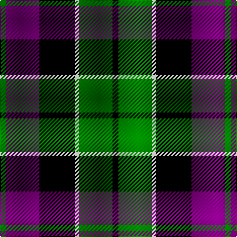

In pattern [GBKWGK](/patterns/gbkwgk/).

This was sourced from weddslist.  It is a [6 stripes tartan](/stripes/stripes6/).

Original link http://www.weddslist.com/cgi-bin/tartans/pg.pl?source=sts

## Thread count
G/6 P34 K36 LN4 G34 K/6

## Palette
Each colour and its ΔE from the base-6 reference it is a variant of.

| Colour | Shade | Base | ΔE (OKLab) |
|---|---|---|---|
| G | <code style="background-color:#008000;">#008000</code> `#008000` | G <code style="background-color:#006100;">#006100</code> | 0.10 |
| K | <code style="background-color:#000000;">#000000</code> `#000000` | K <code style="background-color:#000000;">#000000</code> | 0.00 |
| LN | <code style="background-color:#E0E0E0;">#E0E0E0</code> `#E0E0E0` | W <code style="background-color:#F7F7F7;">#F7F7F7</code> | 0.07 |
| P | <code style="background-color:#800080;">#800080</code> `#800080` | B <code style="background-color:#2A418A;">#2A418A</code> | 0.17 |

# Sample pattern

## Nearest tartans

The nearest existing variants by ΔTartan distance.

1. [Wilson's, No 100](/setts/s6/g3b17k18y2g17k3~b800080-g008000-k000000-yf0c000~x2/) — ΔT 0.12
1. [Gordon of Esslemont](/setts/s7/y6g3y3g22k23b23k4~b800080-g008000-k000000-yf0c000~x2/) — ΔT 0.74
1. [Wilson's No 158](/setts/s6/g21w2g4k17b14k3~b800080-g008000-k000000-we0e0e0~x2/) — ΔT 0.75
1. [Wilson's, No 150 "Coburg"](/setts/s6/g18b2g4k14ba12k3~b5480b0-ba800080-g008000-k000000~x2/) — ΔT 0.78
1. [United Distillers (Corporate)](/setts/s6/r2k14r1ka14r14y2~k000000-ka101010-r948860-ye8c000~x2/) — ΔT 0.83
1. [Baillie](/setts/s7/b3k1b8k6g8k1w2~b800080-g008000-k000000-we0e0e0~x2/) — ΔT 0.85
1. [Wilson's, No 160](/setts/s6/g21y2g4k16b14k3~b800080-g008000-k000000-yf0c000~x2/) — ΔT 0.85
1. [Fletcher of Dunans](/setts/s7/b6k1b6k8r1g8r2~b304080-g008000-k000000-rc00000~x2/) — ΔT 0.89
1. [MacKay, Plaid](/setts/s6/g14b82g9k80g80k14~b800080-g008000-k000000/) — ΔT 0.89
1. [MacNeil 1](/setts/s6/w1b9k9g9k2w1~b304080-g008000-k000000-we0e0e0~x4/) — ΔT 0.90

## Neighbour map

Every grey dot is one of 15726 variants placed by the first two principal components of the ΔTartan feature space (44% of its variance). Red is this tartan; blue dots are its nearest — click one to open its page.

<svg viewBox="0 0 640 380" role="img" style="max-width:100%;height:auto;border:1px solid #e0e0e0;border-radius:4px;display:block" xmlns="http://www.w3.org/2000/svg"><image href="/nn/cloud.v1.png" width="640" height="380"/><a href="/setts/s6/g3b17k18y2g17k3~b800080-g008000-k000000-yf0c000~x2/"><circle cx="152.5" cy="214.8" r="4" fill="#3465a4"><title>Wilson's, No 100</title></circle></a><a href="/setts/s7/y6g3y3g22k23b23k4~b800080-g008000-k000000-yf0c000~x2/"><circle cx="119.0" cy="203.8" r="4" fill="#3465a4"><title>Gordon of Esslemont</title></circle></a><a href="/setts/s6/g21w2g4k17b14k3~b800080-g008000-k000000-we0e0e0~x2/"><circle cx="178.7" cy="210.7" r="4" fill="#3465a4"><title>Wilson's No 158</title></circle></a><a href="/setts/s6/g18b2g4k14ba12k3~b5480b0-ba800080-g008000-k000000~x2/"><circle cx="173.6" cy="222.1" r="4" fill="#3465a4"><title>Wilson's, No 150 &quot;Coburg&quot;</title></circle></a><a href="/setts/s6/r2k14r1ka14r14y2~k000000-ka101010-r948860-ye8c000~x2/"><circle cx="176.7" cy="194.8" r="4" fill="#3465a4"><title>United Distillers (Corporate)</title></circle></a><a href="/setts/s7/b3k1b8k6g8k1w2~b800080-g008000-k000000-we0e0e0~x2/"><circle cx="145.2" cy="209.9" r="4" fill="#3465a4"><title>Baillie</title></circle></a><a href="/setts/s6/g21y2g4k16b14k3~b800080-g008000-k000000-yf0c000~x2/"><circle cx="181.8" cy="211.0" r="4" fill="#3465a4"><title>Wilson's, No 160</title></circle></a><a href="/setts/s7/b6k1b6k8r1g8r2~b304080-g008000-k000000-rc00000~x2/"><circle cx="143.6" cy="227.6" r="4" fill="#3465a4"><title>Fletcher of Dunans</title></circle></a><a href="/setts/s6/g14b82g9k80g80k14~b800080-g008000-k000000/"><circle cx="186.8" cy="233.0" r="4" fill="#3465a4"><title>MacKay, Plaid</title></circle></a><a href="/setts/s6/w1b9k9g9k2w1~b304080-g008000-k000000-we0e0e0~x4/"><circle cx="142.4" cy="217.5" r="4" fill="#3465a4"><title>MacNeil 1</title></circle></a><circle cx="151.5" cy="214.5" r="5" fill="#c00000"/></svg>

ID: /setts/s6/g3b17k18w2g17k3~b800080-g008000-k000000-we0e0e0~x2/
