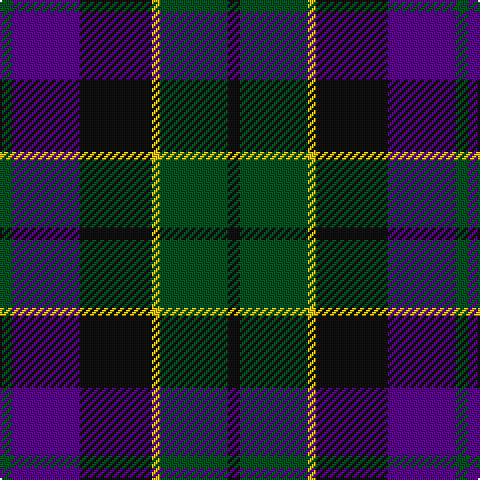

In pattern [GBKYGK](/patterns/gbkygk/).

This was sourced from register-of-tartans.  It is a [6 stripes tartan](/stripes/stripes6/).

Original link https://www.tartanregister.gov.uk/tartanDetails.aspx?ref=4674

## Thread count
G/6 P34 K36 Y4 G34 K/6

## Palette
Each colour and its ΔE from the base-6 reference it is a variant of.

| Colour | Shade | Base | ΔE (OKLab) |
|---|---|---|---|
| G | <code style="background-color:#005020;">#005020</code> `#005020` | G <code style="background-color:#006100;">#006100</code> | 0.07 |
| K | <code style="background-color:#101010;">#101010</code> `#101010` | K <code style="background-color:#000000;">#000000</code> | 0.17 |
| P | <code style="background-color:#5A008C;">#5A008C</code> `#5A008C` | B <code style="background-color:#2A418A;">#2A418A</code> | 0.13 |
| Y | <code style="background-color:#E8C000;">#E8C000</code> `#E8C000` | Y <code style="background-color:#F2BF00;">#F2BF00</code> | 0.02 |

# Sample pattern

## Nearest tartans

The nearest existing variants by ΔTartan distance.

1. [Fletcher of Dunans Clan Tartan Tartan Number: 272. Earliest known date: 1906 The Fletchers of Dunans tartan is distinguished by a red stripe in place of the more usual black. Fletchers were arrow makers associated with the Stewarts and Campbells in Argyll and with the MacGregors in Perthshire. See products available Copyright © Blair Urquhart, Comrie, 2015](/setts/s7/b6k1b6k8r1g8r2~b2c2c80-g006818-k101010-rc80000~x2/) — ΔT 0.67
1. [Unnamed 19th Century Plaid](/setts/s7/g8b1g1k6ba6k1ba3~b5c8ca8-ba440044-g006818-k101010~x4/) — ΔT 0.70
1. [National Galleries of Scotland](/setts/s7/k7g22k22b6r2b15r2~b1c0070-g006818-k101010-rc80000~x2/) — ΔT 0.70
1. [Renfrew](/setts/s7/b6k2b18k18g18k3r2~b2c2c80-g006818-k101010-rc80000~x2/) — ΔT 0.75
1. [Morrison Clan Tartan Tartan Number: 1083. Earliest known date: 1908 The Clan Morrison have strong links with the MacKays and this is evident in the similarity of the tartans. Morrison has an added red stripe. Lord Lyon recorded a new sett in 1968 based on a fragment of Morrison tartan dated 1747. See products available Copyright © Blair Urquhart, Comrie, 2015](/setts/s6/k3g14k14g2b14r3~b2c2c80-g006818-k101010-rc80000~x2/) — ΔT 0.77
1. [Ferguson of Balquhidder #2](/setts/s6/g4b24r3k24g25k4~b2c2c80-g006818-k101010-rc80000~x2/) — ΔT 0.79
1. [Reid and Taylor](/setts/s7/b2k1r1b9k9g10k2~b2c2c80-g006818-k101010-rc80000~x2/) — ΔT 0.81
1. [Blair Clan Tartan Tartan Number: 416. Earliest known date: pre 1963 Described by MacKinlay as a "Modern family sett". See products available Copyright © Blair Urquhart, Comrie, 2015](/setts/s7/b3r1b10k8g10r1g3~b2c2c80-g006818-k101010-rc80000~x4/) — ΔT 0.82
1. [Gunn](/setts/s6/g2b12g1k12g12r2~b1c0070-g006400-k101010-rc80000~x2/) — ΔT 0.82
1. [Gallamore](/setts/s6/k3b14r2k14g14k3~b2c2c80-g006818-k101010-rc80000~x2/) — ΔT 0.84

## Neighbour map

Every grey dot is one of 15726 variants placed by the first two principal components of the ΔTartan feature space (44% of its variance). Red is this tartan; blue dots are its nearest — click one to open its page.

<svg viewBox="0 0 640 380" role="img" style="max-width:100%;height:auto;border:1px solid #e0e0e0;border-radius:4px;display:block" xmlns="http://www.w3.org/2000/svg"><image href="/nn/cloud.v1.png" width="640" height="380"/><a href="/setts/s7/b6k1b6k8r1g8r2~b2c2c80-g006818-k101010-rc80000~x2/"><circle cx="185.4" cy="242.3" r="4" fill="#3465a4"><title>Fletcher of Dunans Clan Tartan Tartan Number: 272. Earliest known date: 1906 The Fletchers of Dunans tartan is distinguished by a red stripe in place of the more usual black. Fletchers were arrow makers associated with the Stewarts and Campbells in Argyll and with the MacGregors in Perthshire. See products available Copyright © Blair Urquhart, Comrie, 2015</title></circle></a><a href="/setts/s7/g8b1g1k6ba6k1ba3~b5c8ca8-ba440044-g006818-k101010~x4/"><circle cx="200.3" cy="236.9" r="4" fill="#3465a4"><title>Unnamed 19th Century Plaid</title></circle></a><a href="/setts/s7/k7g22k22b6r2b15r2~b1c0070-g006818-k101010-rc80000~x2/"><circle cx="215.2" cy="224.7" r="4" fill="#3465a4"><title>National Galleries of Scotland</title></circle></a><a href="/setts/s7/b6k2b18k18g18k3r2~b2c2c80-g006818-k101010-rc80000~x2/"><circle cx="216.1" cy="233.0" r="4" fill="#3465a4"><title>Renfrew</title></circle></a><a href="/setts/s6/k3g14k14g2b14r3~b2c2c80-g006818-k101010-rc80000~x2/"><circle cx="180.0" cy="251.8" r="4" fill="#3465a4"><title>Morrison Clan Tartan Tartan Number: 1083. Earliest known date: 1908 The Clan Morrison have strong links with the MacKays and this is evident in the similarity of the tartans. Morrison has an added red stripe. Lord Lyon recorded a new sett in 1968 based on a fragment of Morrison tartan dated 1747. See products available Copyright © Blair Urquhart, Comrie, 2015</title></circle></a><a href="/setts/s6/g4b24r3k24g25k4~b2c2c80-g006818-k101010-rc80000~x2/"><circle cx="201.1" cy="243.1" r="4" fill="#3465a4"><title>Ferguson of Balquhidder #2</title></circle></a><a href="/setts/s7/b2k1r1b9k9g10k2~b2c2c80-g006818-k101010-rc80000~x2/"><circle cx="218.0" cy="225.9" r="4" fill="#3465a4"><title>Reid and Taylor</title></circle></a><a href="/setts/s7/b3r1b10k8g10r1g3~b2c2c80-g006818-k101010-rc80000~x4/"><circle cx="207.5" cy="229.0" r="4" fill="#3465a4"><title>Blair Clan Tartan Tartan Number: 416. Earliest known date: pre 1963 Described by MacKinlay as a &quot;Modern family sett&quot;. See products available Copyright © Blair Urquhart, Comrie, 2015</title></circle></a><a href="/setts/s6/g2b12g1k12g12r2~b1c0070-g006400-k101010-rc80000~x2/"><circle cx="213.2" cy="226.2" r="4" fill="#3465a4"><title>Gunn</title></circle></a><a href="/setts/s6/k3b14r2k14g14k3~b2c2c80-g006818-k101010-rc80000~x2/"><circle cx="211.1" cy="255.8" r="4" fill="#3465a4"><title>Gallamore</title></circle></a><circle cx="201.3" cy="235.5" r="5" fill="#c00000"/></svg>

ID: /setts/s6/g3b17k18y2g17k3~b5a008c-g005020-k101010-ye8c000~x2/
