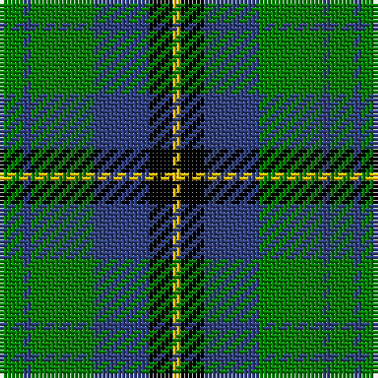

In pattern [GBGBKY](/patterns/gbgbky/).

This was sourced from weddslist.  It is a [6 stripes tartan](/stripes/stripes6/).

Original link http://www.weddslist.com/cgi-bin/tartans/pg.pl?source=sts

## Thread count
G/6 B2 G16 B14 K6 Y/2

## Palette
Each colour and its ΔE from the base-6 reference it is a variant of.

| Colour | Shade | Base | ΔE (OKLab) |
|---|---|---|---|
| B | <code style="background-color:#304080;">#304080</code> `#304080` | B <code style="background-color:#2A418A;">#2A418A</code> | 0.02 |
| G | <code style="background-color:#008000;">#008000</code> `#008000` | G <code style="background-color:#006100;">#006100</code> | 0.10 |
| K | <code style="background-color:#000000;">#000000</code> `#000000` | K <code style="background-color:#000000;">#000000</code> | 0.00 |
| Y | <code style="background-color:#F0C000;">#F0C000</code> `#F0C000` | Y <code style="background-color:#F2BF00;">#F2BF00</code> | 0.00 |

# Sample pattern

## Nearest tartans

The nearest existing variants by ΔTartan distance.

1. [Menteith](/setts/s6/g9w1g6k7b7k1x2~b304080-g008000-k000000-we0e0e0/) — ΔT 0.84
1. [Unnamed 3](/setts/s6/g2b4k6ba1g9k2x2~b8080d0-ba5480b0-g008000-k000000/) — ΔT 0.88
1. [Aiton](/setts/s8/b6k1g3k1b3k1g10r3x2~b304080-g008000-k000000-rc00000/) — ΔT 1.00
1. [Cameron of Lochiel (Hunting)](/setts/s7/r3g10r3g14b16g3y2x2~b1c0070-g006818-rc80000-ye8c000/) — ΔT 1.03
1. [MacKay](/setts/s6/g1b5g1k5g6y1x2~b304080-g008000-k000000-yf0c000/) — ΔT 1.05
1. [Tweedside, hunting](/setts/s9/b21g5k5g15w3g5w3g5k3x2~b304080-g008000-k000000-we0e0e0/) — ΔT 1.07
1. [Wilson's No.079](/setts/s4/k7w1g7b1x2~b5c8ca8-g006818-k101010-wfcfcfc/) — ΔT 1.09
1. [Unidentified #28](/setts/s6/g2b4k6ba1g9k2x2~b0596fa-ba3c82af-g005020-k101010/) — ΔT 1.10
1. [MacCallum](/setts/s7/g8k2b1g4k6ba6k1x2~b5480b0-ba304080-g008000-k000000/) — ΔT 1.11
1. [Graham of Menteith](/setts/s6/g18b2g4k14ba12k3x2~b5480b0-ba304080-g008000-k000000/) — ΔT 1.12

## Neighbour map

Every grey dot is one of 15726 variants placed by the first two principal components of the ΔTartan feature space (44% of its variance). Red is this tartan; blue dots are its nearest — click one to open its page.

<svg viewBox="0 0 640 380" role="img" style="max-width:100%;height:auto;border:1px solid #e0e0e0;border-radius:4px;display:block" xmlns="http://www.w3.org/2000/svg"><image href="/nn/cloud.v1.png" width="640" height="380"/><a href="/setts/s6/g9w1g6k7b7k1x2~b304080-g008000-k000000-we0e0e0/"><circle cx="191.0" cy="237.4" r="4" fill="#3465a4"><title>Menteith</title></circle></a><a href="/setts/s6/g2b4k6ba1g9k2x2~b8080d0-ba5480b0-g008000-k000000/"><circle cx="186.2" cy="224.0" r="4" fill="#3465a4"><title>Unnamed 3</title></circle></a><a href="/setts/s8/b6k1g3k1b3k1g10r3x2~b304080-g008000-k000000-rc00000/"><circle cx="222.0" cy="200.4" r="4" fill="#3465a4"><title>Aiton</title></circle></a><a href="/setts/s7/r3g10r3g14b16g3y2x2~b1c0070-g006818-rc80000-ye8c000/"><circle cx="257.2" cy="225.1" r="4" fill="#3465a4"><title>Cameron of Lochiel (Hunting)</title></circle></a><a href="/setts/s6/g1b5g1k5g6y1x2~b304080-g008000-k000000-yf0c000/"><circle cx="153.3" cy="238.7" r="4" fill="#3465a4"><title>MacKay</title></circle></a><a href="/setts/s9/b21g5k5g15w3g5w3g5k3x2~b304080-g008000-k000000-we0e0e0/"><circle cx="185.3" cy="202.6" r="4" fill="#3465a4"><title>Tweedside, hunting</title></circle></a><a href="/setts/s4/k7w1g7b1x2~b5c8ca8-g006818-k101010-wfcfcfc/"><circle cx="218.6" cy="252.4" r="4" fill="#3465a4"><title>Wilson's No.079</title></circle></a><a href="/setts/s6/g2b4k6ba1g9k2x2~b0596fa-ba3c82af-g005020-k101010/"><circle cx="225.8" cy="240.1" r="4" fill="#3465a4"><title>Unidentified #28</title></circle></a><a href="/setts/s7/g8k2b1g4k6ba6k1x2~b5480b0-ba304080-g008000-k000000/"><circle cx="167.4" cy="231.5" r="4" fill="#3465a4"><title>MacCallum</title></circle></a><a href="/setts/s6/g18b2g4k14ba12k3x2~b5480b0-ba304080-g008000-k000000/"><circle cx="173.8" cy="228.4" r="4" fill="#3465a4"><title>Graham of Menteith</title></circle></a><circle cx="213.7" cy="232.3" r="5" fill="#c00000"/></svg>

ID: /setts/s6/g3b1g8b7k3y1x2~b304080-g008000-k000000-yf0c000/
