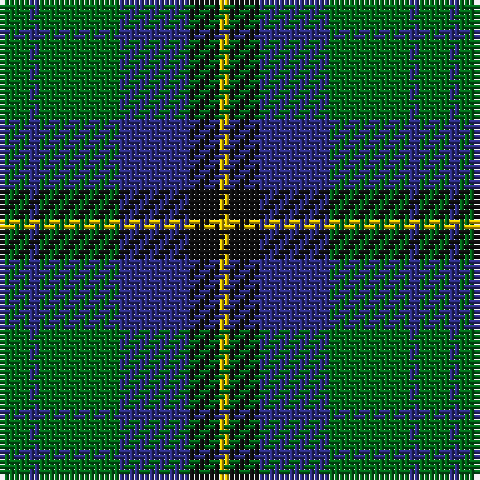

In pattern [GBGBKY](/patterns/gbgbky/).

This was sourced from tartans-authority.  It is a [6 stripes tartan](/stripes/stripes6/).

Original link http://www.tartansauthority.com/tartan-ferret/display/720/

## Attestations

This cloth appears in 3 source records; the oldest owns this page.

- pre 1969 — Trafalgar (Fashion) (tartans-authority, [record](http://www.tartansauthority.com/tartan-ferret/display/720/))
- 01/01/1988 — Trafalgar (register-of-tartans, [record](https://www.tartanregister.gov.uk/tartanDetails.aspx?ref=4145))
- undated — Trafalger Trade Tartan Tartan Number: 720. Earliest known date: pre 2003 per A.C. Lumsden. A Canadian 'Fancy'. See products available Copyright © Blair Urquhart, Comrie, 2015 (house-of-tartan, [record](http://www.house-of-tartan.scotland.net/house/TartanViewjs.asp?colr=Def&tnam=720))

## Register references

External register numbers recorded for this tartan.

- Scottish Register of Tartans: [4145](https://www.tartanregister.gov.uk/tartanDetails.aspx?ref=4145)
- Scottish Tartans Authority (ITI): 720
- Scottish Tartans World Register: 720

## Thread count
G/6 DB2 G16 DB14 K6 Y/2

## Palette
Each colour and its ΔE from the base-6 reference it is a variant of.

| Colour | Shade | Base | ΔE (OKLab) |
|---|---|---|---|
| DB | <code style="background-color:#2C2C80;">#2C2C80</code> `#2C2C80` | B <code style="background-color:#2A418A;">#2A418A</code> | 0.06 |
| G | <code style="background-color:#006818;">#006818</code> `#006818` | G <code style="background-color:#006100;">#006100</code> | 0.02 |
| K | <code style="background-color:#101010;">#101010</code> `#101010` | K <code style="background-color:#000000;">#000000</code> | 0.17 |
| Y | <code style="background-color:#E8C000;">#E8C000</code> `#E8C000` | Y <code style="background-color:#F2BF00;">#F2BF00</code> | 0.02 |

# Sample pattern

## Nearest tartans

The nearest existing variants by ΔTartan distance.

1. [Unidentified #28](/setts/s6/g2b4k6ba1g9k2~b0596fa-ba3c82af-g005020-k101010~x2/) — ΔT 0.53
1. [Menteith District Tartan Tartan Number: 929. Earliest known date: Mid 19th century Menteith lies in the upper reaches of the River Forth. The tartan is similar to the Graham of Mentieth sett recorded by Logan in 1831. The proportions of colours are quite distinct, however, and the azure stipe in the family tartan is replaced by white in the district. The Menteith district tartan was rescued from oblivion in 1941 by Graeme Menteith who wrote to MacGregor-Hastie about it. (STS archives) See products available Copyright © Blair Urquhart, Comrie, 2015](/setts/s6/g9w1g6k7b7k1~b2c2c80-g006818-k101010-we0e0e0~x2/) — ΔT 0.63
1. [Menteith](/setts/s6/g9w1g6k7b7k1~b1c0070-g006818-k101010-wc0c0c0~x4/) — ΔT 0.71
1. [Redland](/setts/s6/g52w7g9k35b35k7~b2c2c80-g006818-k101010-w98c8e8/) — ΔT 0.72
1. [Bethlehem, City of](/setts/s5/b3r10g9ra1g3~b1c0070-g003820-r888888-ra880000~x4/) — ΔT 0.85
1. [Graham of Menteith Clan Tartan Tartan Number: 698. Earliest known date: 1831 Logan describes the broad blue stripe as 'smalt', in his book, 'The Scottish Gael' published in 1831. Smibert also records this sett in 1850. However, in the text for McIan's Costume of the Clans (1845-47), Logan admits that this sett's antiquity is questionable. Menteith is the name given to the western branch of the Graham family. The Menteith District tartan is similar but the azure stripe is white. (See also Montrose, Menteith.) See products available Copyright © Blair Urquhart, Comrie, 2015](/setts/s6/g18b2g4k14ba12k3~b5c8ca8-ba2c2c80-g006818-k101010~x2/) — ΔT 0.86
1. [MacCallum Clan Tartan Tartan Number: 767. Earliest known date: 1893 D. W. Stewart wrote, "It is believed that the family (MacCallum), having lost trace of the old sett 50 or 60 years ago (i.e. 1832 - 1843), had the modern design prepared from the recollection of old people in Argyllshire; but the recovery of the original design shows that considerable deviation had been made." 'Old and Rare Scottish Tartans' recorded just 45 tartans, specially woven in silk, of particular interest or antiquity. Copies of the book are now valuable collectors items. See products available Copyright © Blair Urquhart, Comrie, 2015](/setts/s7/g8k2b1g4k6ba6k1~b5c8ca8-ba2c2c80-g006818-k101010~x2/) — ΔT 0.86
1. [Cameron Hunting Clan Tartan Tartan Number: 1535. Earliest known date: 1956 A document written in Latin of 1689 descibes the Cameron men from Lochaber as being clad in blue and yellow when they followed their great Chief, Sir Ewan Cameron, to battle and victory at Killiecrankie. This new design was evolved in the 1940s by J G MacKay of Portree and first put on show at the Cameron Gathering at Achnacarry in 1956. The original Cameron first appeared in the Vestiarium Scoticum (1842). See products available Copyright © Blair Urquhart, Comrie, 2015](/setts/s7/r3g10r3g14b16g3y2~b2c2c80-g006818-re87878-ye8c000~x2/) — ΔT 0.92
1. [Heritage Tartan, The](/setts/s6/b8r4b24g35w4g8~b1c0070-g006818-r880000-wc0c0c0/) — ΔT 0.95
1. [Blaylock Annandale](/setts/s7/g24b6w3k6b12k15g4~b1f5aba-g10712e-k101010-w9eafdb~x2/) — ΔT 0.95

## Neighbour map

Every grey dot is one of 15726 variants placed by the first two principal components of the ΔTartan feature space (44% of its variance). Red is this tartan; blue dots are its nearest — click one to open its page.

<svg viewBox="0 0 640 380" role="img" style="max-width:100%;height:auto;border:1px solid #e0e0e0;border-radius:4px;display:block" xmlns="http://www.w3.org/2000/svg"><image href="/nn/cloud.v1.png" width="640" height="380"/><a href="/setts/s6/g2b4k6ba1g9k2~b0596fa-ba3c82af-g005020-k101010~x2/"><circle cx="225.8" cy="240.1" r="4" fill="#3465a4"><title>Unidentified #28</title></circle></a><a href="/setts/s6/g9w1g6k7b7k1~b2c2c80-g006818-k101010-we0e0e0~x2/"><circle cx="230.7" cy="251.5" r="4" fill="#3465a4"><title>Menteith District Tartan Tartan Number: 929. Earliest known date: Mid 19th century Menteith lies in the upper reaches of the River Forth. The tartan is similar to the Graham of Mentieth sett recorded by Logan in 1831. The proportions of colours are quite distinct, however, and the azure stipe in the family tartan is replaced by white in the district. The Menteith district tartan was rescued from oblivion in 1941 by Graeme Menteith who wrote to MacGregor-Hastie about it. (STS archives) See products available Copyright © Blair Urquhart, Comrie, 2015</title></circle></a><a href="/setts/s6/g9w1g6k7b7k1~b1c0070-g006818-k101010-wc0c0c0~x4/"><circle cx="229.7" cy="252.1" r="4" fill="#3465a4"><title>Menteith</title></circle></a><a href="/setts/s6/g52w7g9k35b35k7~b2c2c80-g006818-k101010-w98c8e8/"><circle cx="204.1" cy="243.3" r="4" fill="#3465a4"><title>Redland</title></circle></a><a href="/setts/s5/b3r10g9ra1g3~b1c0070-g003820-r888888-ra880000~x4/"><circle cx="253.8" cy="241.2" r="4" fill="#3465a4"><title>Bethlehem, City of</title></circle></a><a href="/setts/s6/g18b2g4k14ba12k3~b5c8ca8-ba2c2c80-g006818-k101010~x2/"><circle cx="224.8" cy="246.5" r="4" fill="#3465a4"><title>Graham of Menteith Clan Tartan Tartan Number: 698. Earliest known date: 1831 Logan describes the broad blue stripe as 'smalt', in his book, 'The Scottish Gael' published in 1831. Smibert also records this sett in 1850. However, in the text for McIan's Costume of the Clans (1845-47), Logan admits that this sett's antiquity is questionable. Menteith is the name given to the western branch of the Graham family. The Menteith District tartan is similar but the azure stripe is white. (See also Montrose, Menteith.) See products available Copyright © Blair Urquhart, Comrie, 2015</title></circle></a><a href="/setts/s7/g8k2b1g4k6ba6k1~b5c8ca8-ba2c2c80-g006818-k101010~x2/"><circle cx="218.8" cy="249.7" r="4" fill="#3465a4"><title>MacCallum Clan Tartan Tartan Number: 767. Earliest known date: 1893 D. W. Stewart wrote, &quot;It is believed that the family (MacCallum), having lost trace of the old sett 50 or 60 years ago (i.e. 1832 - 1843), had the modern design prepared from the recollection of old people in Argyllshire; but the recovery of the original design shows that considerable deviation had been made.&quot; 'Old and Rare Scottish Tartans' recorded just 45 tartans, specially woven in silk, of particular interest or antiquity. Copies of the book are now valuable collectors items. See products available Copyright © Blair Urquhart, Comrie, 2015</title></circle></a><a href="/setts/s7/r3g10r3g14b16g3y2~b2c2c80-g006818-re87878-ye8c000~x2/"><circle cx="264.8" cy="227.3" r="4" fill="#3465a4"><title>Cameron Hunting Clan Tartan Tartan Number: 1535. Earliest known date: 1956 A document written in Latin of 1689 descibes the Cameron men from Lochaber as being clad in blue and yellow when they followed their great Chief, Sir Ewan Cameron, to battle and victory at Killiecrankie. This new design was evolved in the 1940s by J G MacKay of Portree and first put on show at the Cameron Gathering at Achnacarry in 1956. The original Cameron first appeared in the Vestiarium Scoticum (1842). See products available Copyright © Blair Urquhart, Comrie, 2015</title></circle></a><a href="/setts/s6/b8r4b24g35w4g8~b1c0070-g006818-r880000-wc0c0c0/"><circle cx="281.7" cy="227.6" r="4" fill="#3465a4"><title>Heritage Tartan, The</title></circle></a><a href="/setts/s7/g24b6w3k6b12k15g4~b1f5aba-g10712e-k101010-w9eafdb~x2/"><circle cx="185.9" cy="232.7" r="4" fill="#3465a4"><title>Blaylock Annandale</title></circle></a><circle cx="245.7" cy="244.5" r="5" fill="#c00000"/></svg>

ID: /setts/s6/g3b1g8b7k3y1~b2c2c80-g006818-k101010-ye8c000~x2/
