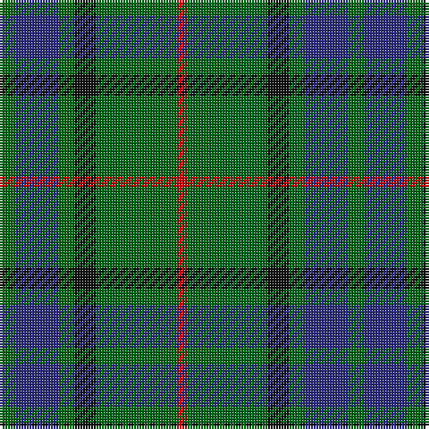

In pattern [GBGKGR](/patterns/gbgkgr/).

This was sourced from house-of-tartan.  It is a [6 stripes tartan](/stripes/stripes6/).

Original link http://www.house-of-tartan.scotland.net/house/TartanViewjs.asp?colr=Def&tnam=709

## Thread count
G/6 DB16 G6 K8 G30 R/4

## Palette
Each colour and its ΔE from the base-6 reference it is a variant of.

| Colour | Shade | Base | ΔE (OKLab) |
|---|---|---|---|
| DB | <code style="background-color:#2C2C80;">#2C2C80</code> `#2C2C80` | B <code style="background-color:#2A418A;">#2A418A</code> | 0.06 |
| G | <code style="background-color:#006818;">#006818</code> `#006818` | G <code style="background-color:#006100;">#006100</code> | 0.02 |
| K | <code style="background-color:#101010;">#101010</code> `#101010` | K <code style="background-color:#000000;">#000000</code> | 0.17 |
| R | <code style="background-color:#C80000;">#C80000</code> `#C80000` | R <code style="background-color:#CC0000;">#CC0000</code> | 0.01 |

# Sample pattern

## Nearest tartans

The nearest existing variants by ΔTartan distance.

1. [Lauder (Family)](/setts/s6/g3b8g3k4g15r2x2~b202060-g006818-k101010-rc80000/) — ΔT 0.18
1. [Wcwm 1045](/setts/s6/g2b8g2k3g12r2x2~b346488-g004c00-k000000-r8c0000/) — ΔT 0.72
1. [Salvation Army Htg (Corporate)](/setts/s7/b5g8k1y2k1g8b4x4~b1c1c50-g285800-k101010-ycca800/) — ΔT 0.76
1. [Glen Nevis #3](/setts/s8/g14r2g2r3g7b12g2ba2x2~b202060-ba4c0000-g006818-r880000/) — ΔT 0.87
1. [Scottish Scouts (1957) (Corporate)](/setts/s7/r3g22b16g14r2g6y2x2~b1c0070-g006818-r880000-yd09800/) — ΔT 1.02
1. [Cameron of Lochiel (Hunting) Clan/Family Tartan Tartan Number: 5351. Earliest known date: 01/01/1940 Design close to Cameron Hunting which has two red lines shown in Vestiarium Scoticum. This design evolved in the 1940s by J G MacKay of Portree and was first put on show at the Cameron Gathering at Achnacarry in 1956. (original STA ref: 1535) See products available Copyright © Blair Urquhart, Comrie, 2015](/setts/s7/r5g20r5g20b24g6y4~b2c2c80-g006818-rc80000-ye8c000/) — ΔT 1.11
1. [Bean of Freeport Htg (Corporate)](/setts/s7/b6r15g41r15b20g41ba6~b003c64-ba1c0070-g006438-rc8002c/) — ΔT 1.11
1. [Duncan Clan Tartan Tartan Number: 1112. Earliest known date: 1906 Duncans and Robertsons share a common ancester, one of the ancient Earls of Atholl, 'Fat Duncan', who led the clan at the Battle of Bannockburn. This sett is also known as Leslie of Wardis or Leslie Hunting, (No. 1113) but Duncan lacks the broad black present in the Leslie Hunting. See products available Copyright © Blair Urquhart, Comrie, 2015](/setts/s6/k4g21w3g21b21r4x2~b2c2c80-g006818-k101010-rc80000-we0e0e0/) — ΔT 1.17
1. [MacIntyre](/setts/s6/g4b12r3b12g32w4x2~b304080-g004010-rc00000-we0e0e0/) — ΔT 1.17
1. [MacKintosh Hunting](/setts/s7/y2g12b6r3g12r4b1x2~b000052-g11450d-raa0000-yaaaa00/) — ΔT 1.17

## Neighbour map

Every grey dot is one of 15726 variants placed by the first two principal components of the ΔTartan feature space (44% of its variance). Red is this tartan; blue dots are its nearest — click one to open its page.

<svg viewBox="0 0 640 380" role="img" style="max-width:100%;height:auto;border:1px solid #e0e0e0;border-radius:4px;display:block" xmlns="http://www.w3.org/2000/svg"><image href="/nn/cloud.v1.png" width="640" height="380"/><a href="/setts/s6/g3b8g3k4g15r2x2~b202060-g006818-k101010-rc80000/"><circle cx="326.7" cy="250.4" r="4" fill="#3465a4"><title>Lauder (Family)</title></circle></a><a href="/setts/s6/g2b8g2k3g12r2x2~b346488-g004c00-k000000-r8c0000/"><circle cx="291.7" cy="255.7" r="4" fill="#3465a4"><title>Wcwm 1045</title></circle></a><a href="/setts/s7/b5g8k1y2k1g8b4x4~b1c1c50-g285800-k101010-ycca800/"><circle cx="293.1" cy="248.7" r="4" fill="#3465a4"><title>Salvation Army Htg (Corporate)</title></circle></a><a href="/setts/s8/g14r2g2r3g7b12g2ba2x2~b202060-ba4c0000-g006818-r880000/"><circle cx="320.3" cy="236.6" r="4" fill="#3465a4"><title>Glen Nevis #3</title></circle></a><a href="/setts/s7/r3g22b16g14r2g6y2x2~b1c0070-g006818-r880000-yd09800/"><circle cx="363.4" cy="225.6" r="4" fill="#3465a4"><title>Scottish Scouts (1957) (Corporate)</title></circle></a><a href="/setts/s7/r5g20r5g20b24g6y4~b2c2c80-g006818-rc80000-ye8c000/"><circle cx="261.8" cy="246.6" r="4" fill="#3465a4"><title>Cameron of Lochiel (Hunting) Clan/Family Tartan Tartan Number: 5351. Earliest known date: 01/01/1940 Design close to Cameron Hunting which has two red lines shown in Vestiarium Scoticum. This design evolved in the 1940s by J G MacKay of Portree and was first put on show at the Cameron Gathering at Achnacarry in 1956. (original STA ref: 1535) See products available Copyright © Blair Urquhart, Comrie, 2015</title></circle></a><a href="/setts/s7/b6r15g41r15b20g41ba6~b003c64-ba1c0070-g006438-rc8002c/"><circle cx="303.3" cy="254.2" r="4" fill="#3465a4"><title>Bean of Freeport Htg (Corporate)</title></circle></a><a href="/setts/s6/k4g21w3g21b21r4x2~b2c2c80-g006818-k101010-rc80000-we0e0e0/"><circle cx="263.8" cy="233.1" r="4" fill="#3465a4"><title>Duncan Clan Tartan Tartan Number: 1112. Earliest known date: 1906 Duncans and Robertsons share a common ancester, one of the ancient Earls of Atholl, 'Fat Duncan', who led the clan at the Battle of Bannockburn. This sett is also known as Leslie of Wardis or Leslie Hunting, (No. 1113) but Duncan lacks the broad black present in the Leslie Hunting. See products available Copyright © Blair Urquhart, Comrie, 2015</title></circle></a><a href="/setts/s6/g4b12r3b12g32w4x2~b304080-g004010-rc00000-we0e0e0/"><circle cx="320.7" cy="223.1" r="4" fill="#3465a4"><title>MacIntyre</title></circle></a><a href="/setts/s7/y2g12b6r3g12r4b1x2~b000052-g11450d-raa0000-yaaaa00/"><circle cx="332.5" cy="224.8" r="4" fill="#3465a4"><title>MacKintosh Hunting</title></circle></a><circle cx="326.0" cy="249.6" r="5" fill="#c00000"/></svg>

ID: /setts/s6/g3b8g3k4g15r2x2~b2c2c80-g006818-k101010-rc80000/
