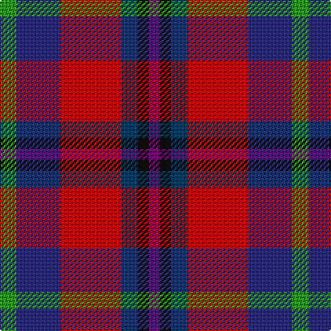

In pattern [BKBRBG](/patterns/bkbrbg/).

This was sourced from tartans-authority.  It is a [6 stripes tartan](/stripes/stripes6/).

Original link http://www.tartansauthority.com/tartan-ferret/display/7870/

## Attestations

This cloth appears in 2 source records; the oldest owns this page.

- pre 2009 — Nicolson of Tiree & Coll (Clan) (tartans-authority, [record](http://www.tartansauthority.com/tartan-ferret/display/7870/))
- undated — Nicolson of Tiree & Coll (register-of-tartans, [record](https://www.tartanregister.gov.uk/tartanDetails.aspx?ref=5817))

## Thread count
G/12 DB32 R44 DBa12 K8 P/8

## Palette
Each colour and its ΔE from the base-6 reference it is a variant of.

| Colour | Shade | Base | ΔE (OKLab) |
|---|---|---|---|
| DB | <code style="background-color:#2C2C80;">#2C2C80</code> `#2C2C80` | B <code style="background-color:#2A418A;">#2A418A</code> | 0.06 |
| DBa | <code style="background-color:#003C64;">#003C64</code> `#003C64` | B <code style="background-color:#2A418A;">#2A418A</code> | 0.08 |
| G | <code style="background-color:#289C18;">#289C18</code> `#289C18` | G <code style="background-color:#006100;">#006100</code> | 0.19 |
| K | <code style="background-color:#101010;">#101010</code> `#101010` | K <code style="background-color:#000000;">#000000</code> | 0.17 |
| P | <code style="background-color:#780078;">#780078</code> `#780078` | B <code style="background-color:#2A418A;">#2A418A</code> | 0.17 |
| R | <code style="background-color:#C80000;">#C80000</code> `#C80000` | R <code style="background-color:#CC0000;">#CC0000</code> | 0.01 |

# Sample pattern

## Nearest tartans

The nearest existing variants by ΔTartan distance.

1. [Nicolson of Lewis (Clan?)](/setts/s6/b3ba5bb2g5r11w3~b344054-ba003c64-bb5c5c5c-g003820-rc80000-we0e0e0~x4/) — ΔT 0.90
1. [Ryan/Fehder (Personal)](/setts/s6/w4r7y5b13ra18g3~b296ca0-g20561c-rc23d2c-ra71190b-wffffff-yc29339~x2/) — ΔT 1.09
1. [Feis An Eilein](/setts/s7/g2r9b8ra4b8ga2y2~b2c4084-g808080-ga005020-rdc0000-ra781c38-ye8c000~x8/) — ΔT 1.10
1. [Feis An Eilein (Corporate)](/setts/s7/w2r9b8ra4b8g2y2~b2c2c80-g006818-rc80000-ra880000-w98c8e8-ye8c000~x4/) — ΔT 1.12
1. [Lord's Own Highlanders (Corporate)](/setts/s6/w5r20k8ra5b36y5~b501850-k101010-r888888-rac80000-we0e0e0-ybc8c00~x2/) — ΔT 1.15
1. [Sustainability (Fashion)](/setts/s8/b20k3g18r12ba4r12b15y4~b2c2c80-ba2888c4-g006818-k101010-rc80000-ye8c000~x2/) — ΔT 1.26
1. [Dunbog Primary School Corporate Tartan Tartan Number: 954. Earliest known date: 1985 C. Armstrong is a pupil at the school. See products available Copyright © Blair Urquhart, Comrie, 2015](/setts/s6/r12b3g5ba16y2g2~b2c2c80-ba202060-g006818-rc80000-ye8c000~x2/) — ΔT 1.29
1. [Galway County Crest (Fashion)](/setts/s9/r10b5ba15k3ba15k5ra25k3w4~b2888c4-ba2c2c80-k101010-r888888-ra880000-we0e0e0~x2/) — ΔT 1.35
1. [Lanark (Fashion #1)](/setts/s6/r1b3ba1g3ba5w1~b202060-ba680028-g006818-ra00000-wa8ace8~x4/) — ΔT 1.36
1. [Eichelberger (Perrsonal)](/setts/s7/k20r6y3b24g3r8w4~b2c2c80-g006818-k101010-rc80000-we0e0e0-yfccc00~x2/) — ΔT 1.39

## Neighbour map

Every grey dot is one of 15726 variants placed by the first two principal components of the ΔTartan feature space (44% of its variance). Red is this tartan; blue dots are its nearest — click one to open its page.

<svg viewBox="0 0 640 380" role="img" style="max-width:100%;height:auto;border:1px solid #e0e0e0;border-radius:4px;display:block" xmlns="http://www.w3.org/2000/svg"><image href="/nn/cloud.v1.png" width="640" height="380"/><a href="/setts/s6/b3ba5bb2g5r11w3~b344054-ba003c64-bb5c5c5c-g003820-rc80000-we0e0e0~x4/"><circle cx="97.9" cy="206.2" r="4" fill="#3465a4"><title>Nicolson of Lewis (Clan?)</title></circle></a><a href="/setts/s6/w4r7y5b13ra18g3~b296ca0-g20561c-rc23d2c-ra71190b-wffffff-yc29339~x2/"><circle cx="101.0" cy="199.2" r="4" fill="#3465a4"><title>Ryan/Fehder (Personal)</title></circle></a><a href="/setts/s7/g2r9b8ra4b8ga2y2~b2c4084-g808080-ga005020-rdc0000-ra781c38-ye8c000~x8/"><circle cx="150.9" cy="218.4" r="4" fill="#3465a4"><title>Feis An Eilein</title></circle></a><a href="/setts/s7/w2r9b8ra4b8g2y2~b2c2c80-g006818-rc80000-ra880000-w98c8e8-ye8c000~x4/"><circle cx="135.9" cy="212.5" r="4" fill="#3465a4"><title>Feis An Eilein (Corporate)</title></circle></a><a href="/setts/s6/w5r20k8ra5b36y5~b501850-k101010-r888888-rac80000-we0e0e0-ybc8c00~x2/"><circle cx="177.1" cy="176.1" r="4" fill="#3465a4"><title>Lord's Own Highlanders (Corporate)</title></circle></a><a href="/setts/s8/b20k3g18r12ba4r12b15y4~b2c2c80-ba2888c4-g006818-k101010-rc80000-ye8c000~x2/"><circle cx="119.2" cy="200.7" r="4" fill="#3465a4"><title>Sustainability (Fashion)</title></circle></a><a href="/setts/s6/r12b3g5ba16y2g2~b2c2c80-ba202060-g006818-rc80000-ye8c000~x2/"><circle cx="178.3" cy="198.5" r="4" fill="#3465a4"><title>Dunbog Primary School Corporate Tartan Tartan Number: 954. Earliest known date: 1985 C. Armstrong is a pupil at the school. See products available Copyright © Blair Urquhart, Comrie, 2015</title></circle></a><a href="/setts/s9/r10b5ba15k3ba15k5ra25k3w4~b2888c4-ba2c2c80-k101010-r888888-ra880000-we0e0e0~x2/"><circle cx="121.9" cy="169.4" r="4" fill="#3465a4"><title>Galway County Crest (Fashion)</title></circle></a><a href="/setts/s6/r1b3ba1g3ba5w1~b202060-ba680028-g006818-ra00000-wa8ace8~x4/"><circle cx="179.3" cy="242.6" r="4" fill="#3465a4"><title>Lanark (Fashion #1)</title></circle></a><a href="/setts/s7/k20r6y3b24g3r8w4~b2c2c80-g006818-k101010-rc80000-we0e0e0-yfccc00~x2/"><circle cx="114.9" cy="168.1" r="4" fill="#3465a4"><title>Eichelberger (Perrsonal)</title></circle></a><circle cx="126.5" cy="202.0" r="5" fill="#c00000"/></svg>

ID: /setts/s6/g3b8r11ba3k2bb2~b2c2c80-ba003c64-bb780078-g289c18-k101010-rc80000~x4/
