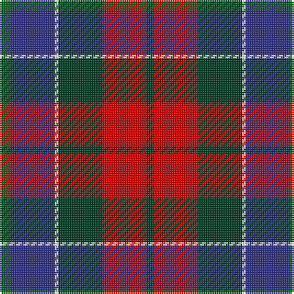

In pattern [GBWGRG](/stripes/gbwgrg/).

This was sourced from tartans-authority.  It is a [6 stripe tartan](/stripes/stripes6/).

Original link http://www.tartansauthority.com/tartan-ferret/display/2191/

## Attestations

This cloth appears in 2 source records; the oldest owns this page.

- 1993 — Patterson, John (Personal) (tartans-authority, [record](http://www.tartansauthority.com/tartan-ferret/display/2191/))
- undated — Patterson, John (weddslist, [record](http://www.weddslist.com/cgi-bin/tartans/pg.pl?source=sts))

## Thread count
G/6 DB24 W2 DG24 R24 DG/4

## Palette
Each colour and the base-6 reference it is a variant of.

| Colour | Shade | Base |
|---|---|---|
| DB | <code style="background-color:#2C2C80;">#2C2C80</code> `oklch(35.0% 0.138 276.6)` <small>#2C2C80</small> | B <code style="background-color:#2A418A;">#2A418A</code> |
| DG | <code style="background-color:#003820;">#003820</code> `oklch(30.0% 0.070 158.3)` <small>#003820</small> | G <code style="background-color:#006100;">#006100</code> |
| G | <code style="background-color:#006818;">#006818</code> `oklch(45.0% 0.142 145.0)` <small>#006818</small> | G <code style="background-color:#006100;">#006100</code> |
| R | <code style="background-color:#C80000;">#C80000</code> `oklch(52.3% 0.215 29.2)` <small>#C80000</small> | R <code style="background-color:#CC0000;">#CC0000</code> |
| W | <code style="background-color:#FCFCFC;">#FCFCFC</code> `oklch(99.1% 0.000 89.9)` <small>#FCFCFC</small> | W <code style="background-color:#F7F7F7;">#F7F7F7</code> |

# Sample pattern

## Nearest tartans

The nearest existing variants by ΔTartan distance.

1. [Patterson, John (Personal)](/setts/s6/dg3db12w1dg12r12dg2~x2/) — ΔT 0.28
1. [St. Clement of Rome (Corporate)](/setts/s8/db18k5r26k5g25k5db18ly2~x2/) — ΔT 0.70
1. [Canine All Dogs (Fashion)](/setts/s6/r10db6g24db24r6ly3/) — ΔT 0.80
1. [Gold Brothers](/setts/s6/db6g27db3k19dp27w3~x2/) — ΔT 0.83
1. [Commonwealth Games Council (Corp.)](/setts/s6/m3k17n11m2o20w2~x2/) — ΔT 0.89
1. [Kilgour (Asymmetrical)](/setts/s8/db6k3r14k3g14k3db6ly1~x4/) — ΔT 0.93
1. [Kilgour (Cant)](/setts/s8/db6ly1db6k3r14k3g14k3~x4/) — ΔT 0.93
1. [Kilgour (Symmetrical)](/setts/s8/db6k3g14k3r14k3db6ly1~x4/) — ΔT 0.93
1. [Thompson's Fancy Personal Tartan Tartan Number: 286. Earliest known date: pre 2003 Designed for his own use. See products available Copyright © Blair Urquhart, Comrie, 2015](/setts/s6/r2dy8db2t4k4t1~x6/) — ΔT 0.94
1. [MacLaren #2](/setts/s7/dp9k7dg5r4dg7k1ly1~x2/) — ΔT 0.95

## Neighbour map

Every grey dot is one of 14299 variants placed by the first two principal components of the ΔTartan feature space (44% of its variance). Red is this tartan; blue dots are its nearest — click one to open its page.

<svg viewBox="0 0 640 380" role="img" style="max-width:100%;height:auto;border:1px solid #e0e0e0;border-radius:4px;display:block" xmlns="http://www.w3.org/2000/svg"><image href="/nn/cloud.v1.png" width="640" height="380"/><a href="/setts/s6/dg3db12w1dg12r12dg2~x2/"><circle cx="163.3" cy="195.6" r="4" fill="#3465a4"><title>Patterson, John (Personal)</title></circle></a><a href="/setts/s8/db18k5r26k5g25k5db18ly2~x2/"><circle cx="158.9" cy="185.2" r="4" fill="#3465a4"><title>St. Clement of Rome (Corporate)</title></circle></a><a href="/setts/s6/r10db6g24db24r6ly3/"><circle cx="142.2" cy="214.1" r="4" fill="#3465a4"><title>Canine All Dogs (Fashion)</title></circle></a><a href="/setts/s6/db6g27db3k19dp27w3~x2/"><circle cx="141.0" cy="206.8" r="4" fill="#3465a4"><title>Gold Brothers</title></circle></a><a href="/setts/s6/m3k17n11m2o20w2~x2/"><circle cx="160.2" cy="191.2" r="4" fill="#3465a4"><title>Commonwealth Games Council (Corp.)</title></circle></a><a href="/setts/s8/db6k3r14k3g14k3db6ly1~x4/"><circle cx="137.0" cy="174.1" r="4" fill="#3465a4"><title>Kilgour (Asymmetrical)</title></circle></a><a href="/setts/s8/db6ly1db6k3r14k3g14k3~x4/"><circle cx="137.0" cy="174.1" r="4" fill="#3465a4"><title>Kilgour (Cant)</title></circle></a><a href="/setts/s8/db6k3g14k3r14k3db6ly1~x4/"><circle cx="137.0" cy="174.1" r="4" fill="#3465a4"><title>Kilgour (Symmetrical)</title></circle></a><a href="/setts/s6/r2dy8db2t4k4t1~x6/"><circle cx="163.3" cy="225.3" r="4" fill="#3465a4"><title>Thompson's Fancy Personal Tartan Tartan Number: 286. Earliest known date: pre 2003 Designed for his own use. See products available Copyright © Blair Urquhart, Comrie, 2015</title></circle></a><a href="/setts/s7/dp9k7dg5r4dg7k1ly1~x2/"><circle cx="143.7" cy="220.9" r="4" fill="#3465a4"><title>MacLaren #2</title></circle></a><circle cx="169.2" cy="199.7" r="5" fill="#c00000"/></svg>

ID: /setts/s6/g3db12w1dg12r12dg2~x2/
