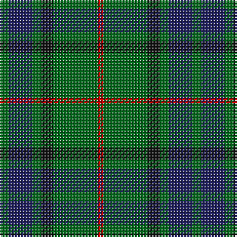

In pattern [GBGKGR](/stripes/gbgkgr/).

This was sourced from register-of-tartans.  It is a [6 stripe tartan](/stripes/stripes6/).

Original link https://www.tartanregister.gov.uk/tartanDetails.aspx?ref=2057

## Attestations

This cloth appears in 4 source records; the oldest owns this page.

- 01/01/1842 — Lauder (Family) (register-of-tartans, [record](https://www.tartanregister.gov.uk/tartanDetails.aspx?ref=2057))
- 1842 — Lauder (Family) (tartans-authority, [record](http://www.tartansauthority.com/tartan-ferret/display/709/))
- undated — Lauder (weddslist, [record](http://www.weddslist.com/cgi-bin/tartans/pg.pl?source=sts))
- undated — Lauder Clan Tartan Tartan Number: 709. Earliest known date: 1842 Possibly designed by Sir Thomas Dick Lauder who was a particular friend of the Sobieski brothers. The Setts No: 87. W & A K Johnston(1906). See products available Copyright © Blair Urquhart, Comrie, 2015 (house-of-tartan, [record](http://www.house-of-tartan.scotland.net/house/TartanViewjs.asp?colr=Def&tnam=709))

## Register references

External register numbers recorded for this tartan.

- Scottish Register of Tartans: [2057](https://www.tartanregister.gov.uk/tartanDetails.aspx?ref=2057)
- Scottish Tartans Authority (ITI): 709
- Scottish Tartans World Register: 709

## Thread count
G/6 DB16 G6 K8 G30 R/4

## Palette
Each colour and the base-6 reference it is a variant of.

| Colour | Shade | Base |
|---|---|---|
| DB | <code style="background-color:#202060;">#202060</code> `oklch(28.9% 0.111 276.9)` <small>#202060</small> | B <code style="background-color:#2A418A;">#2A418A</code> |
| G | <code style="background-color:#006818;">#006818</code> `oklch(45.0% 0.142 145.0)` <small>#006818</small> | G <code style="background-color:#006100;">#006100</code> |
| K | <code style="background-color:#101010;">#101010</code> `oklch(17.3% 0.000 89.9)` <small>#101010</small> | K <code style="background-color:#000000;">#000000</code> |
| R | <code style="background-color:#C80000;">#C80000</code> `oklch(52.3% 0.215 29.2)` <small>#C80000</small> | R <code style="background-color:#CC0000;">#CC0000</code> |

# Sample pattern

## Nearest tartans

The nearest existing variants by ΔTartan distance.

1. [Wcwm 1045](/setts/s6/dg2n8dg2k3dg12r2~x2/) — ΔT 0.67
1. [Salvation Army Htg (Corporate)](/setts/s7/db5dg8k1ly2k1dg8db4~x4/) — ΔT 0.73
1. [Glen Nevis #3](/setts/s8/g14r2g2r3g7db12g2dr2~x2/) — ΔT 0.86
1. [Scottish Scouts (1957) (Corporate)](/setts/s7/r3g22db16g14r2g6lo2~x2/) — ΔT 1.05
1. [Paton (Personal)](/setts/s7/r3g20k20g20lo2g2lo2~x2/) — ΔT 1.10
1. [MacKintosh Hunting](/setts/s7/ly2dg12db6r3dg12r4db1~x2/) — ΔT 1.13
1. [MacArthur-Fox (Personal)](/setts/s5/k8g3k4g20r4~x2/) — ΔT 1.15
1. [Cameron of Lochiel (Hunting) Clan/Family Tartan Tartan Number: 5351. Earliest known date: 01/01/1940 Design close to Cameron Hunting which has two red lines shown in Vestiarium Scoticum. This design evolved in the 1940s by J G MacKay of Portree and was first put on show at the Cameron Gathering at Achnacarry in 1956. (original STA ref: 1535) See products available Copyright © Blair Urquhart, Comrie, 2015](/setts/s7/r5g20r5g20db24g6ly4/) — ΔT 1.16
1. [Bean of Freeport Htg (Corporate)](/setts/s7/dt6r15g41r15dt20g41db6/) — ΔT 1.17
1. [Duncan](/setts/s6/k4g21w3g21db21r4~x2/) — ΔT 1.21

## Neighbour map

Every grey dot is one of 14299 variants placed by the first two principal components of the ΔTartan feature space (44% of its variance). Red is this tartan; blue dots are its nearest — click one to open its page.

<svg viewBox="0 0 640 380" role="img" style="max-width:100%;height:auto;border:1px solid #e0e0e0;border-radius:4px;display:block" xmlns="http://www.w3.org/2000/svg"><image href="/nn/cloud.v1.png" width="640" height="380"/><a href="/setts/s6/dg2n8dg2k3dg12r2~x2/"><circle cx="294.4" cy="259.4" r="4" fill="#3465a4"><title>Wcwm 1045</title></circle></a><a href="/setts/s7/db5dg8k1ly2k1dg8db4~x4/"><circle cx="295.5" cy="252.0" r="4" fill="#3465a4"><title>Salvation Army Htg (Corporate)</title></circle></a><a href="/setts/s8/g14r2g2r3g7db12g2dr2~x2/"><circle cx="322.5" cy="241.3" r="4" fill="#3465a4"><title>Glen Nevis #3</title></circle></a><a href="/setts/s7/r3g22db16g14r2g6lo2~x2/"><circle cx="365.8" cy="226.6" r="4" fill="#3465a4"><title>Scottish Scouts (1957) (Corporate)</title></circle></a><a href="/setts/s7/r3g20k20g20lo2g2lo2~x2/"><circle cx="347.8" cy="221.4" r="4" fill="#3465a4"><title>Paton (Personal)</title></circle></a><a href="/setts/s7/ly2dg12db6r3dg12r4db1~x2/"><circle cx="334.5" cy="226.4" r="4" fill="#3465a4"><title>MacKintosh Hunting</title></circle></a><a href="/setts/s5/k8g3k4g20r4~x2/"><circle cx="355.9" cy="277.8" r="4" fill="#3465a4"><title>MacArthur-Fox (Personal)</title></circle></a><a href="/setts/s7/r5g20r5g20db24g6ly4/"><circle cx="264.1" cy="247.8" r="4" fill="#3465a4"><title>Cameron of Lochiel (Hunting) Clan/Family Tartan Tartan Number: 5351. Earliest known date: 01/01/1940 Design close to Cameron Hunting which has two red lines shown in Vestiarium Scoticum. This design evolved in the 1940s by J G MacKay of Portree and was first put on show at the Cameron Gathering at Achnacarry in 1956. (original STA ref: 1535) See products available Copyright © Blair Urquhart, Comrie, 2015</title></circle></a><a href="/setts/s7/dt6r15g41r15dt20g41db6/"><circle cx="305.0" cy="258.2" r="4" fill="#3465a4"><title>Bean of Freeport Htg (Corporate)</title></circle></a><a href="/setts/s6/k4g21w3g21db21r4~x2/"><circle cx="264.9" cy="234.8" r="4" fill="#3465a4"><title>Duncan</title></circle></a><circle cx="329.0" cy="253.4" r="5" fill="#c00000"/></svg>

ID: /setts/s6/g3db8g3k4g15r2~x2/
