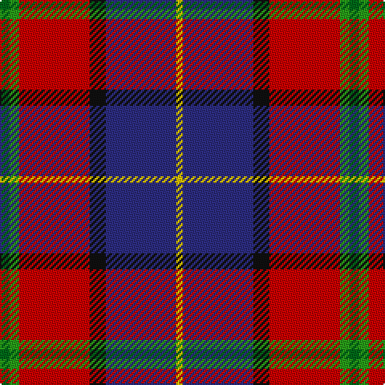

In pattern [GGRKBY](/patterns/ggrkby/).

This was sourced from register-of-tartans.  It is a [6 stripes tartan](/stripes/stripes6/).

Original link https://www.tartanregister.gov.uk/tartanDetails.aspx?ref=2644

## Thread count
Ga/6 G6 R44 K10 DB44 Y/4

## Palette
Each colour and its ΔE from the base-6 reference it is a variant of.

| Colour | Shade | Base | ΔE (OKLab) |
|---|---|---|---|
| DB | <code style="background-color:#2C2C80;">#2C2C80</code> `#2C2C80` | B <code style="background-color:#2A418A;">#2A418A</code> | 0.06 |
| G | <code style="background-color:#289C18;">#289C18</code> `#289C18` | G <code style="background-color:#006100;">#006100</code> | 0.19 |
| Ga | <code style="background-color:#006818;">#006818</code> `#006818` | G <code style="background-color:#006100;">#006100</code> | 0.02 |
| K | <code style="background-color:#101010;">#101010</code> `#101010` | K <code style="background-color:#000000;">#000000</code> | 0.17 |
| R | <code style="background-color:#C80000;">#C80000</code> `#C80000` | R <code style="background-color:#CC0000;">#CC0000</code> | 0.01 |
| Y | <code style="background-color:#E8C000;">#E8C000</code> `#E8C000` | Y <code style="background-color:#F2BF00;">#F2BF00</code> | 0.02 |

# Sample pattern

## Nearest tartans

The nearest existing variants by ΔTartan distance.

1. [Bombeiros Voluntarios De Galicia (Co](/setts/s7/r3b2r25ra12k25w2wa2~b5c5c5c-k101010-rc80000-ra888888-we0e0e0-waa8ace8~x2/) — ΔT 0.94
1. [Wishart Dress (Clan)](/setts/s7/k7b4r31ba3y2ba27w4~b2c2c80-ba202060-k000000-rc80000-wc8c8c8-ye8c000~x2/) — ΔT 0.96
1. [Afternoon Tea / Assam](/setts/s6/r15ra98b72ba25b8w15~b202060-ba5c8ca8-rc80000-ra880000-wfcfcfc/) — ΔT 0.96
1. [Bombeiros Voluntarios De Galicia](/setts/s7/r3b2r25ra12k25w2wa2~b5c5c5c-k101010-rc80000-ra888888-wffffff-waa8ace8~x2/) — ΔT 0.97
1. [Lord's Own Highlanders (Corporate)](/setts/s6/w5r20k8ra5b36y5~b501850-k101010-r888888-rac80000-we0e0e0-ybc8c00~x2/) — ΔT 0.97
1. [MacCreary (Personal)](/setts/s9/k4b12w3b4g8y2r24b4r4~b1c0070-g006818-k101010-rcc4438-wa8ace8-yd09800~x2/) — ΔT 0.98
1. [MacLeod Soc. of Scotland, (Comm)](/setts/s7/g3ga3r22k5b22y2w2~b2c2c80-g006818-ga289c18-k101010-rc80000-wf0d0b4-ye8c000~x2/) — ΔT 0.98
1. [Wishart Dress Family Tartan Tartan Number: 2105. Earliest known date: 1990 The Wisharts of Pittarrow and Logie Wishart were a lowland family dating from around the 12th Century. The family's origins are unknown, but the name Guiscard, Wiscard, Wishart, meaning 'cunning' is Norman-French. We have also sought to associate the Wishart tartan with that of another family by virtue of the marriage of a Sir John Wishart to Jean, daughter of William Douglas, 9th Earl of Angus in the 16th Century. The Wishart tartan combines the Wallace and Douglas tartans, in an original new sett which was designed by Dr David Wishart with the assistance of the Scottish College of Textiles in Galashiels. (D. Wishart, 1990) See products available Copyright © Blair Urquhart, Comrie, 2015](/setts/s7/k2b2r16ba2y1ba13w2~b2c2c80-ba202060-k101010-rc80000-we0e0e0-ye8c000~x2/) — ΔT 1.00
1. [Loch Etive](/setts/s8/w3g2r21k26b18k2b3y3~b2c4084-g00643c-k101010-rdc0000-we0e0e0-yfccc00~x2/) — ΔT 1.02
1. [Dundhuin Ladies (Personal)](/setts/s6/b6ba5k2g18r28w2~b1474b4-ba780078-g006818-k101010-ra00048-we0e0e0~x2/) — ΔT 1.02

## Neighbour map

Every grey dot is one of 15726 variants placed by the first two principal components of the ΔTartan feature space (44% of its variance). Red is this tartan; blue dots are its nearest — click one to open its page.

<svg viewBox="0 0 640 380" role="img" style="max-width:100%;height:auto;border:1px solid #e0e0e0;border-radius:4px;display:block" xmlns="http://www.w3.org/2000/svg"><image href="/nn/cloud.v1.png" width="640" height="380"/><a href="/setts/s7/r3b2r25ra12k25w2wa2~b5c5c5c-k101010-rc80000-ra888888-we0e0e0-waa8ace8~x2/"><circle cx="185.1" cy="136.7" r="4" fill="#3465a4"><title>Bombeiros Voluntarios De Galicia (Co</title></circle></a><a href="/setts/s7/k7b4r31ba3y2ba27w4~b2c2c80-ba202060-k000000-rc80000-wc8c8c8-ye8c000~x2/"><circle cx="198.3" cy="128.0" r="4" fill="#3465a4"><title>Wishart Dress (Clan)</title></circle></a><a href="/setts/s6/r15ra98b72ba25b8w15~b202060-ba5c8ca8-rc80000-ra880000-wfcfcfc/"><circle cx="215.3" cy="174.8" r="4" fill="#3465a4"><title>Afternoon Tea / Assam</title></circle></a><a href="/setts/s7/r3b2r25ra12k25w2wa2~b5c5c5c-k101010-rc80000-ra888888-wffffff-waa8ace8~x2/"><circle cx="182.7" cy="135.7" r="4" fill="#3465a4"><title>Bombeiros Voluntarios De Galicia</title></circle></a><a href="/setts/s6/w5r20k8ra5b36y5~b501850-k101010-r888888-rac80000-we0e0e0-ybc8c00~x2/"><circle cx="177.1" cy="176.1" r="4" fill="#3465a4"><title>Lord's Own Highlanders (Corporate)</title></circle></a><a href="/setts/s9/k4b12w3b4g8y2r24b4r4~b1c0070-g006818-k101010-rcc4438-wa8ace8-yd09800~x2/"><circle cx="180.8" cy="135.0" r="4" fill="#3465a4"><title>MacCreary (Personal)</title></circle></a><a href="/setts/s7/g3ga3r22k5b22y2w2~b2c2c80-g006818-ga289c18-k101010-rc80000-wf0d0b4-ye8c000~x2/"><circle cx="154.7" cy="124.7" r="4" fill="#3465a4"><title>MacLeod Soc. of Scotland, (Comm)</title></circle></a><a href="/setts/s7/k2b2r16ba2y1ba13w2~b2c2c80-ba202060-k101010-rc80000-we0e0e0-ye8c000~x2/"><circle cx="224.7" cy="125.5" r="4" fill="#3465a4"><title>Wishart Dress Family Tartan Tartan Number: 2105. Earliest known date: 1990 The Wisharts of Pittarrow and Logie Wishart were a lowland family dating from around the 12th Century. The family's origins are unknown, but the name Guiscard, Wiscard, Wishart, meaning 'cunning' is Norman-French. We have also sought to associate the Wishart tartan with that of another family by virtue of the marriage of a Sir John Wishart to Jean, daughter of William Douglas, 9th Earl of Angus in the 16th Century. The Wishart tartan combines the Wallace and Douglas tartans, in an original new sett which was designed by Dr David Wishart with the assistance of the Scottish College of Textiles in Galashiels. (D. Wishart, 1990) See products available Copyright © Blair Urquhart, Comrie, 2015</title></circle></a><a href="/setts/s8/w3g2r21k26b18k2b3y3~b2c4084-g00643c-k101010-rdc0000-we0e0e0-yfccc00~x2/"><circle cx="151.1" cy="132.3" r="4" fill="#3465a4"><title>Loch Etive</title></circle></a><a href="/setts/s6/b6ba5k2g18r28w2~b1474b4-ba780078-g006818-k101010-ra00048-we0e0e0~x2/"><circle cx="238.8" cy="155.7" r="4" fill="#3465a4"><title>Dundhuin Ladies (Personal)</title></circle></a><circle cx="186.5" cy="157.5" r="5" fill="#c00000"/></svg>

ID: /setts/s6/g3ga3r22k5b22y2~b2c2c80-g006818-ga289c18-k101010-rc80000-ye8c000~x2/
