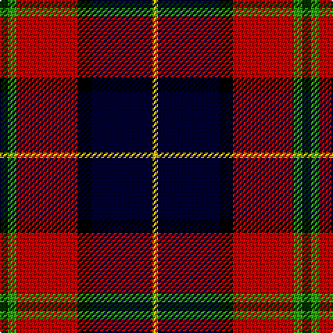

In pattern [GGRKKY](/patterns/ggrkky/).

This was sourced from weddslist.  It is a [6 stripes tartan](/stripes/stripes6/).

Original link http://www.weddslist.com/cgi-bin/tartans/pg.pl?source=sts

## Thread count
DG/6 G6 R44 K10 DB44 Y/4

## Palette
Each colour and its ΔE from the base-6 reference it is a variant of.

| Colour | Shade | Base | ΔE (OKLab) |
|---|---|---|---|
| DB | <code style="background-color:#000030;">#000030</code> `#000030` | K <code style="background-color:#000000;">#000000</code> | 0.17 |
| DG | <code style="background-color:#003000;">#003000</code> `#003000` | G <code style="background-color:#006100;">#006100</code> | 0.17 |
| G | <code style="background-color:#30A010;">#30A010</code> `#30A010` | G <code style="background-color:#006100;">#006100</code> | 0.20 |
| K | <code style="background-color:#000000;">#000000</code> `#000000` | K <code style="background-color:#000000;">#000000</code> | 0.00 |
| R | <code style="background-color:#C00000;">#C00000</code> `#C00000` | R <code style="background-color:#CC0000;">#CC0000</code> | 0.03 |
| Y | <code style="background-color:#F0C000;">#F0C000</code> `#F0C000` | Y <code style="background-color:#F2BF00;">#F2BF00</code> | 0.00 |

# Sample pattern

## Nearest tartans

The nearest existing variants by ΔTartan distance.

1. [Barbour](/setts/s7/r4y2r21b11w2k20ra3x2~b401000-k000000-r806050-rac00000-we0e0e0-yf0c000/) — ΔT 0.73
1. [Loch Etive](/setts/s8/w3g2r21k26b18k2b3y3x2~b2c2c80-g289c18-k101010-rc80000-wc0c0c0-yfccc00/) — ΔT 1.01
1. [Loch Etive](/setts/s8/w3g2r21k26b18k2b3y3x2~b2c4084-g00643c-k101010-rdc0000-we0e0e0-yfccc00/) — ΔT 1.03
1. [Wishart Dress (Clan)](/setts/s7/k7b4r31ba3y2ba27w4x2~b2c2c80-ba202060-k000000-rc80000-wc8c8c8-ye8c000/) — ΔT 1.19
1. [Wishart, dress](/setts/s7/k2b2r16ba2y1ba13w2x2~b304080-ba000050-k000000-rc00000-we0e0e0-yf0c000/) — ΔT 1.19
1. [Bombeiros Voluntarios De Galicia](/setts/s7/r3b2r25ra12k25w2wa2x2~b5c5c5c-k101010-rc80000-ra888888-wffffff-waa8ace8/) — ΔT 1.22
1. [Bombeiros Voluntarios De Galicia (Co](/setts/s7/r3b2r25ra12k25w2wa2x2~b5c5c5c-k101010-rc80000-ra888888-we0e0e0-waa8ace8/) — ΔT 1.23
1. [MacLeod Society of Scotland](/setts/s6/g3ga3r22k5b22y2x2~b2c2c80-g006818-ga289c18-k101010-rc80000-ye8c000/) — ΔT 1.25
1. [Eichelberger (Perrsonal)](/setts/s7/k20r6y3b24g3r8w4x2~b2c2c80-g006818-k101010-rc80000-we0e0e0-yfccc00/) — ΔT 1.31
1. [Culloden, Grey](/setts/s8/g6k2g23k23w2b24ba3r6x2~b800080-ba304080-g808080-k000000-rc00000-we0e0e0/) — ΔT 1.33

## Neighbour map

Every grey dot is one of 15726 variants placed by the first two principal components of the ΔTartan feature space (44% of its variance). Red is this tartan; blue dots are its nearest — click one to open its page.

<svg viewBox="0 0 640 380" role="img" style="max-width:100%;height:auto;border:1px solid #e0e0e0;border-radius:4px;display:block" xmlns="http://www.w3.org/2000/svg"><image href="/nn/cloud.v1.png" width="640" height="380"/><a href="/setts/s7/r4y2r21b11w2k20ra3x2~b401000-k000000-r806050-rac00000-we0e0e0-yf0c000/"><circle cx="150.2" cy="156.7" r="4" fill="#3465a4"><title>Barbour</title></circle></a><a href="/setts/s8/w3g2r21k26b18k2b3y3x2~b2c2c80-g289c18-k101010-rc80000-wc0c0c0-yfccc00/"><circle cx="155.9" cy="135.4" r="4" fill="#3465a4"><title>Loch Etive</title></circle></a><a href="/setts/s8/w3g2r21k26b18k2b3y3x2~b2c4084-g00643c-k101010-rdc0000-we0e0e0-yfccc00/"><circle cx="151.1" cy="132.3" r="4" fill="#3465a4"><title>Loch Etive</title></circle></a><a href="/setts/s7/k7b4r31ba3y2ba27w4x2~b2c2c80-ba202060-k000000-rc80000-wc8c8c8-ye8c000/"><circle cx="198.3" cy="128.0" r="4" fill="#3465a4"><title>Wishart Dress (Clan)</title></circle></a><a href="/setts/s7/k2b2r16ba2y1ba13w2x2~b304080-ba000050-k000000-rc00000-we0e0e0-yf0c000/"><circle cx="209.0" cy="124.1" r="4" fill="#3465a4"><title>Wishart, dress</title></circle></a><a href="/setts/s7/r3b2r25ra12k25w2wa2x2~b5c5c5c-k101010-rc80000-ra888888-wffffff-waa8ace8/"><circle cx="182.7" cy="135.7" r="4" fill="#3465a4"><title>Bombeiros Voluntarios De Galicia</title></circle></a><a href="/setts/s7/r3b2r25ra12k25w2wa2x2~b5c5c5c-k101010-rc80000-ra888888-we0e0e0-waa8ace8/"><circle cx="185.1" cy="136.7" r="4" fill="#3465a4"><title>Bombeiros Voluntarios De Galicia (Co</title></circle></a><a href="/setts/s6/g3ga3r22k5b22y2x2~b2c2c80-g006818-ga289c18-k101010-rc80000-ye8c000/"><circle cx="186.5" cy="157.5" r="4" fill="#3465a4"><title>MacLeod Society of Scotland</title></circle></a><a href="/setts/s7/k20r6y3b24g3r8w4x2~b2c2c80-g006818-k101010-rc80000-we0e0e0-yfccc00/"><circle cx="114.9" cy="168.1" r="4" fill="#3465a4"><title>Eichelberger (Perrsonal)</title></circle></a><a href="/setts/s8/g6k2g23k23w2b24ba3r6x2~b800080-ba304080-g808080-k000000-rc00000-we0e0e0/"><circle cx="117.1" cy="141.3" r="4" fill="#3465a4"><title>Culloden, Grey</title></circle></a><circle cx="167.8" cy="156.0" r="5" fill="#c00000"/></svg>

ID: /setts/s6/g3ga3r22k5ka22y2x2~g003000-ga30a010-k000000-ka000030-rc00000-yf0c000/
