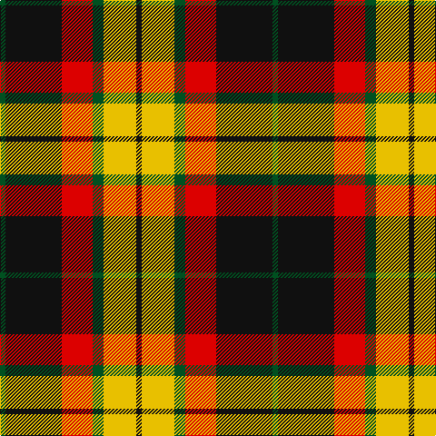

In pattern [GKRGYK](/patterns/gkrgyk/).

This was sourced from register-of-tartans.  It is a [6 stripes tartan](/stripes/stripes6/).

Original link https://www.tartanregister.gov.uk/tartanDetails.aspx?ref=2662

## Thread count
G/6 K62 R34 G12 Y36 K/6

## Palette
Each colour and its ΔE from the base-6 reference it is a variant of.

| Colour | Shade | Base | ΔE (OKLab) |
|---|---|---|---|
| G | <code style="background-color:#005020;">#005020</code> `#005020` | G <code style="background-color:#006100;">#006100</code> | 0.07 |
| K | <code style="background-color:#101010;">#101010</code> `#101010` | K <code style="background-color:#000000;">#000000</code> | 0.17 |
| R | <code style="background-color:#DC0000;">#DC0000</code> `#DC0000` | R <code style="background-color:#CC0000;">#CC0000</code> | 0.03 |
| Y | <code style="background-color:#E8C000;">#E8C000</code> `#E8C000` | Y <code style="background-color:#F2BF00;">#F2BF00</code> | 0.02 |

# Sample pattern

## Nearest tartans

The nearest existing variants by ΔTartan distance.

1. [Strathspey, Check](/setts/s6/g3r22b5g10k10g2x2~b5480b0-g008000-k000000-rc00000/) — ΔT 0.33
1. [Blackstock, dress](/setts/s7/y2g7k6r12k1r1y2x4~g008000-k000000-rc00000-yf0c000/) — ΔT 0.71
1. [MacMillan Variant (Unidentified)](/setts/s6/g3k31r17g6y18k3x2~g008000-k000000-rc00000-yf0c000/) — ΔT 0.73
1. [Blackstock Red (Dress)](/setts/s7/y2g7k6r11k1r1y2x4~g285800-k000000-rb00000-yc89800/) — ΔT 0.83
1. [Dickie](/setts/s8/g8r2g12k6g3b6r24k4x2~b00008c-g146400-k000000-rc82800/) — ΔT 0.94
1. [Blackstock Dress Family Tartan Tartan Number: 1881. Earliest known date: 1982 Commissioned by Herbert Earl Blackstock in 1983, President of the Clan Blackstock Society in the USA. Blackstocks were a 'Scotch-Irish' family who emigrated to the US from Ulster. Designed by kiltmaker and historian Bob Martin of Greenville, South Carolina. www.clanblackstocksociety.com See products available Copyright © Blair Urquhart, Comrie, 2015](/setts/s7/y2g7k6r12k1r1y2x4~g006818-k101010-rc80000-ye8c000/) — ΔT 0.96
1. [Wcwm 759-3](/setts/s6/w5r34k24r4ra24r4x2~k000000-r8c8c8c-ra8c0000-wc8c8c8/) — ΔT 1.08
1. [Burberry, Check](/setts/s5/k6w6k6r21ra2x4~k000000-r906030-rac00000-we0e0e0/) — ΔT 1.08
1. [Thom(p)son camel](/setts/s6/r4ra30k6w13k13w3x2~k000000-rc00000-ra806050-we0e0e0/) — ΔT 1.09
1. [Unidentified 12](/setts/s6/k6r2g17r16k1b2x2~b5480b0-g008000-k000000-rc00000/) — ΔT 1.10

## Neighbour map

Every grey dot is one of 15726 variants placed by the first two principal components of the ΔTartan feature space (44% of its variance). Red is this tartan; blue dots are its nearest — click one to open its page.

<svg viewBox="0 0 640 380" role="img" style="max-width:100%;height:auto;border:1px solid #e0e0e0;border-radius:4px;display:block" xmlns="http://www.w3.org/2000/svg"><image href="/nn/cloud.v1.png" width="640" height="380"/><a href="/setts/s6/g3r22b5g10k10g2x2~b5480b0-g008000-k000000-rc00000/"><circle cx="196.3" cy="196.7" r="4" fill="#3465a4"><title>Strathspey, Check</title></circle></a><a href="/setts/s7/y2g7k6r12k1r1y2x4~g008000-k000000-rc00000-yf0c000/"><circle cx="189.0" cy="172.8" r="4" fill="#3465a4"><title>Blackstock, dress</title></circle></a><a href="/setts/s6/g3k31r17g6y18k3x2~g008000-k000000-rc00000-yf0c000/"><circle cx="177.8" cy="195.4" r="4" fill="#3465a4"><title>MacMillan Variant (Unidentified)</title></circle></a><a href="/setts/s7/y2g7k6r11k1r1y2x4~g285800-k000000-rb00000-yc89800/"><circle cx="186.9" cy="185.7" r="4" fill="#3465a4"><title>Blackstock Red (Dress)</title></circle></a><a href="/setts/s8/g8r2g12k6g3b6r24k4x2~b00008c-g146400-k000000-rc82800/"><circle cx="198.6" cy="182.2" r="4" fill="#3465a4"><title>Dickie</title></circle></a><a href="/setts/s7/y2g7k6r12k1r1y2x4~g006818-k101010-rc80000-ye8c000/"><circle cx="206.3" cy="177.3" r="4" fill="#3465a4"><title>Blackstock Dress Family Tartan Tartan Number: 1881. Earliest known date: 1982 Commissioned by Herbert Earl Blackstock in 1983, President of the Clan Blackstock Society in the USA. Blackstocks were a 'Scotch-Irish' family who emigrated to the US from Ulster. Designed by kiltmaker and historian Bob Martin of Greenville, South Carolina. www.clanblackstocksociety.com See products available Copyright © Blair Urquhart, Comrie, 2015</title></circle></a><a href="/setts/s6/w5r34k24r4ra24r4x2~k000000-r8c8c8c-ra8c0000-wc8c8c8/"><circle cx="188.8" cy="206.0" r="4" fill="#3465a4"><title>Wcwm 759-3</title></circle></a><a href="/setts/s5/k6w6k6r21ra2x4~k000000-r906030-rac00000-we0e0e0/"><circle cx="238.1" cy="202.6" r="4" fill="#3465a4"><title>Burberry, Check</title></circle></a><a href="/setts/s6/r4ra30k6w13k13w3x2~k000000-rc00000-ra806050-we0e0e0/"><circle cx="182.6" cy="192.1" r="4" fill="#3465a4"><title>Thom(p)son camel</title></circle></a><a href="/setts/s6/k6r2g17r16k1b2x2~b5480b0-g008000-k000000-rc00000/"><circle cx="233.6" cy="173.6" r="4" fill="#3465a4"><title>Unidentified 12</title></circle></a><circle cx="187.8" cy="195.1" r="5" fill="#c00000"/></svg>

ID: /setts/s6/g3k31r17g6y18k3x2~g005020-k101010-rdc0000-ye8c000/
