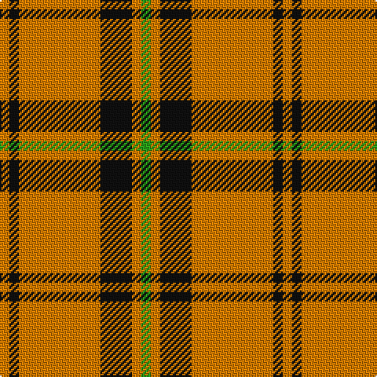

**Bands:** [YKYKYG](/stripes/ykykyg/) · **Stripes:** [LO K LO K LO G](/stripes/stripes6/) LO K LO K LO G

This was sourced from register-of-tartans.  It is a [6 band tartan](/bands/bands6/).

Original link https://www.tartanregister.gov.uk/tartanDetails.aspx?ref=5544

## Register references

External register numbers recorded for this tartan.

- Scottish Register of Tartans: [5544](https://www.tartanregister.gov.uk/tartanDetails.aspx?ref=5544)
- Scottish Tartans Authority (ITI): 7504

## Thread count
O/6 K6 O52 K20 O6 G/6

## Palette
Each colour and its ΔE from the base-6 reference it is a variant of.

| Colour | Shade | Base | ΔE (OKLab) |
|---|---|---|---|
| G | <code style="background-color:#289C18;">#289C18</code> `#289C18` | G <code style="background-color:#006100;">#006100</code> | 0.19 |
| K | <code style="background-color:#101010;">#101010</code> `#101010` | K <code style="background-color:#000000;">#000000</code> | 0.17 |
| O | <code style="background-color:#D87C00;">#D87C00</code> `#D87C00` | Y <code style="background-color:#F2BF00;">#F2BF00</code> | 0.17 |

# Sample pattern

## Nearest tartans

The nearest existing variants by ΔTartan distance.

1. [Volkswagen Orange Trim (Fashion)](/setts/s6/lo26k10lo3g3lo3k3~x6/) — ΔT 0.00
1. [Loch Tummel](/setts/s5/o38w9o3dr9w3~x2/) — ΔT 1.27
1. [Baileville (Personal)](/setts/s7/ly1k4ly1k4ly11r1ly1~x4/) — ΔT 1.36
1. [Coca Cola (Corporate)](/setts/s5/w15dy15w15dy80r6/) — ΔT 1.40
1. [Welsh, National](/setts/s7/k4o2r2o2k2o15ly2~x4/) — ΔT 1.40
1. [Baillieville](/setts/s7/ly1k4ly1k4ly11m1ly1~x4/) — ΔT 1.42
1. [Loch Tummel](/setts/s5/dy38w9dy3k9w3~x2/) — ΔT 1.42
1. [Coca Cola](/setts/s5/w7dy7w7dy40r3~x2/) — ΔT 1.45
1. [Makhtoum](/setts/s6/w11r40g13r5g12r5~x2/) — ΔT 1.52
1. [Monoch Airline](/setts/s6/lo4k6lo1k1lo16k2~x2/) — ΔT 1.52

## Neighbour map

Every grey dot is one of 14299 variants placed by the first two principal components of the ΔTartan feature space (44% of its variance). Red is this tartan; blue dots are its nearest — click one to open its page.

<svg viewBox="0 0 640 380" role="img" style="max-width:100%;height:auto;border:1px solid #e0e0e0;border-radius:4px;display:block" xmlns="http://www.w3.org/2000/svg"><image href="/nn/cloud.v1.png" width="640" height="380"/><a href="/setts/s6/lo26k10lo3g3lo3k3~x6/"><circle cx="386.6" cy="195.4" r="4" fill="#3465a4"><title>Volkswagen Orange Trim (Fashion)</title></circle></a><a href="/setts/s5/o38w9o3dr9w3~x2/"><circle cx="408.1" cy="198.0" r="4" fill="#3465a4"><title>Loch Tummel</title></circle></a><a href="/setts/s7/ly1k4ly1k4ly11r1ly1~x4/"><circle cx="335.7" cy="173.9" r="4" fill="#3465a4"><title>Baileville (Personal)</title></circle></a><a href="/setts/s5/w15dy15w15dy80r6/"><circle cx="445.4" cy="197.5" r="4" fill="#3465a4"><title>Coca Cola (Corporate)</title></circle></a><a href="/setts/s7/k4o2r2o2k2o15ly2~x4/"><circle cx="345.3" cy="182.1" r="4" fill="#3465a4"><title>Welsh, National</title></circle></a><a href="/setts/s7/ly1k4ly1k4ly11m1ly1~x4/"><circle cx="330.9" cy="173.4" r="4" fill="#3465a4"><title>Baillieville</title></circle></a><a href="/setts/s5/dy38w9dy3k9w3~x2/"><circle cx="382.7" cy="192.8" r="4" fill="#3465a4"><title>Loch Tummel</title></circle></a><a href="/setts/s5/w7dy7w7dy40r3~x2/"><circle cx="455.5" cy="196.4" r="4" fill="#3465a4"><title>Coca Cola</title></circle></a><a href="/setts/s6/w11r40g13r5g12r5~x2/"><circle cx="328.7" cy="216.4" r="4" fill="#3465a4"><title>Makhtoum</title></circle></a><a href="/setts/s6/lo4k6lo1k1lo16k2~x2/"><circle cx="446.7" cy="190.3" r="4" fill="#3465a4"><title>Monoch Airline</title></circle></a><circle cx="386.6" cy="195.4" r="5" fill="#c00000"/></svg>

ID: /setts/s6/g3lo3k10lo26k3lo3~x2/
