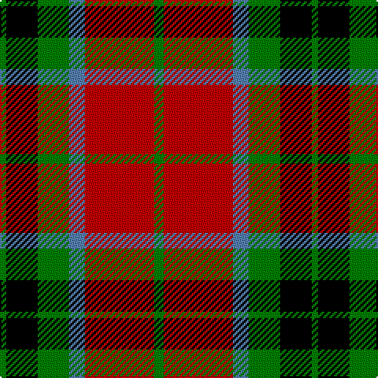

In pattern [GKGBRG](/patterns/gkgbrg/).

This was sourced from weddslist.  It is a [6 stripes tartan](/stripes/stripes6/).

Original link http://www.weddslist.com/cgi-bin/tartans/pg.pl?source=sts

## Thread count
G/4 K20 G20 B10 R44 G/6

## Palette
Each colour and its ΔE from the base-6 reference it is a variant of.

| Colour | Shade | Base | ΔE (OKLab) |
|---|---|---|---|
| B | <code style="background-color:#5480B0;">#5480B0</code> `#5480B0` | B <code style="background-color:#2A418A;">#2A418A</code> | 0.19 |
| G | <code style="background-color:#008000;">#008000</code> `#008000` | G <code style="background-color:#006100;">#006100</code> | 0.10 |
| K | <code style="background-color:#000000;">#000000</code> `#000000` | K <code style="background-color:#000000;">#000000</code> | 0.00 |
| R | <code style="background-color:#C00000;">#C00000</code> `#C00000` | R <code style="background-color:#CC0000;">#CC0000</code> | 0.03 |

# Sample pattern

## Nearest tartans

The nearest existing variants by ΔTartan distance.

1. [MacMillan Varient (Unidentified)](/setts/s6/g3k31r17g6y18k3x2~g005020-k101010-rdc0000-ye8c000/) — ΔT 0.33
1. [Blackstock Red (Dress)](/setts/s7/y2g7k6r11k1r1y2x4~g285800-k000000-rb00000-yc89800/) — ΔT 0.70
1. [Dickie](/setts/s8/g8r2g12k6g3b6r24k4x2~b00008c-g146400-k000000-rc82800/) — ΔT 0.75
1. [Blackstock, dress](/setts/s7/y2g7k6r12k1r1y2x4~g008000-k000000-rc00000-yf0c000/) — ΔT 0.79
1. [Blackstock Dress Family Tartan Tartan Number: 1881. Earliest known date: 1982 Commissioned by Herbert Earl Blackstock in 1983, President of the Clan Blackstock Society in the USA. Blackstocks were a 'Scotch-Irish' family who emigrated to the US from Ulster. Designed by kiltmaker and historian Bob Martin of Greenville, South Carolina. www.clanblackstocksociety.com See products available Copyright © Blair Urquhart, Comrie, 2015](/setts/s7/y2g7k6r12k1r1y2x4~g006818-k101010-rc80000-ye8c000/) — ΔT 0.84
1. [MacMillan Variant (Unidentified)](/setts/s6/g3k31r17g6y18k3x2~g008000-k000000-rc00000-yf0c000/) — ΔT 0.90
1. [MacMillan - 2002 (Black - Unofficial](/setts/s6/g3k31r17g6y18k3x2~g004810-k101010-r880000-ybc8c00/) — ΔT 0.92
1. [Manson Family Tartan Tartan Number: 987. Earliest known date: 1983 The official recording of the sett shows the letter G for the dark green stripe. In heraldic terms this means 'Gules' - red. The designer, Hugh Kirkwood Rankine, clearly intended dark green and this is reproduced here. See products available Copyright © Blair Urquhart, Comrie, 2015](/setts/s8/g1r9g3k3g3r1k9w1x2~g006818-k101010-rc80000-we0e0e0/) — ΔT 0.95
1. [Wcwm 1062](/setts/s7/g3r20g16k22y6k3g2x2~g006818-k101010-rc80000-yd09800/) — ΔT 0.96
1. [Unidentified 12](/setts/s6/k6r2g17r16k1b2x2~b5480b0-g008000-k000000-rc00000/) — ΔT 0.98

## Neighbour map

Every grey dot is one of 15726 variants placed by the first two principal components of the ΔTartan feature space (44% of its variance). Red is this tartan; blue dots are its nearest — click one to open its page.

<svg viewBox="0 0 640 380" role="img" style="max-width:100%;height:auto;border:1px solid #e0e0e0;border-radius:4px;display:block" xmlns="http://www.w3.org/2000/svg"><image href="/nn/cloud.v1.png" width="640" height="380"/><a href="/setts/s6/g3k31r17g6y18k3x2~g005020-k101010-rdc0000-ye8c000/"><circle cx="187.8" cy="195.1" r="4" fill="#3465a4"><title>MacMillan Varient (Unidentified)</title></circle></a><a href="/setts/s7/y2g7k6r11k1r1y2x4~g285800-k000000-rb00000-yc89800/"><circle cx="186.9" cy="185.7" r="4" fill="#3465a4"><title>Blackstock Red (Dress)</title></circle></a><a href="/setts/s8/g8r2g12k6g3b6r24k4x2~b00008c-g146400-k000000-rc82800/"><circle cx="198.6" cy="182.2" r="4" fill="#3465a4"><title>Dickie</title></circle></a><a href="/setts/s7/y2g7k6r12k1r1y2x4~g008000-k000000-rc00000-yf0c000/"><circle cx="189.0" cy="172.8" r="4" fill="#3465a4"><title>Blackstock, dress</title></circle></a><a href="/setts/s7/y2g7k6r12k1r1y2x4~g006818-k101010-rc80000-ye8c000/"><circle cx="206.3" cy="177.3" r="4" fill="#3465a4"><title>Blackstock Dress Family Tartan Tartan Number: 1881. Earliest known date: 1982 Commissioned by Herbert Earl Blackstock in 1983, President of the Clan Blackstock Society in the USA. Blackstocks were a 'Scotch-Irish' family who emigrated to the US from Ulster. Designed by kiltmaker and historian Bob Martin of Greenville, South Carolina. www.clanblackstocksociety.com See products available Copyright © Blair Urquhart, Comrie, 2015</title></circle></a><a href="/setts/s6/g3k31r17g6y18k3x2~g008000-k000000-rc00000-yf0c000/"><circle cx="177.8" cy="195.4" r="4" fill="#3465a4"><title>MacMillan Variant (Unidentified)</title></circle></a><a href="/setts/s6/g3k31r17g6y18k3x2~g004810-k101010-r880000-ybc8c00/"><circle cx="216.2" cy="211.2" r="4" fill="#3465a4"><title>MacMillan - 2002 (Black - Unofficial</title></circle></a><a href="/setts/s8/g1r9g3k3g3r1k9w1x2~g006818-k101010-rc80000-we0e0e0/"><circle cx="201.3" cy="193.7" r="4" fill="#3465a4"><title>Manson Family Tartan Tartan Number: 987. Earliest known date: 1983 The official recording of the sett shows the letter G for the dark green stripe. In heraldic terms this means 'Gules' - red. The designer, Hugh Kirkwood Rankine, clearly intended dark green and this is reproduced here. See products available Copyright © Blair Urquhart, Comrie, 2015</title></circle></a><a href="/setts/s7/g3r20g16k22y6k3g2x2~g006818-k101010-rc80000-yd09800/"><circle cx="177.6" cy="197.1" r="4" fill="#3465a4"><title>Wcwm 1062</title></circle></a><a href="/setts/s6/k6r2g17r16k1b2x2~b5480b0-g008000-k000000-rc00000/"><circle cx="233.6" cy="173.6" r="4" fill="#3465a4"><title>Unidentified 12</title></circle></a><circle cx="196.3" cy="196.7" r="5" fill="#c00000"/></svg>

ID: /setts/s6/g3r22b5g10k10g2x2~b5480b0-g008000-k000000-rc00000/
