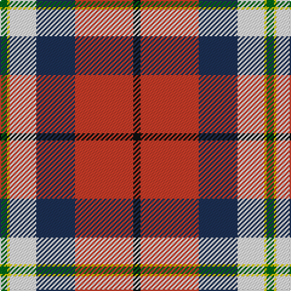

In pattern [GYWBRK](/patterns/gywbrk/).

This was sourced from register-of-tartans.  It is a [6 stripes tartan](/stripes/stripes6/).

Original link https://www.tartanregister.gov.uk/tartanDetails.aspx?ref=387

## Attestations

This cloth appears in 2 source records; the oldest owns this page.

- 01/05/2005 — Bro-sant-Malou (register-of-tartans, [record](https://www.tartanregister.gov.uk/tartanDetails.aspx?ref=387))
- 2005 May — Bro-sant-Malou (Corporate) (tartans-authority, [record](http://www.tartansauthority.com/tartan-ferret/display/6649/))

## Thread count
G/6 Y2 W22 DB32 R48 K/6

## Palette
Each colour and its ΔE from the base-6 reference it is a variant of.

| Colour | Shade | Base | ΔE (OKLab) |
|---|---|---|---|
| DB | <code style="background-color:#1C3054;">#1C3054</code> `#1C3054` | B <code style="background-color:#2A418A;">#2A418A</code> | 0.10 |
| G | <code style="background-color:#006818;">#006818</code> `#006818` | G <code style="background-color:#006100;">#006100</code> | 0.02 |
| K | <code style="background-color:#101010;">#101010</code> `#101010` | K <code style="background-color:#000000;">#000000</code> | 0.17 |
| R | <code style="background-color:#C83C28;">#C83C28</code> `#C83C28` | R <code style="background-color:#CC0000;">#CC0000</code> | 0.05 |
| W | <code style="background-color:#F8F8F8;">#F8F8F8</code> `#F8F8F8` | W <code style="background-color:#F7F7F7;">#F7F7F7</code> | 0.00 |
| Y | <code style="background-color:#D8C800;">#D8C800</code> `#D8C800` | Y <code style="background-color:#F2BF00;">#F2BF00</code> | 0.04 |

# Sample pattern

## Nearest tartans

The nearest existing variants by ΔTartan distance.

1. [Edinburgh Napier University (Corp.)](/setts/s8/b4w4b4w5k8g2r19y1x2~b5c8ca8-g289c18-k101010-rc80000-wf0e4cc-ybc8c00/) — ΔT 0.91
1. [Rosevear](/setts/s9/r50y4w16b2w4b2w15g27ra4x2~b2c2c80-g006818-r901c38-rac80000-we0e0e0-ye8c000/) — ΔT 1.21
1. [Oor Wullie Corporate Tartan Tartan Number: 10356. Earliest known date: August 2010 Oor Wullie's tartan is based on the Black Watch which was his Uncle Wattie's regiment and in this new design the red is from the hackle on their famous bonnets. The silver grey is for Wullie's iconic bucket and for his faithful pet, Jeemie the moose. The black is for his mentor PC Murdoch and for Wullie's dungarees, the yellow is for his tousled gold locks that never see a comb. The three lines on the yellow are for his best pals Fat Bob, Soapy Soutar and Wee Eck. The black and white are for the newsprint of The Sunday Post in which Wullie and his pals have lived for 75 years. See products available Copyright © Blair Urquhart, Comrie, 2015](/setts/s7/k3r3y2r20ka16w24wa2x2~k000000-ka101010-rc80000-wc0c0c0-wae0e0e0-yf09400/) — ΔT 1.29
1. [Hebridean Arisaid, Red/White (Dance)](/setts/s9/w37k4b12g12w2y2r23w4r6x2~b30308c-g006818-k101010-r800028-we0e0e0-ye08070/) — ΔT 1.29
1. [Rosevear](/setts/s9/r50y4w16b2w4b2w15g27ra4x2~b304080-g008000-r802040-rac00000-we0e0e0-yf0c000/) — ΔT 1.30
1. [Clyde Family (Hurleford) (Personal)](/setts/s7/r64k30g30b18w4b2w3~b271b86-g649848-k1c1714-rca2625-wf7f1e8/) — ΔT 1.30
1. [Scottish American Society of Michigan (Official)](/setts/s6/r48b16y5g17w8k3x2~b5f749c-g23321b-k000000-rb62531-wf9f5ef-ye0a126/) — ΔT 1.31
1. [Edinburgh Napier University](/setts/s8/b4w8b8w10k16y4r38ya1~b000cdb-k000000-rdc143c-wfaf0e6-y32cd32-yadaa520/) — ΔT 1.32
1. [Oor Wullie (Corporate)](/setts/s7/y3r3ya2r20k16w24wa2x2~k101010-rc80000-wc0c0c0-wae0e0e0-yfccc00-yae8c000/) — ΔT 1.32
1. [Ball](/setts/s6/y13b8r5k3w2g1x4~b1474b4-g006818-k101010-rc80000-wfcfcfc-ydc943c/) — ΔT 1.33

## Neighbour map

Every grey dot is one of 15726 variants placed by the first two principal components of the ΔTartan feature space (44% of its variance). Red is this tartan; blue dots are its nearest — click one to open its page.

<svg viewBox="0 0 640 380" role="img" style="max-width:100%;height:auto;border:1px solid #e0e0e0;border-radius:4px;display:block" xmlns="http://www.w3.org/2000/svg"><image href="/nn/cloud.v1.png" width="640" height="380"/><a href="/setts/s8/b4w4b4w5k8g2r19y1x2~b5c8ca8-g289c18-k101010-rc80000-wf0e4cc-ybc8c00/"><circle cx="160.5" cy="109.2" r="4" fill="#3465a4"><title>Edinburgh Napier University (Corp.)</title></circle></a><a href="/setts/s9/r50y4w16b2w4b2w15g27ra4x2~b2c2c80-g006818-r901c38-rac80000-we0e0e0-ye8c000/"><circle cx="193.3" cy="86.0" r="4" fill="#3465a4"><title>Rosevear</title></circle></a><a href="/setts/s7/k3r3y2r20ka16w24wa2x2~k000000-ka101010-rc80000-wc0c0c0-wae0e0e0-yf09400/"><circle cx="126.5" cy="131.6" r="4" fill="#3465a4"><title>Oor Wullie Corporate Tartan Tartan Number: 10356. Earliest known date: August 2010 Oor Wullie's tartan is based on the Black Watch which was his Uncle Wattie's regiment and in this new design the red is from the hackle on their famous bonnets. The silver grey is for Wullie's iconic bucket and for his faithful pet, Jeemie the moose. The black is for his mentor PC Murdoch and for Wullie's dungarees, the yellow is for his tousled gold locks that never see a comb. The three lines on the yellow are for his best pals Fat Bob, Soapy Soutar and Wee Eck. The black and white are for the newsprint of The Sunday Post in which Wullie and his pals have lived for 75 years. See products available Copyright © Blair Urquhart, Comrie, 2015</title></circle></a><a href="/setts/s9/w37k4b12g12w2y2r23w4r6x2~b30308c-g006818-k101010-r800028-we0e0e0-ye08070/"><circle cx="163.5" cy="100.0" r="4" fill="#3465a4"><title>Hebridean Arisaid, Red/White (Dance)</title></circle></a><a href="/setts/s9/r50y4w16b2w4b2w15g27ra4x2~b304080-g008000-r802040-rac00000-we0e0e0-yf0c000/"><circle cx="190.5" cy="86.5" r="4" fill="#3465a4"><title>Rosevear</title></circle></a><a href="/setts/s7/r64k30g30b18w4b2w3~b271b86-g649848-k1c1714-rca2625-wf7f1e8/"><circle cx="229.5" cy="119.0" r="4" fill="#3465a4"><title>Clyde Family (Hurleford) (Personal)</title></circle></a><a href="/setts/s6/r48b16y5g17w8k3x2~b5f749c-g23321b-k000000-rb62531-wf9f5ef-ye0a126/"><circle cx="231.4" cy="136.6" r="4" fill="#3465a4"><title>Scottish American Society of Michigan (Official)</title></circle></a><a href="/setts/s8/b4w8b8w10k16y4r38ya1~b000cdb-k000000-rdc143c-wfaf0e6-y32cd32-yadaa520/"><circle cx="189.1" cy="73.9" r="4" fill="#3465a4"><title>Edinburgh Napier University</title></circle></a><a href="/setts/s7/y3r3ya2r20k16w24wa2x2~k101010-rc80000-wc0c0c0-wae0e0e0-yfccc00-yae8c000/"><circle cx="128.0" cy="130.6" r="4" fill="#3465a4"><title>Oor Wullie (Corporate)</title></circle></a><a href="/setts/s6/y13b8r5k3w2g1x4~b1474b4-g006818-k101010-rc80000-wfcfcfc-ydc943c/"><circle cx="149.5" cy="152.3" r="4" fill="#3465a4"><title>Ball</title></circle></a><circle cx="180.4" cy="119.9" r="5" fill="#c00000"/></svg>

ID: /setts/s6/g3y1w11b16r24k3x2~b1c3054-g006818-k101010-rc83c28-wf8f8f8-yd8c800/
