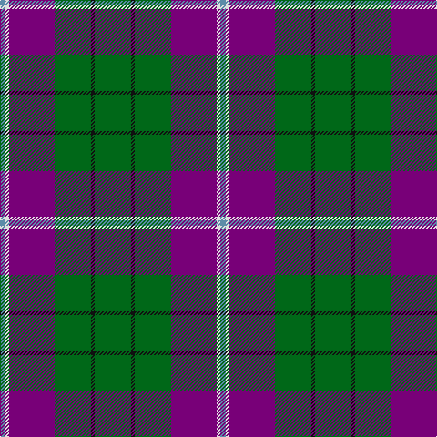

In pattern [BWBGKG](/patterns/bwbgkg/).

This was sourced from tartans-authority.  It is a [6 stripes tartan](/stripes/stripes6/).

Original link http://www.tartansauthority.com/tartan-ferret/display/10375/

## Thread count
B/6 LN4 P50 G40 K4 G/40

## Palette
Each colour and its ΔE from the base-6 reference it is a variant of.

| Colour | Shade | Base | ΔE (OKLab) |
|---|---|---|---|
| B | <code style="background-color:#5C8CA8;">#5C8CA8</code> `#5C8CA8` | B <code style="background-color:#2A418A;">#2A418A</code> | 0.23 |
| G | <code style="background-color:#006818;">#006818</code> `#006818` | G <code style="background-color:#006100;">#006100</code> | 0.02 |
| K | <code style="background-color:#101010;">#101010</code> `#101010` | K <code style="background-color:#000000;">#000000</code> | 0.17 |
| LN | <code style="background-color:#E0E0E0;">#E0E0E0</code> `#E0E0E0` | W <code style="background-color:#F7F7F7;">#F7F7F7</code> | 0.07 |
| P | <code style="background-color:#780078;">#780078</code> `#780078` | B <code style="background-color:#2A418A;">#2A418A</code> | 0.17 |

# Sample pattern

## Nearest tartans

The nearest existing variants by ΔTartan distance.

1. [Taylor Family Tartan Tartan Number: 809. Earliest known date: 1955 Some similarity to the Cameron recorded in the Vestiarium Scoticum, which may be connected with the name of the designer, Lt Col Iain Cameron Taylor, or to the Clan Cameron warrior Taillear dubh na Tuaighe (Black Taylor of the Axe) who lived in the seventeenth century. The pink stripe is described as 'coral'. The tartan is recognised by the Cameron of Lochiel. See products available Copyright © Blair Urquhart, Comrie, 2015](/setts/s8/g16k4g26r8g24b44g10y6-b780078-g006818-k101010-rd05054-ye8c000/) — ΔT 0.80
1. [Lossiemouth/Hersbruck](/setts/s6/g52b6g24k20ba30w4-b2c2c80-ba780078-g006818-k101010-we0e0e0/) — ΔT 0.81
1. [Vance (Family Association)](/setts/s6/r16b96w8g52b8k12-b304080-g008000-k000000-rc00000-we0e0e0/) — ΔT 1.14
1. [Celtic Norse Heritage Society](/setts/s5/r60k6b18g18y6-b2c2c80-g006818-k101010-r888888-yfccc00/) — ΔT 1.19
1. [Asheville Firefighters, The](/setts/s6/k17g48y4r10w12g4-g004028-k101010-rc80000-wa8ace8-yffe600/) — ΔT 1.20
1. [MacNamara](/setts/s7/y8b34k22r34b54k4w6-b506878-k101010-rc80000-we0e0e0-ye8c000/) — ΔT 1.21
1. [MacIntyre Hunting Clan Tartan Tartan Number: 743. Earliest known date: 1800 There is a doublet in Kingussie Museum dated 1800 in this tartan. It also appeared in the Vestiarium Scoticum (1842). See products available Copyright © Blair Urquhart, Comrie, 2015](/setts/s6/g8b24r6b24g64w8-b2c2c80-g006818-rc80000-we0e0e0/) — ΔT 1.24
1. [Inglis Family Tartan Tartan Number: 1798. Earliest known date: 1930-50 Inglis, or Ingles, tartan is a variation of the MacIntyre tartan recognised by Lord Lyon. The green stripe of the MacIntyre is replaced by yellow in the Inglis tartan. The pattern comes from the collection of the late James MacKinlay which he called MacIntyre or Inglis. MacKinlay collected samples of tartan between 1930 and 1950 but did not provide details of the origins of the specimens. The original MacIntyre tartan can be seen on a doublet at the Kingussie museum dated 1800. It was registered in the Public Register of All Arms and Bearings in 1955. See products available Copyright © Blair Urquhart, Comrie, 2015](/setts/s6/w8g56b36r8b36y6-b2c2c80-g006818-rc80000-we0e0e0-ye8c000/) — ΔT 1.24
1. [Inglis](/setts/s6/w8g56b36r8b36y6-b304080-g008000-rc00000-we0e0e0-yf0c000/) — ΔT 1.25
1. [Bryan Wedding (Personal)](/setts/s6/g60y10b20k20w4k4-b486c9c-g58442c-k101010-we8e8e8-ydcbc1c/) — ΔT 1.25

## Neighbour map

Every grey dot is one of 15726 variants placed by the first two principal components of the ΔTartan feature space (44% of its variance). Red is this tartan; blue dots are its nearest — click one to open its page.

<svg viewBox="0 0 640 380" role="img" style="max-width:100%;height:auto;border:1px solid #e0e0e0;border-radius:4px;display:block" xmlns="http://www.w3.org/2000/svg"><image href="/nn/cloud.v1.png" width="640" height="380"/><a href="/setts/s8/g16k4g26r8g24b44g10y6-b780078-g006818-k101010-rd05054-ye8c000/"><circle cx="272.8" cy="192.1" r="4" fill="#3465a4"><title>Taylor Family Tartan Tartan Number: 809. Earliest known date: 1955 Some similarity to the Cameron recorded in the Vestiarium Scoticum, which may be connected with the name of the designer, Lt Col Iain Cameron Taylor, or to the Clan Cameron warrior Taillear dubh na Tuaighe (Black Taylor of the Axe) who lived in the seventeenth century. The pink stripe is described as 'coral'. The tartan is recognised by the Cameron of Lochiel. See products available Copyright © Blair Urquhart, Comrie, 2015</title></circle></a><a href="/setts/s6/g52b6g24k20ba30w4-b2c2c80-ba780078-g006818-k101010-we0e0e0/"><circle cx="273.2" cy="205.0" r="4" fill="#3465a4"><title>Lossiemouth/Hersbruck</title></circle></a><a href="/setts/s6/r16b96w8g52b8k12-b304080-g008000-k000000-rc00000-we0e0e0/"><circle cx="273.9" cy="176.7" r="4" fill="#3465a4"><title>Vance (Family Association)</title></circle></a><a href="/setts/s5/r60k6b18g18y6-b2c2c80-g006818-k101010-r888888-yfccc00/"><circle cx="279.6" cy="196.9" r="4" fill="#3465a4"><title>Celtic Norse Heritage Society</title></circle></a><a href="/setts/s6/k17g48y4r10w12g4-g004028-k101010-rc80000-wa8ace8-yffe600/"><circle cx="259.2" cy="177.0" r="4" fill="#3465a4"><title>Asheville Firefighters, The</title></circle></a><a href="/setts/s7/y8b34k22r34b54k4w6-b506878-k101010-rc80000-we0e0e0-ye8c000/"><circle cx="262.2" cy="180.1" r="4" fill="#3465a4"><title>MacNamara</title></circle></a><a href="/setts/s6/g8b24r6b24g64w8-b2c2c80-g006818-rc80000-we0e0e0/"><circle cx="303.6" cy="213.4" r="4" fill="#3465a4"><title>MacIntyre Hunting Clan Tartan Tartan Number: 743. Earliest known date: 1800 There is a doublet in Kingussie Museum dated 1800 in this tartan. It also appeared in the Vestiarium Scoticum (1842). See products available Copyright © Blair Urquhart, Comrie, 2015</title></circle></a><a href="/setts/s6/w8g56b36r8b36y6-b2c2c80-g006818-rc80000-we0e0e0-ye8c000/"><circle cx="226.0" cy="207.0" r="4" fill="#3465a4"><title>Inglis Family Tartan Tartan Number: 1798. Earliest known date: 1930-50 Inglis, or Ingles, tartan is a variation of the MacIntyre tartan recognised by Lord Lyon. The green stripe of the MacIntyre is replaced by yellow in the Inglis tartan. The pattern comes from the collection of the late James MacKinlay which he called MacIntyre or Inglis. MacKinlay collected samples of tartan between 1930 and 1950 but did not provide details of the origins of the specimens. The original MacIntyre tartan can be seen on a doublet at the Kingussie museum dated 1800. It was registered in the Public Register of All Arms and Bearings in 1955. See products available Copyright © Blair Urquhart, Comrie, 2015</title></circle></a><a href="/setts/s6/w8g56b36r8b36y6-b304080-g008000-rc00000-we0e0e0-yf0c000/"><circle cx="226.5" cy="207.0" r="4" fill="#3465a4"><title>Inglis</title></circle></a><a href="/setts/s6/g60y10b20k20w4k4-b486c9c-g58442c-k101010-we8e8e8-ydcbc1c/"><circle cx="265.0" cy="169.9" r="4" fill="#3465a4"><title>Bryan Wedding (Personal)</title></circle></a><circle cx="301.7" cy="195.3" r="5" fill="#c00000"/></svg>

ID: /setts/s6/g40k4g40b50w4ba6-b780078-ba5c8ca8-g006818-k101010-we0e0e0/
