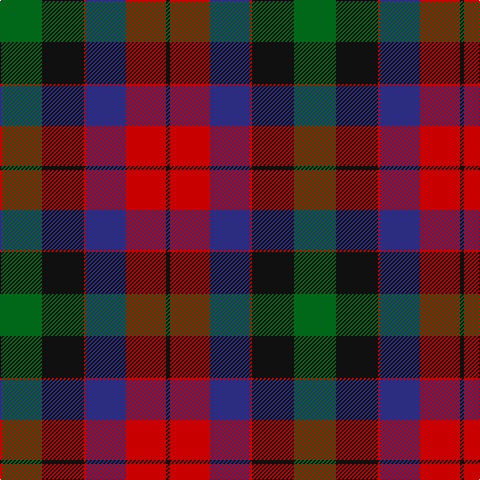

In pattern [GKRBRK](/patterns/gkrbrk/).

This was sourced from register-of-tartans.  It is a [6 stripes tartan](/stripes/stripes6/).

Original link https://www.tartanregister.gov.uk/tartanDetails.aspx?ref=3807

## Thread count
G/42 K42 R2 DB40 R40 K/4

## Palette
Each colour and its ΔE from the base-6 reference it is a variant of.

| Colour | Shade | Base | ΔE (OKLab) |
|---|---|---|---|
| DB | <code style="background-color:#2C2C80;">#2C2C80</code> `#2C2C80` | B <code style="background-color:#2A418A;">#2A418A</code> | 0.06 |
| G | <code style="background-color:#006818;">#006818</code> `#006818` | G <code style="background-color:#006100;">#006100</code> | 0.02 |
| K | <code style="background-color:#101010;">#101010</code> `#101010` | K <code style="background-color:#000000;">#000000</code> | 0.17 |
| R | <code style="background-color:#C80000;">#C80000</code> `#C80000` | R <code style="background-color:#CC0000;">#CC0000</code> | 0.01 |

# Sample pattern

## Nearest tartans

The nearest existing variants by ΔTartan distance.

1. [Borthwick (Clan)](/setts/s9/g34k2r32k4ra28k38ra28k4r12-g006818-k101010-r901c38-ra888888/) — ΔT 1.06
1. [Nibley (Personal)](/setts/s6/w6g36b44r38g2r4-b202060-g003820-rc80000-we0e0e0/) — ΔT 1.23
1. [Borthwick](/setts/s9/g34k2b32k4ga28k38ga28k4b12-b59110d-g11450d-ga7e7e7e-k000000/) — ΔT 1.24
1. [Borthwick](/setts/s9/g17k1b16k2ga14k19ga14k2b6-b59110d-g11450d-ga7e7e7e-k000000/) — ΔT 1.24
1. [Skene of Cromar (1885)](/setts/s5/b4r40g40k42r2-b2c4084-g005020-k101010-rdc0000/) — ΔT 1.25
1. [Skene of Cromar Clan Tartan Tartan Number: 535. Earliest known date: pre 2003 Count divided by 2 for display purposes. See products available Copyright © Blair Urquhart, Comrie, 2015](/setts/s5/b4r40g40k42r2-b2c2c80-g006818-k101010-rc80000/) — ΔT 1.28
1. [Kilgour (Asymmetrical)](/setts/s8/b24k12r56k12g56k12b24y4-b2c2c80-g006818-k101010-rc80000-ye8c000/) — ΔT 1.34
1. [Kilgour (Cant)](/setts/s8/b24y4b24k12r56k12g56k12-b2c2c80-g006818-k101010-rc80000-ye8c000/) — ΔT 1.34
1. [Kilgour (Symmetrical)](/setts/s8/b24k12g56k12r56k12b24y4-b2c2c80-g006818-k101010-rc80000-ye8c000/) — ΔT 1.34
1. [Borthwick](/setts/s9/g17k1r16k2ga14k19ga14k2r6-g004c00-ga707070-k000000-rc80000/) — ΔT 1.38

## Neighbour map

Every grey dot is one of 15726 variants placed by the first two principal components of the ΔTartan feature space (44% of its variance). Red is this tartan; blue dots are its nearest — click one to open its page.

<svg viewBox="0 0 640 380" role="img" style="max-width:100%;height:auto;border:1px solid #e0e0e0;border-radius:4px;display:block" xmlns="http://www.w3.org/2000/svg"><image href="/nn/cloud.v1.png" width="640" height="380"/><a href="/setts/s9/g34k2r32k4ra28k38ra28k4r12-g006818-k101010-r901c38-ra888888/"><circle cx="167.2" cy="181.9" r="4" fill="#3465a4"><title>Borthwick (Clan)</title></circle></a><a href="/setts/s6/w6g36b44r38g2r4-b202060-g003820-rc80000-we0e0e0/"><circle cx="221.7" cy="178.3" r="4" fill="#3465a4"><title>Nibley (Personal)</title></circle></a><a href="/setts/s9/g34k2b32k4ga28k38ga28k4b12-b59110d-g11450d-ga7e7e7e-k000000/"><circle cx="150.9" cy="180.1" r="4" fill="#3465a4"><title>Borthwick</title></circle></a><a href="/setts/s9/g17k1b16k2ga14k19ga14k2b6-b59110d-g11450d-ga7e7e7e-k000000/"><circle cx="150.9" cy="180.1" r="4" fill="#3465a4"><title>Borthwick</title></circle></a><a href="/setts/s5/b4r40g40k42r2-b2c4084-g005020-k101010-rdc0000/"><circle cx="214.7" cy="197.4" r="4" fill="#3465a4"><title>Skene of Cromar (1885)</title></circle></a><a href="/setts/s5/b4r40g40k42r2-b2c2c80-g006818-k101010-rc80000/"><circle cx="214.3" cy="198.5" r="4" fill="#3465a4"><title>Skene of Cromar Clan Tartan Tartan Number: 535. Earliest known date: pre 2003 Count divided by 2 for display purposes. See products available Copyright © Blair Urquhart, Comrie, 2015</title></circle></a><a href="/setts/s8/b24k12r56k12g56k12b24y4-b2c2c80-g006818-k101010-rc80000-ye8c000/"><circle cx="133.1" cy="172.2" r="4" fill="#3465a4"><title>Kilgour (Asymmetrical)</title></circle></a><a href="/setts/s8/b24y4b24k12r56k12g56k12-b2c2c80-g006818-k101010-rc80000-ye8c000/"><circle cx="133.1" cy="172.2" r="4" fill="#3465a4"><title>Kilgour (Cant)</title></circle></a><a href="/setts/s8/b24k12g56k12r56k12b24y4-b2c2c80-g006818-k101010-rc80000-ye8c000/"><circle cx="133.1" cy="172.2" r="4" fill="#3465a4"><title>Kilgour (Symmetrical)</title></circle></a><a href="/setts/s9/g17k1r16k2ga14k19ga14k2r6-g004c00-ga707070-k000000-rc80000/"><circle cx="145.7" cy="172.1" r="4" fill="#3465a4"><title>Borthwick</title></circle></a><circle cx="162.7" cy="202.1" r="5" fill="#c00000"/></svg>

ID: /setts/s6/g42k42r2b40r40k4-b2c2c80-g006818-k101010-rc80000/
