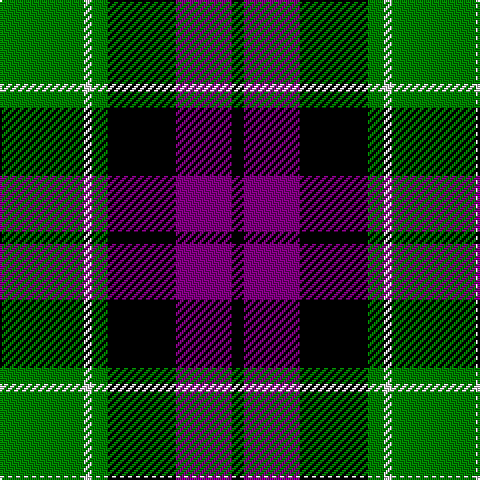

In pattern [GWGKBK](/patterns/gwgkbk/).

This was sourced from weddslist.  It is a [6 stripes tartan](/stripes/stripes6/).

Original link http://www.weddslist.com/cgi-bin/tartans/pg.pl?source=sts

## Thread count
G/42 LN4 G8 K34 P28 K/6

## Palette
Each colour and its ΔE from the base-6 reference it is a variant of.

| Colour | Shade | Base | ΔE (OKLab) |
|---|---|---|---|
| G | <code style="background-color:#008000;">#008000</code> `#008000` | G <code style="background-color:#006400;">#006400</code> | 0.09 |
| K | <code style="background-color:#000000;">#000000</code> `#000000` | K <code style="background-color:#000000;">#000000</code> | 0.00 |
| LN | <code style="background-color:#E0E0E0;">#E0E0E0</code> `#E0E0E0` | W <code style="background-color:#F4F4F0;">#F4F4F0</code> | 0.06 |
| P | <code style="background-color:#800080;">#800080</code> `#800080` | B <code style="background-color:#2C4084;">#2C4084</code> | 0.17 |

# Sample pattern

## Nearest tartans

The nearest existing variants by ΔTartan distance.

1. [Wilson's, No 160](/setts/s6/g42y4g8k32b28k6-b800080-g008000-k000000-yf0c000/) — ΔT 0.14
1. [Wilson's, No 150 "Coburg"](/setts/s6/g36b4g8k28ba24k6-b5480b0-ba800080-g008000-k000000/) — ΔT 0.32
1. [MacArthur of Milton, hunting](/setts/s6/g28b4g4k16ba18k4-b304080-ba800080-g008000-k000000/) — ΔT 0.69
1. [Wilson's, No 100](/setts/s6/g6b34k36y4g34k6-b800080-g008000-k000000-yf0c000/) — ΔT 0.72
1. [Wilson's, No 76](/setts/s6/g6b34k36w4g34k6-b800080-g008000-k000000-we0e0e0/) — ΔT 0.75
1. [United Distillers (Corporate)](/setts/s6/y4k28y2ka28y28ya4-k000000-ka101010-y948860-yae8c000/) — ΔT 0.79
1. [Melville](/setts/s6/k8w4g36k26b24k4-b304080-g008000-k000000-we0e0e0/) — ΔT 0.81
1. [Graham of Montrose](/setts/s6/g8b30w4k32g38k8-b304080-g008000-k000000-we0e0e0/) — ΔT 0.84
1. [MacNeil 1](/setts/s6/w4b36k36g36k8w4-b304080-g008000-k000000-we0e0e0/) — ΔT 0.86
1. [Gunn](/setts/s6/r4g24k24g2b24g2-b304080-g008000-k000000-rc00000/) — ΔT 0.87

## Neighbour map

Every grey dot is one of 15726 variants placed by the first two principal components of the ΔTartan feature space (44% of its variance). Red is this tartan; blue dots are its nearest — click one to open its page.

<svg viewBox="0 0 640 380" role="img" style="max-width:100%;height:auto;border:1px solid #e0e0e0;border-radius:4px;display:block" xmlns="http://www.w3.org/2000/svg"><image href="/nn/cloud.v1.png" width="640" height="380"/><a href="/setts/s6/g42y4g8k32b28k6-b800080-g008000-k000000-yf0c000/"><circle cx="182.4" cy="208.9" r="4" fill="#3465a4"><title>Wilson's, No 160</title></circle></a><a href="/setts/s6/g36b4g8k28ba24k6-b5480b0-ba800080-g008000-k000000/"><circle cx="174.4" cy="220.1" r="4" fill="#3465a4"><title>Wilson's, No 150 &quot;Coburg&quot;</title></circle></a><a href="/setts/s6/g28b4g4k16ba18k4-b304080-ba800080-g008000-k000000/"><circle cx="175.4" cy="224.5" r="4" fill="#3465a4"><title>MacArthur of Milton, hunting</title></circle></a><a href="/setts/s6/g6b34k36y4g34k6-b800080-g008000-k000000-yf0c000/"><circle cx="153.1" cy="213.0" r="4" fill="#3465a4"><title>Wilson's, No 100</title></circle></a><a href="/setts/s6/g6b34k36w4g34k6-b800080-g008000-k000000-we0e0e0/"><circle cx="152.0" cy="212.7" r="4" fill="#3465a4"><title>Wilson's, No 76</title></circle></a><a href="/setts/s6/y4k28y2ka28y28ya4-k000000-ka101010-y948860-yae8c000/"><circle cx="176.8" cy="193.0" r="4" fill="#3465a4"><title>United Distillers (Corporate)</title></circle></a><a href="/setts/s6/k8w4g36k26b24k4-b304080-g008000-k000000-we0e0e0/"><circle cx="156.2" cy="220.8" r="4" fill="#3465a4"><title>Melville</title></circle></a><a href="/setts/s6/g8b30w4k32g38k8-b304080-g008000-k000000-we0e0e0/"><circle cx="158.8" cy="223.4" r="4" fill="#3465a4"><title>Graham of Montrose</title></circle></a><a href="/setts/s6/w4b36k36g36k8w4-b304080-g008000-k000000-we0e0e0/"><circle cx="142.8" cy="216.1" r="4" fill="#3465a4"><title>MacNeil 1</title></circle></a><a href="/setts/s6/r4g24k24g2b24g2-b304080-g008000-k000000-rc00000/"><circle cx="169.2" cy="204.7" r="4" fill="#3465a4"><title>Gunn</title></circle></a><circle cx="179.3" cy="208.6" r="5" fill="#c00000"/></svg>

ID: /setts/s6/g42w4g8k34b28k6-b800080-g008000-k000000-we0e0e0/
