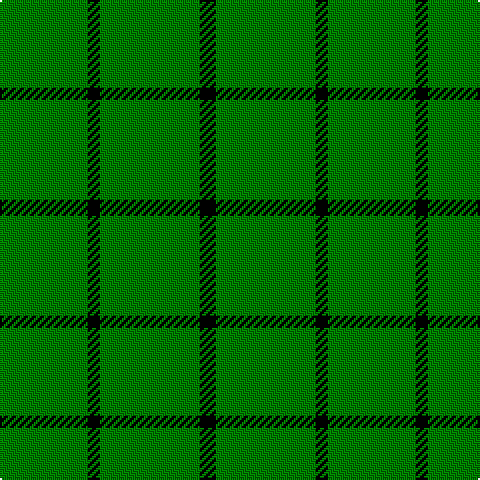

In pattern [GKGGGK](/patterns/gkgggk/).

This was sourced from weddslist.  It is a [6 stripes tartan](/stripes/stripes6/).

Original link http://www.weddslist.com/cgi-bin/tartans/pg.pl?source=sts

## Thread count
G/44 K6 G6 G32 G12 K/8

## Palette
Each colour and its ΔE from the base-6 reference it is a variant of.

| Colour | Shade | Base | ΔE (OKLab) |
|---|---|---|---|
| G | <code style="background-color:#008000;">#008000</code> `#008000` | G <code style="background-color:#006400;">#006400</code> | 0.09 |
| K | <code style="background-color:#000000;">#000000</code> `#000000` | K <code style="background-color:#000000;">#000000</code> | 0.00 |

# Sample pattern

## Nearest tartans

The nearest existing variants by ΔTartan distance.

1. [Cowper (Personal)](/setts/s10/g4w4g32w4g32w4g8w4g16w4-g006818-wfcfcfc/) — ΔT 1.85
1. [Peterhead](/setts/s5/g28b4g8k12g8-b304080-g008000-k000000/) — ΔT 2.52
1. [Highland Spring (1997)](/setts/s6/g46r6g14r6g46b14-b440044-g006818-rc80000/) — ΔT 2.56
1. [Glen of Daviot (Dalgleish)](/setts/s5/g100k12b22g50y8-b000088-g007800-k000000-y9c9c00/) — ΔT 2.57
1. [Hibernian S3](/setts/s3/g98w8y22-g006818-wfcfcfc-yd87c00/) — ΔT 2.80
1. [Kenmore Hunting (Fashion)](/setts/s7/k4g4g38g4g4g38r4-g006818-k000000-r880000/) — ΔT 2.83
1. [Loch Laggan](/setts/s6/r19g6r7g101k7g7-g008000-k000000-rc00000/) — ΔT 2.88
1. [Welsh, National](/setts/s5/r16g8r8g88w8-g008000-rc00000-we0e0e0/) — ΔT 2.90
1. [Loch Laggan](/setts/s10/g8k4g76r4g8r16g8r4g76k4-g289c18-k101010-rc80000/) — ΔT 2.95
1. [Highland Spring (Green)](/setts/s4/g14r6g46ra14-g008000-rc00000-ra802040/) — ΔT 2.97

## Neighbour map

Every grey dot is one of 15726 variants placed by the first two principal components of the ΔTartan feature space (44% of its variance). Red is this tartan; blue dots are its nearest — click one to open its page.

<svg viewBox="0 0 640 380" role="img" style="max-width:100%;height:auto;border:1px solid #e0e0e0;border-radius:4px;display:block" xmlns="http://www.w3.org/2000/svg"><image href="/nn/cloud.v1.png" width="640" height="380"/><a href="/setts/s10/g4w4g32w4g32w4g8w4g16w4-g006818-wfcfcfc/"><circle cx="492.0" cy="224.4" r="4" fill="#3465a4"><title>Cowper (Personal)</title></circle></a><a href="/setts/s5/g28b4g8k12g8-b304080-g008000-k000000/"><circle cx="387.8" cy="269.7" r="4" fill="#3465a4"><title>Peterhead</title></circle></a><a href="/setts/s6/g46r6g14r6g46b14-b440044-g006818-rc80000/"><circle cx="517.1" cy="274.6" r="4" fill="#3465a4"><title>Highland Spring (1997)</title></circle></a><a href="/setts/s5/g100k12b22g50y8-b000088-g007800-k000000-y9c9c00/"><circle cx="462.2" cy="227.5" r="4" fill="#3465a4"><title>Glen of Daviot (Dalgleish)</title></circle></a><a href="/setts/s3/g98w8y22-g006818-wfcfcfc-yd87c00/"><circle cx="493.8" cy="256.4" r="4" fill="#3465a4"><title>Hibernian S3</title></circle></a><a href="/setts/s7/k4g4g38g4g4g38r4-g006818-k000000-r880000/"><circle cx="626.0" cy="252.1" r="4" fill="#3465a4"><title>Kenmore Hunting (Fashion)</title></circle></a><a href="/setts/s6/r19g6r7g101k7g7-g008000-k000000-rc00000/"><circle cx="528.4" cy="188.0" r="4" fill="#3465a4"><title>Loch Laggan</title></circle></a><a href="/setts/s5/r16g8r8g88w8-g008000-rc00000-we0e0e0/"><circle cx="491.9" cy="218.5" r="4" fill="#3465a4"><title>Welsh, National</title></circle></a><a href="/setts/s10/g8k4g76r4g8r16g8r4g76k4-g289c18-k101010-rc80000/"><circle cx="589.1" cy="174.1" r="4" fill="#3465a4"><title>Loch Laggan</title></circle></a><a href="/setts/s4/g14r6g46ra14-g008000-rc00000-ra802040/"><circle cx="475.8" cy="285.8" r="4" fill="#3465a4"><title>Highland Spring (Green)</title></circle></a><circle cx="543.4" cy="277.4" r="5" fill="#c00000"/></svg>

ID: /setts/s6/g44k6g6g32g12k8-g008000-k000000/
