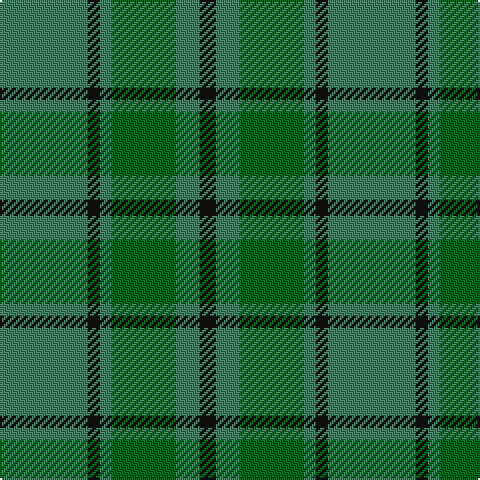

In pattern [GKGGGK](/patterns/gkgggk/).

This was sourced from register-of-tartans.  It is a [6 stripes tartan](/stripes/stripes6/).

Original link https://www.tartanregister.gov.uk/tartanDetails.aspx?ref=530

## Thread count
Gb/44 K6 Gb6 G32 Gb12 K/8

## Palette
Each colour and its ΔE from the base-6 reference it is a variant of.

| Colour | Shade | Base | ΔE (OKLab) |
|---|---|---|---|
| DG | <code style="background-color:#003820;">#003820</code> `#003820` | G <code style="background-color:#006100;">#006100</code> | 0.15 |
| G | <code style="background-color:#006818;">#006818</code> `#006818` | G <code style="background-color:#006100;">#006100</code> | 0.02 |
| Ga | <code style="background-color:#289C18;">#289C18</code> `#289C18` | G <code style="background-color:#006100;">#006100</code> | 0.19 |
| Gb | <code style="background-color:#408060;">#408060</code> `#408060` | G <code style="background-color:#006100;">#006100</code> | 0.14 |
| K | <code style="background-color:#101010;">#101010</code> `#101010` | K <code style="background-color:#000000;">#000000</code> | 0.17 |

# Sample pattern

## Nearest tartans

The nearest existing variants by ΔTartan distance.

1. [Confederate Artillery (Military)](/setts/s6/g4r28g16r6g24ra4-g006818-ra0783c-ra8c0000/) — ΔT 1.52
1. [Daks, Tartan-Loden](/setts/s8/b6r14g4ra4g28r4g4b6-b304080-g008000-r806050-rac00000/) — ΔT 1.55
1. [Dunbar Hunting](/setts/s6/g8k4g56k16ga42g6-g006818-ga003820-k101010/) — ΔT 1.57
1. [Daks (Loden)](/setts/s8/b6g14ga4gb4ga28g4ga4b6-b2c2c80-g604000-ga006818-gb808080/) — ΔT 1.58
1. [Hueg (Hunting) (Personal)](/setts/s10/b34g10b10g34b8g34k4ga4k4g10-b003c64-g006818-ga604000-k101010/) — ΔT 1.66
1. [MacKinnon, hunting](/setts/s7/g4r32g32ra4g32r32w4-g008000-r806050-rac00000-we0e0e0/) — ΔT 1.67
1. [Armagh Irish County Tartan Tartan Number: 2276. Earliest known date: 1996 One of a series of Irish District tartans designed by Polly Wittering of the House of Edgar, with colours reminiscent of the Country with soft warm colours dominating. See products available Copyright © Blair Urquhart, Comrie, 2015](/setts/s9/g8y4g34ga4r8ga4g6ga22g4-g407c40-ga043828-ra81830-ybcac20/) — ΔT 1.68
1. [O'Neill Pipe Band 1983 (Corporate)](/setts/s7/r4g4r20g32y4g4y4-g006818-rb84c00-y48a4c0/) — ΔT 1.71
1. [MacSporran Rejected design](/setts/s6/g60ga26g14ga60g4y8-g002814-ga005020-ye8c000/) — ΔT 1.71
1. [Irving of Bonshaw](/setts/s5/g108ga56b8ga8y8-b003c64-g006818-ga048888-ye8c000/) — ΔT 1.75

## Neighbour map

Every grey dot is one of 15726 variants placed by the first two principal components of the ΔTartan feature space (44% of its variance). Red is this tartan; blue dots are its nearest — click one to open its page.

<svg viewBox="0 0 640 380" role="img" style="max-width:100%;height:auto;border:1px solid #e0e0e0;border-radius:4px;display:block" xmlns="http://www.w3.org/2000/svg"><image href="/nn/cloud.v1.png" width="640" height="380"/><a href="/setts/s6/g4r28g16r6g24ra4-g006818-ra0783c-ra8c0000/"><circle cx="384.9" cy="291.0" r="4" fill="#3465a4"><title>Confederate Artillery (Military)</title></circle></a><a href="/setts/s8/b6r14g4ra4g28r4g4b6-b304080-g008000-r806050-rac00000/"><circle cx="302.3" cy="232.7" r="4" fill="#3465a4"><title>Daks, Tartan-Loden</title></circle></a><a href="/setts/s6/g8k4g56k16ga42g6-g006818-ga003820-k101010/"><circle cx="399.0" cy="261.0" r="4" fill="#3465a4"><title>Dunbar Hunting</title></circle></a><a href="/setts/s8/b6g14ga4gb4ga28g4ga4b6-b2c2c80-g604000-ga006818-gb808080/"><circle cx="326.4" cy="247.3" r="4" fill="#3465a4"><title>Daks (Loden)</title></circle></a><a href="/setts/s10/b34g10b10g34b8g34k4ga4k4g10-b003c64-g006818-ga604000-k101010/"><circle cx="377.5" cy="246.6" r="4" fill="#3465a4"><title>Hueg (Hunting) (Personal)</title></circle></a><a href="/setts/s7/g4r32g32ra4g32r32w4-g008000-r806050-rac00000-we0e0e0/"><circle cx="333.8" cy="261.1" r="4" fill="#3465a4"><title>MacKinnon, hunting</title></circle></a><a href="/setts/s9/g8y4g34ga4r8ga4g6ga22g4-g407c40-ga043828-ra81830-ybcac20/"><circle cx="333.5" cy="216.4" r="4" fill="#3465a4"><title>Armagh Irish County Tartan Tartan Number: 2276. Earliest known date: 1996 One of a series of Irish District tartans designed by Polly Wittering of the House of Edgar, with colours reminiscent of the Country with soft warm colours dominating. See products available Copyright © Blair Urquhart, Comrie, 2015</title></circle></a><a href="/setts/s7/r4g4r20g32y4g4y4-g006818-rb84c00-y48a4c0/"><circle cx="368.1" cy="235.2" r="4" fill="#3465a4"><title>O'Neill Pipe Band 1983 (Corporate)</title></circle></a><a href="/setts/s6/g60ga26g14ga60g4y8-g002814-ga005020-ye8c000/"><circle cx="393.5" cy="263.8" r="4" fill="#3465a4"><title>MacSporran Rejected design</title></circle></a><a href="/setts/s5/g108ga56b8ga8y8-b003c64-g006818-ga048888-ye8c000/"><circle cx="421.6" cy="241.0" r="4" fill="#3465a4"><title>Irving of Bonshaw</title></circle></a><circle cx="372.1" cy="278.2" r="5" fill="#c00000"/></svg>

ID: /setts/s6/g44k6g6ga32g12k8-g408060-ga006818-k101010/
