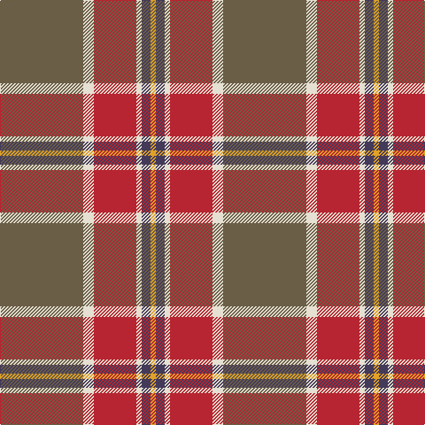

In pattern [GWRWBY](/patterns/gwrwby/).

This was sourced from register-of-tartans.  It is a [6 stripes tartan](/stripes/stripes6/).

Original link https://www.tartanregister.gov.uk/tartanDetails.aspx?ref=10597

## Thread count
Na/94 W12 R48 W6 N10 Y/6

## Palette
Each colour and its ΔE from the base-6 reference it is a variant of.

| Colour | Shade | Base | ΔE (OKLab) |
|---|---|---|---|
| N | <code style="background-color:#433A5A;">#433A5A</code> `#433A5A` | B <code style="background-color:#2A418A;">#2A418A</code> | 0.09 |
| Na | <code style="background-color:#6A5E47;">#6A5E47</code> `#6A5E47` | G <code style="background-color:#006100;">#006100</code> | 0.14 |
| R | <code style="background-color:#B62531;">#B62531</code> `#B62531` | R <code style="background-color:#CC0000;">#CC0000</code> | 0.05 |
| W | <code style="background-color:#E5E0D2;">#E5E0D2</code> `#E5E0D2` | W <code style="background-color:#F7F7F7;">#F7F7F7</code> | 0.07 |
| Y | <code style="background-color:#E0A126;">#E0A126</code> `#E0A126` | Y <code style="background-color:#F2BF00;">#F2BF00</code> | 0.08 |

# Sample pattern

## Nearest tartans

The nearest existing variants by ΔTartan distance.

1. [Duminiak (Personal)](/setts/s6/r47w6ra24w3b5y3~b003c64-r888888-rac80000-we0e0e0-ybc8c00~x2/) — ΔT 0.77
1. [Spragg (Name)](/setts/s7/r2g16ra1r2ra12y1b1~b5c8ca8-g048888-r901c38-rac80000-ye8c000~x2/) — ΔT 0.82
1. [Unidentified 35](/setts/s7/b4ba2b2w2ba9r27ra4~b304080-ba401000-r906030-rac00000-we0e0e0~x3/) — ΔT 0.82
1. [Spragg, Andrew](/setts/s7/r2g16ra1r2ra12y1ga1~g165041-ga547c73-ra62a2a-racc1100-yffe600~x2/) — ΔT 1.00
1. [Dundhuin Gold](/setts/s6/r59b28y5g3w4y5~b5f749c-g23321b-r905966-we5e0d2-yf8e38c~x2/) — ΔT 1.23
1. [Bronte](/setts/s5/g24b2r25y2k3~b1870a4-g408060-k101010-rc80000-ye8c000~x2/) — ΔT 1.24
1. [Dundhuin](/setts/s6/y6r5k2g18ra28w2~g6a8a67-k1c1714-r905966-ra9d2123-wf9f5ef-y99a3ba~x2/) — ΔT 1.26
1. [Un-named Dutch](/setts/s7/b2r10b10ra3r2y24w2~b5c5c5c-r880000-ra888888-wf8f8f8-ya0a0a0~x2/) — ΔT 1.34
1. [Elbrick Dress (Personal)](/setts/s8/r6b22r6g20y2r45b2w5~b1474b4-g408060-rc80000-wfcfcfc-ye8c000~x2/) — ΔT 1.39
1. [Buncle (Duns)](/setts/s5/b9ba2g12r31y9~b486373-ba351e14-g203b27-ra32d18-ye0a126~x2/) — ΔT 1.40

## Neighbour map

Every grey dot is one of 15726 variants placed by the first two principal components of the ΔTartan feature space (44% of its variance). Red is this tartan; blue dots are its nearest — click one to open its page.

<svg viewBox="0 0 640 380" role="img" style="max-width:100%;height:auto;border:1px solid #e0e0e0;border-radius:4px;display:block" xmlns="http://www.w3.org/2000/svg"><image href="/nn/cloud.v1.png" width="640" height="380"/><a href="/setts/s6/r47w6ra24w3b5y3~b003c64-r888888-rac80000-we0e0e0-ybc8c00~x2/"><circle cx="325.2" cy="157.3" r="4" fill="#3465a4"><title>Duminiak (Personal)</title></circle></a><a href="/setts/s7/r2g16ra1r2ra12y1b1~b5c8ca8-g048888-r901c38-rac80000-ye8c000~x2/"><circle cx="298.3" cy="149.9" r="4" fill="#3465a4"><title>Spragg (Name)</title></circle></a><a href="/setts/s7/b4ba2b2w2ba9r27ra4~b304080-ba401000-r906030-rac00000-we0e0e0~x3/"><circle cx="324.0" cy="158.6" r="4" fill="#3465a4"><title>Unidentified 35</title></circle></a><a href="/setts/s7/r2g16ra1r2ra12y1ga1~g165041-ga547c73-ra62a2a-racc1100-yffe600~x2/"><circle cx="301.8" cy="151.9" r="4" fill="#3465a4"><title>Spragg, Andrew</title></circle></a><a href="/setts/s6/r59b28y5g3w4y5~b5f749c-g23321b-r905966-we5e0d2-yf8e38c~x2/"><circle cx="374.1" cy="156.7" r="4" fill="#3465a4"><title>Dundhuin Gold</title></circle></a><a href="/setts/s5/g24b2r25y2k3~b1870a4-g408060-k101010-rc80000-ye8c000~x2/"><circle cx="283.3" cy="182.5" r="4" fill="#3465a4"><title>Bronte</title></circle></a><a href="/setts/s6/y6r5k2g18ra28w2~g6a8a67-k1c1714-r905966-ra9d2123-wf9f5ef-y99a3ba~x2/"><circle cx="257.5" cy="159.2" r="4" fill="#3465a4"><title>Dundhuin</title></circle></a><a href="/setts/s7/b2r10b10ra3r2y24w2~b5c5c5c-r880000-ra888888-wf8f8f8-ya0a0a0~x2/"><circle cx="250.2" cy="166.9" r="4" fill="#3465a4"><title>Un-named Dutch</title></circle></a><a href="/setts/s8/r6b22r6g20y2r45b2w5~b1474b4-g408060-rc80000-wfcfcfc-ye8c000~x2/"><circle cx="308.4" cy="129.1" r="4" fill="#3465a4"><title>Elbrick Dress (Personal)</title></circle></a><a href="/setts/s5/b9ba2g12r31y9~b486373-ba351e14-g203b27-ra32d18-ye0a126~x2/"><circle cx="282.1" cy="195.4" r="4" fill="#3465a4"><title>Buncle (Duns)</title></circle></a><circle cx="335.1" cy="164.4" r="5" fill="#c00000"/></svg>

ID: /setts/s6/g47w6r24w3b5y3~b433a5a-g6a5e47-rb62531-we5e0d2-ye0a126~x2/
