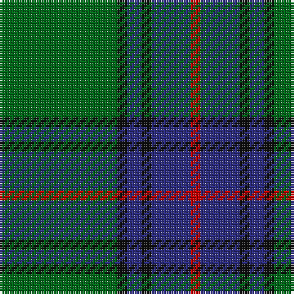

In pattern [GKBKBR](/patterns/gkbkbr/).

This was sourced from tartans-authority.  It is a [6 stripes tartan](/stripes/stripes6/).

Original link http://www.tartansauthority.com/tartan-ferret/display/768/

## Attestations

This cloth appears in 2 source records; the oldest owns this page.

- 1845 — Shaw (Clan 1) (tartans-authority, [record](http://www.tartansauthority.com/tartan-ferret/display/768/))
- undated — Shaw Clan Tartan Tartan Number: 768. Earliest known date: 1845 The Lyon recognition of a more recent design is "..specifically without prejudice to the continued use of the hitherto accepted Shaw tartan." This sett was published by McIan (c.1845) in a drawing of Fearcher Shaw of the Black Watch, who was executed for mutiny in 1743. Co-author, James Logan, describes the figure as wearing the 'regimental' tartan with a red line to distinguish the philabeg from the belted plaid. The Shaw tartan, it appears, had been derived from errors in the graphic illustration of the 'Black Watch'. For this reason John Shaw of Tordarroch, 22nd Chief, had a new Shaw tartan designed reflecting the genuine historical connections with Clan Mackintosh and Clan Chattan. See products available Copyright © Blair Urquhart, Comrie, 2015 (house-of-tartan, [record](http://www.house-of-tartan.scotland.net/house/TartanViewjs.asp?colr=Def&tnam=768))

## Thread count
G/48 K4 DB6 K4 DB16 R/4

## Palette
Each colour and its ΔE from the base-6 reference it is a variant of.

| Colour | Shade | Base | ΔE (OKLab) |
|---|---|---|---|
| DB | <code style="background-color:#2C2C80;">#2C2C80</code> `#2C2C80` | B <code style="background-color:#2C4084;">#2C4084</code> | 0.05 |
| G | <code style="background-color:#006818;">#006818</code> `#006818` | G <code style="background-color:#006400;">#006400</code> | 0.02 |
| K | <code style="background-color:#101010;">#101010</code> `#101010` | K <code style="background-color:#000000;">#000000</code> | 0.17 |
| R | <code style="background-color:#C80000;">#C80000</code> `#C80000` | R <code style="background-color:#C80000;">#C80000</code> | 0.00 |

# Sample pattern

## Nearest tartans

The nearest existing variants by ΔTartan distance.

1. [US Marine Corps](/setts/s8/g80r6g8r6g24b64y8r6-b2c2c80-g006818-rc80000-yd09800/) — ΔT 0.82
1. [U.S. Marine Corps (Military?)](/setts/s8/g80r6g8r6g24b64y8r6-b2c2c80-g005810-rc80000-ye8c000/) — ΔT 0.86
1. [Rowan (Personal)](/setts/s5/g48y4b32k4b4-b2c2c80-g006818-k101010-yd09800/) — ΔT 0.88
1. [St Andrews Links](/setts/s7/b32g8b6g6y4g48r4-b14283c-g006818-r880000-yd09800/) — ΔT 0.97
1. [Irvine Clan Tartan Tartan Number: 733. Earliest known date: c.1889 Scottish Tartans Society notes say that this tartan was 'first made by Peter MacArthur and Co, Hamilton'. MacKinlay, a tartan collector between 1930 and 1950, gives the earliest date as 1889 but it is not known upon what evidence. The name Irvine derives from an old parish name in Dumfries-shire, and from Irvine in Ayrshire. William de Irwyne obtained the forest of Drum in 1324, and is thus the ancestor of the Irvines of Drum. See products available Copyright © Blair Urquhart, Comrie, 2015](/setts/s5/g72b36k4b4w4-b2c2c80-g006818-k101010-we0e0e0/) — ΔT 0.98
1. [Harley (Leslie), Robert](/setts/s8/g8k12y4k12g8b32g64k4-b202060-g006818-k101010-ye8c000/) — ΔT 0.99
1. [Leatherneck U.S.Marine Corps Corporate Tartan Tartan Number: 975. Earliest known date: 1986 Designed by Madam Leask and the Scottish Tartans Society Accredited in 1981. See products available Copyright © Blair Urquhart, Comrie, 2015](/setts/s8/g56r4g4r4g16b48y6r4-b2c2c80-g006818-rc80000-ye8c000/) — ΔT 1.02
1. [Leatherneck](/setts/s8/g80r6g8r6g24b64y8r6-b1c0070-g006818-r880000-yd09800/) — ΔT 1.02
1. [Leatherneck, U.S.Marine Corps](/setts/s8/g56r4g4r4g16b48ga6r4-b304080-g008000-ga908000-rc00000/) — ΔT 1.09
1. [MacIntyre](/setts/s6/g8b24r6b24g64w8-b304080-g004010-rc00000-we0e0e0/) — ΔT 1.11

## Neighbour map

Every grey dot is one of 15726 variants placed by the first two principal components of the ΔTartan feature space (44% of its variance). Red is this tartan; blue dots are its nearest — click one to open its page.

<svg viewBox="0 0 640 380" role="img" style="max-width:100%;height:auto;border:1px solid #e0e0e0;border-radius:4px;display:block" xmlns="http://www.w3.org/2000/svg"><image href="/nn/cloud.v1.png" width="640" height="380"/><a href="/setts/s8/g80r6g8r6g24b64y8r6-b2c2c80-g006818-rc80000-yd09800/"><circle cx="340.7" cy="185.0" r="4" fill="#3465a4"><title>US Marine Corps</title></circle></a><a href="/setts/s8/g80r6g8r6g24b64y8r6-b2c2c80-g005810-rc80000-ye8c000/"><circle cx="339.3" cy="184.7" r="4" fill="#3465a4"><title>U.S. Marine Corps (Military?)</title></circle></a><a href="/setts/s5/g48y4b32k4b4-b2c2c80-g006818-k101010-yd09800/"><circle cx="337.2" cy="221.4" r="4" fill="#3465a4"><title>Rowan (Personal)</title></circle></a><a href="/setts/s7/b32g8b6g6y4g48r4-b14283c-g006818-r880000-yd09800/"><circle cx="380.9" cy="214.9" r="4" fill="#3465a4"><title>St Andrews Links</title></circle></a><a href="/setts/s5/g72b36k4b4w4-b2c2c80-g006818-k101010-we0e0e0/"><circle cx="394.7" cy="198.0" r="4" fill="#3465a4"><title>Irvine Clan Tartan Tartan Number: 733. Earliest known date: c.1889 Scottish Tartans Society notes say that this tartan was 'first made by Peter MacArthur and Co, Hamilton'. MacKinlay, a tartan collector between 1930 and 1950, gives the earliest date as 1889 but it is not known upon what evidence. The name Irvine derives from an old parish name in Dumfries-shire, and from Irvine in Ayrshire. William de Irwyne obtained the forest of Drum in 1324, and is thus the ancestor of the Irvines of Drum. See products available Copyright © Blair Urquhart, Comrie, 2015</title></circle></a><a href="/setts/s8/g8k12y4k12g8b32g64k4-b202060-g006818-k101010-ye8c000/"><circle cx="334.2" cy="184.3" r="4" fill="#3465a4"><title>Harley (Leslie), Robert</title></circle></a><a href="/setts/s8/g56r4g4r4g16b48y6r4-b2c2c80-g006818-rc80000-ye8c000/"><circle cx="327.1" cy="177.0" r="4" fill="#3465a4"><title>Leatherneck U.S.Marine Corps Corporate Tartan Tartan Number: 975. Earliest known date: 1986 Designed by Madam Leask and the Scottish Tartans Society Accredited in 1981. See products available Copyright © Blair Urquhart, Comrie, 2015</title></circle></a><a href="/setts/s8/g80r6g8r6g24b64y8r6-b1c0070-g006818-r880000-yd09800/"><circle cx="327.9" cy="181.8" r="4" fill="#3465a4"><title>Leatherneck</title></circle></a><a href="/setts/s8/g56r4g4r4g16b48ga6r4-b304080-g008000-ga908000-rc00000/"><circle cx="337.9" cy="182.5" r="4" fill="#3465a4"><title>Leatherneck, U.S.Marine Corps</title></circle></a><a href="/setts/s6/g8b24r6b24g64w8-b304080-g004010-rc00000-we0e0e0/"><circle cx="320.6" cy="221.8" r="4" fill="#3465a4"><title>MacIntyre</title></circle></a><circle cx="366.7" cy="203.8" r="5" fill="#c00000"/></svg>

ID: /setts/s6/g48k4b6k4b16r4-b2c2c80-g006818-k101010-rc80000/
