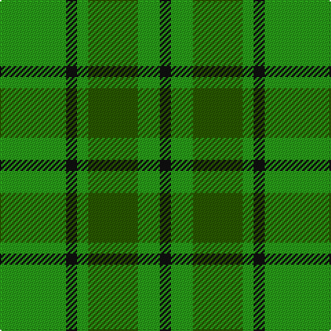

In pattern [GKGGGK](/patterns/gkgggk/).

This was sourced from tartans-authority.  It is a [6 stripes tartan](/stripes/stripes6/).

Original link http://www.tartansauthority.com/tartan-ferret/display/6125/

## Thread count
G/48 K8 G8 Ga36 G16 K/8

## Palette
Each colour and its ΔE from the base-6 reference it is a variant of.

| Colour | Shade | Base | ΔE (OKLab) |
|---|---|---|---|
| G | <code style="background-color:#289C18;">#289C18</code> `#289C18` | G <code style="background-color:#006400;">#006400</code> | 0.18 |
| Ga | <code style="background-color:#285800;">#285800</code> `#285800` | G <code style="background-color:#006400;">#006400</code> | 0.04 |
| K | <code style="background-color:#101010;">#101010</code> `#101010` | K <code style="background-color:#000000;">#000000</code> | 0.17 |

# Sample pattern

## Nearest tartans

The nearest existing variants by ΔTartan distance.

1. [Campbell-Simpson (Personal)](/setts/s10/g48k8g8ga36g16k8g16ga36g8k8-g289c18-ga285800-k101010/) — ΔT 1.28
1. [Armagh](/setts/s9/g8y4g34ga4r8ga4g6ga22g4-g008000-ga003000-rc00000-yf0c000/) — ΔT 1.63
1. [Freedom of Derry](/setts/s7/g14y7g14ga50g64w6g7-g289c18-ga003820-we0e0e0-ye8c000/) — ΔT 1.65
1. [MacSporran, Rejected design](/setts/s6/g60ga26g14ga60g4y8-g003000-ga008000-yf0c000/) — ΔT 1.68
1. [Justus hunting](/setts/s7/b12g48r12g12y12g48b12-b304080-g008000-rc00000-yf0c000/) — ΔT 1.77
1. [North Dakota State University (Corp.](/setts/s6/y22g10y20ga8g52y8-g006818-ga289c18-ybc8c00/) — ΔT 1.80
1. [O'Neill](/setts/s4/g18y40g80w10-g008000-we0e0e0-yd08010/) — ΔT 1.83
1. [Erskine, hunting](/setts/s6/g10ga6g48ga48g6ga10-g003000-ga008000/) — ΔT 1.84
1. [MacKintosh, hunting](/setts/s7/b2r6g22r4b10g22y2-b304080-g008000-rc00000-yf0c000/) — ΔT 1.86
1. [Wilson's No.140](/setts/s4/k4y2g14b2-b5c8ca8-g006818-k101010-ye8c000/) — ΔT 1.87

## Neighbour map

Every grey dot is one of 15726 variants placed by the first two principal components of the ΔTartan feature space (44% of its variance). Red is this tartan; blue dots are its nearest — click one to open its page.

<svg viewBox="0 0 640 380" role="img" style="max-width:100%;height:auto;border:1px solid #e0e0e0;border-radius:4px;display:block" xmlns="http://www.w3.org/2000/svg"><image href="/nn/cloud.v1.png" width="640" height="380"/><a href="/setts/s10/g48k8g8ga36g16k8g16ga36g8k8-g289c18-ga285800-k101010/"><circle cx="273.2" cy="252.0" r="4" fill="#3465a4"><title>Campbell-Simpson (Personal)</title></circle></a><a href="/setts/s9/g8y4g34ga4r8ga4g6ga22g4-g008000-ga003000-rc00000-yf0c000/"><circle cx="301.7" cy="205.8" r="4" fill="#3465a4"><title>Armagh</title></circle></a><a href="/setts/s7/g14y7g14ga50g64w6g7-g289c18-ga003820-we0e0e0-ye8c000/"><circle cx="335.1" cy="203.2" r="4" fill="#3465a4"><title>Freedom of Derry</title></circle></a><a href="/setts/s6/g60ga26g14ga60g4y8-g003000-ga008000-yf0c000/"><circle cx="341.1" cy="238.0" r="4" fill="#3465a4"><title>MacSporran, Rejected design</title></circle></a><a href="/setts/s7/b12g48r12g12y12g48b12-b304080-g008000-rc00000-yf0c000/"><circle cx="345.2" cy="262.3" r="4" fill="#3465a4"><title>Justus hunting</title></circle></a><a href="/setts/s6/y22g10y20ga8g52y8-g006818-ga289c18-ybc8c00/"><circle cx="345.5" cy="274.7" r="4" fill="#3465a4"><title>North Dakota State University (Corp.</title></circle></a><a href="/setts/s4/g18y40g80w10-g008000-we0e0e0-yd08010/"><circle cx="406.7" cy="278.8" r="4" fill="#3465a4"><title>O'Neill</title></circle></a><a href="/setts/s6/g10ga6g48ga48g6ga10-g003000-ga008000/"><circle cx="384.3" cy="283.7" r="4" fill="#3465a4"><title>Erskine, hunting</title></circle></a><a href="/setts/s7/b2r6g22r4b10g22y2-b304080-g008000-rc00000-yf0c000/"><circle cx="364.2" cy="214.8" r="4" fill="#3465a4"><title>MacKintosh, hunting</title></circle></a><a href="/setts/s4/k4y2g14b2-b5c8ca8-g006818-k101010-ye8c000/"><circle cx="336.5" cy="246.1" r="4" fill="#3465a4"><title>Wilson's No.140</title></circle></a><circle cx="317.6" cy="270.4" r="5" fill="#c00000"/></svg>

ID: /setts/s6/g48k8g8ga36g16k8-g289c18-ga285800-k101010/
