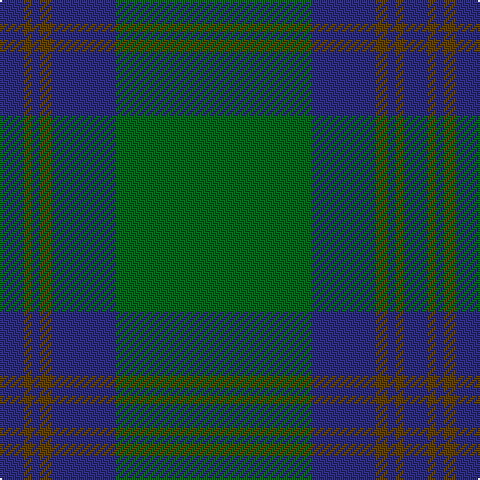

In pattern [BGBGBG](/patterns/bgbgbg/).

This was sourced from register-of-tartans.  It is a [6 stripes tartan](/stripes/stripes6/).

Original link https://www.tartanregister.gov.uk/tartanDetails.aspx?ref=3584

## Attestations

This cloth appears in 2 source records; the oldest owns this page.

- 01/01/1993 — Royal and Ancient, The (register-of-tartans, [record](https://www.tartanregister.gov.uk/tartanDetails.aspx?ref=3584))
- 1993 — Royal & Ancient (Sports) (tartans-authority, [record](http://www.tartansauthority.com/tartan-ferret/display/2193/))

## Register references

External register numbers recorded for this tartan.

- Scottish Register of Tartans: [3584](https://www.tartanregister.gov.uk/tartanDetails.aspx?ref=3584)
- Scottish Tartans Authority (ITI): 2193
- Scottish Tartans World Register: 2193

## Thread count
DB/12 T4 DB4 T6 DB32 G/98

## Palette
Each colour and its ΔE from the base-6 reference it is a variant of.

| Colour | Shade | Base | ΔE (OKLab) |
|---|---|---|---|
| DB | <code style="background-color:#2C2C80;">#2C2C80</code> `#2C2C80` | B <code style="background-color:#2A418A;">#2A418A</code> | 0.06 |
| G | <code style="background-color:#006818;">#006818</code> `#006818` | G <code style="background-color:#006100;">#006100</code> | 0.02 |
| T | <code style="background-color:#604000;">#604000</code> `#604000` | G <code style="background-color:#006100;">#006100</code> | 0.14 |

# Sample pattern

## Nearest tartans

The nearest existing variants by ΔTartan distance.

1. [Royal and Ancient, The](/setts/s6/g49b16r3b2r2b6~b304080-g008000-r806050~x2/) — ΔT 0.90
1. [St Andrews Old Course Hotel Corporate Tartan Tartan Number: 2332. Earliest known date: 1994 St Andrews Old Course Hotel, Golf Resort, and SPA See products available Copyright © Blair Urquhart, Comrie, 2015](/setts/s6/g50b20k3b2ga2b5~b2c2c80-g006818-ga604000-k101010~x2/) — ΔT 0.97
1. [Tyrconnell (Personal)](/setts/s5/g44b9r2b9g2~b202060-g006818-rc80000~x2/) — ΔT 1.21
1. [Fife, Duke Of](/setts/s6/g32k6g4k8r1k2~g005814-k101010-rc80000~x4/) — ΔT 1.34
1. [Semper](/setts/s8/g16ga1gb4ga41gb1ga6gc2ga2~g408060-ga003820-gb789484-gc289c18~x2/) — ΔT 1.48
1. [Semper](/setts/s8/g16ga1y4ga41y1ga6gb2ga2~g408060-ga004028-gb649848-y86c67c~x2/) — ΔT 1.52
1. [Glen Trool (Fashion)](/setts/s5/g42r10g3ra10r3~g004428-ra07c58-ra880000~x2/) — ΔT 1.59
1. [Celtic (New) Corporate Sport Tartan Tartan Number: 2232. Earliest known date: 1842 Should have a white line (?). See products available Copyright © Blair Urquhart, Comrie, 2015](/setts/s8/g44k2g2k2g3k12b10r3~b2c2c80-g006818-k101010-rc80000~x2/) — ΔT 1.65
1. [Greenlaw, American (Name)](/setts/s8/b46r2b3r2b14g38k3g4~b1474b4-g006818-k101010-rc80000~x2/) — ΔT 1.69
1. [Wilson](/setts/s6/b64g20r4g3r4g3~b304080-g008000-rc00000/) — ΔT 1.69

## Neighbour map

Every grey dot is one of 15726 variants placed by the first two principal components of the ΔTartan feature space (44% of its variance). Red is this tartan; blue dots are its nearest — click one to open its page.

<svg viewBox="0 0 640 380" role="img" style="max-width:100%;height:auto;border:1px solid #e0e0e0;border-radius:4px;display:block" xmlns="http://www.w3.org/2000/svg"><image href="/nn/cloud.v1.png" width="640" height="380"/><a href="/setts/s6/g49b16r3b2r2b6~b304080-g008000-r806050~x2/"><circle cx="468.6" cy="197.5" r="4" fill="#3465a4"><title>Royal and Ancient, The</title></circle></a><a href="/setts/s6/g50b20k3b2ga2b5~b2c2c80-g006818-ga604000-k101010~x2/"><circle cx="444.9" cy="184.0" r="4" fill="#3465a4"><title>St Andrews Old Course Hotel Corporate Tartan Tartan Number: 2332. Earliest known date: 1994 St Andrews Old Course Hotel, Golf Resort, and SPA See products available Copyright © Blair Urquhart, Comrie, 2015</title></circle></a><a href="/setts/s5/g44b9r2b9g2~b202060-g006818-rc80000~x2/"><circle cx="511.0" cy="219.1" r="4" fill="#3465a4"><title>Tyrconnell (Personal)</title></circle></a><a href="/setts/s6/g32k6g4k8r1k2~g005814-k101010-rc80000~x4/"><circle cx="528.6" cy="205.0" r="4" fill="#3465a4"><title>Fife, Duke Of</title></circle></a><a href="/setts/s8/g16ga1gb4ga41gb1ga6gc2ga2~g408060-ga003820-gb789484-gc289c18~x2/"><circle cx="510.8" cy="152.7" r="4" fill="#3465a4"><title>Semper</title></circle></a><a href="/setts/s8/g16ga1y4ga41y1ga6gb2ga2~g408060-ga004028-gb649848-y86c67c~x2/"><circle cx="501.6" cy="148.7" r="4" fill="#3465a4"><title>Semper</title></circle></a><a href="/setts/s5/g42r10g3ra10r3~g004428-ra07c58-ra880000~x2/"><circle cx="466.1" cy="237.8" r="4" fill="#3465a4"><title>Glen Trool (Fashion)</title></circle></a><a href="/setts/s8/g44k2g2k2g3k12b10r3~b2c2c80-g006818-k101010-rc80000~x2/"><circle cx="417.4" cy="161.7" r="4" fill="#3465a4"><title>Celtic (New) Corporate Sport Tartan Tartan Number: 2232. Earliest known date: 1842 Should have a white line (?). See products available Copyright © Blair Urquhart, Comrie, 2015</title></circle></a><a href="/setts/s8/b46r2b3r2b14g38k3g4~b1474b4-g006818-k101010-rc80000~x2/"><circle cx="408.0" cy="176.4" r="4" fill="#3465a4"><title>Greenlaw, American (Name)</title></circle></a><a href="/setts/s6/b64g20r4g3r4g3~b304080-g008000-rc00000/"><circle cx="472.7" cy="191.6" r="4" fill="#3465a4"><title>Wilson</title></circle></a><circle cx="483.1" cy="204.2" r="5" fill="#c00000"/></svg>

ID: /setts/s6/g49b16ga3b2ga2b6~b2c2c80-g006818-ga604000~x2/
