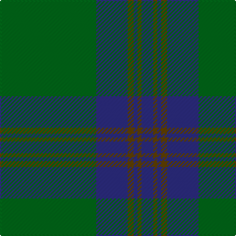

This page is one **sett** — a single exact thread-count. It belongs to the [tartan](/tartans/g49db16dy3db2dy2db6/)
(the same proportion at any scale), whose colour order is pattern [BGBGBG](/stripes/bgbgbg/).

Sourced from register-of-tartans.  It is a [6 stripe tartan](/stripes/stripes6/).

Original link https://www.tartanregister.gov.uk/tartanDetails.aspx?ref=3584

## Also known as

This cloth is also recorded under:

- Royal and Ancient, The

2 attestations — the source records this cloth was collapsed from (oldest owns this page)

<ul>
<li>01/01/1993 — Royal and Ancient, The (register-of-tartans, <a href="https://www.tartanregister.gov.uk/tartanDetails.aspx?ref=3584">record</a>)</li>
<li>1993 — Royal & Ancient (Sports) (tartans-authority, <a href="http://www.tartansauthority.com/tartan-ferret/display/2193/">record</a>)</li>
</ul>

## Register references

External register numbers recorded for this tartan.

- Scottish Register of Tartans: [3584](https://www.tartanregister.gov.uk/tartanDetails.aspx?ref=3584)
- Scottish Tartans Authority (ITI): 2193
- Scottish Tartans World Register: 2193

## Thread count
G/98 DB32 T6 DB4 T4 DB/12

## Palette

Palette: <strong>Tartan Register</strong>
<table><thead><tr><th>Colour</th><th>Threads</th><th>Shade</th><th>Base</th><th>OKLCh</th></tr></thead><tbody><tr><td>G/</td><td style="text-align:right;font-variant-numeric:tabular-nums">98</td><td><code style="background-color:#006818;">#006818</code> <small style="color:#888">#006818</small></td><td>G <code style="background-color:#006100;">#006100</code></td><td><small style="color:#888">oklch(45.0% 0.142 145.0)</small></td></tr><tr><td>DB</td><td style="text-align:right;font-variant-numeric:tabular-nums">32</td><td><code style="background-color:#2C2C80;">#2C2C80</code> <small style="color:#888">#2C2C80</small></td><td>B <code style="background-color:#2A418A;">#2A418A</code></td><td><small style="color:#888">oklch(35.0% 0.138 276.6)</small></td></tr><tr><td>T</td><td style="text-align:right;font-variant-numeric:tabular-nums">6</td><td><code style="background-color:#604000;">#604000</code> <small style="color:#888">#604000</small></td><td>G <code style="background-color:#006100;">#006100</code></td><td><small style="color:#888">oklch(39.8% 0.083 76.8)</small></td></tr><tr><td>DB</td><td style="text-align:right;font-variant-numeric:tabular-nums">4</td><td><code style="background-color:#2C2C80;">#2C2C80</code> <small style="color:#888">#2C2C80</small></td><td>B <code style="background-color:#2A418A;">#2A418A</code></td><td><small style="color:#888">oklch(35.0% 0.138 276.6)</small></td></tr><tr><td>T</td><td style="text-align:right;font-variant-numeric:tabular-nums">4</td><td><code style="background-color:#604000;">#604000</code> <small style="color:#888">#604000</small></td><td>G <code style="background-color:#006100;">#006100</code></td><td><small style="color:#888">oklch(39.8% 0.083 76.8)</small></td></tr><tr><td>DB/</td><td style="text-align:right;font-variant-numeric:tabular-nums">12</td><td><code style="background-color:#2C2C80;">#2C2C80</code> <small style="color:#888">#2C2C80</small></td><td>B <code style="background-color:#2A418A;">#2A418A</code></td><td><small style="color:#888">oklch(35.0% 0.138 276.6)</small></td></tr></tbody></table>

# Sample pattern

## Nearest tartans

The nearest existing variants by ΔTartan distance, with this tartan at the top so the swatches line up against it.

ΔTartan

Tartan

Sett

—

<a href="/ttd/edit/#slug=g49db16dy3db2dy2db6~x2">Royal and Ancient, The</a> <a class="nn-out" href="/setts/s6/g49db16dy3db2dy2db6~x2/" title="open its dictionary page">↗</a>

0.90

<a href="/ttd/edit/#slug=g49db16o3db2o2db6~x2">Royal and Ancient, The</a> <a class="nn-out" href="/setts/s6/g49db16o3db2o2db6~x2/" title="open its dictionary page">↗</a>

0.97

<a href="/ttd/edit/#slug=g50db20k3db2dy2db5~x2">St Andrews Old Course Hotel Corporate Tartan Tartan Number: 2332. Earliest known date: 1994 St Andrews Old Course Hotel, Golf Resort, and SPA See products available Copyright © Blair Urquhart, Comrie, 2015</a> <a class="nn-out" href="/setts/s6/g50db20k3db2dy2db5~x2/" title="open its dictionary page">↗</a>

1.20

<a href="/ttd/edit/#slug=g44db9r2db9g2~x2">Tyrconnell (Personal)</a> <a class="nn-out" href="/setts/s5/g44db9r2db9g2~x2/" title="open its dictionary page">↗</a>

1.34

<a href="/ttd/edit/#slug=dg32k6dg4k8r1k2~x4">Fife, Duke Of</a> <a class="nn-out" href="/setts/s6/dg32k6dg4k8r1k2~x4/" title="open its dictionary page">↗</a>

1.48

<a href="/ttd/edit/#slug=gi16dg1y4dg41y1dg6g2dg2~x2">Semper</a> <a class="nn-out" href="/setts/s8/gi16dg1y4dg41y1dg6g2dg2~x2/" title="open its dictionary page">↗</a>

1.52

<a href="/ttd/edit/#slug=gi16dg1lg4dg41lg1dg6g2dg2~x2">Semper</a> <a class="nn-out" href="/setts/s8/gi16dg1lg4dg41lg1dg6g2dg2~x2/" title="open its dictionary page">↗</a>

1.60

<a href="/ttd/edit/#slug=dg42o10dg3r10o3~x2">Glen Trool (Fashion)</a> <a class="nn-out" href="/setts/s5/dg42o10dg3r10o3~x2/" title="open its dictionary page">↗</a>

1.65

<a href="/ttd/edit/#slug=g44k2g2k2g3k12db10r3~x2">Celtic (New) Corporate Sport Tartan Tartan Number: 2232. Earliest known date: 1842 Should have a white line (?). See products available Copyright © Blair Urquhart, Comrie, 2015</a> <a class="nn-out" href="/setts/s8/g44k2g2k2g3k12db10r3~x2/" title="open its dictionary page">↗</a>

1.69

<a href="/ttd/edit/#slug=g50db20k3db2o2db5~x2">St Andrews Hotel, Golf Resort, and SPA</a> <a class="nn-out" href="/setts/s6/g50db20k3db2o2db5~x2/" title="open its dictionary page">↗</a>

1.69

<a href="/ttd/edit/#slug=b46r2b3r2b14g38k3g4~x2">Greenlaw, American (Name)</a> <a class="nn-out" href="/setts/s8/b46r2b3r2b14g38k3g4~x2/" title="open its dictionary page">↗</a>

## Neighbour map

Every grey dot is one of 14359 variants placed by the first two principal components of the ΔTartan feature space (44% of its variance). Red is this tartan; blue dots are its nearest — click one to open its page.

<svg viewBox="0 0 640 380" role="img" style="max-width:100%;height:auto;border:1px solid #e0e0e0;border-radius:4px;display:block" xmlns="http://www.w3.org/2000/svg"><image href="/nn/cloud.v1.png" width="640" height="380"/><a href="/setts/s6/g49db16o3db2o2db6~x2/"><circle cx="470.2" cy="201.8" r="4" fill="#3465a4"><title>Royal and Ancient, The</title></circle></a><a href="/setts/s6/g50db20k3db2dy2db5~x2/"><circle cx="446.9" cy="189.3" r="4" fill="#3465a4"><title>St Andrews Old Course Hotel Corporate Tartan Tartan Number: 2332. Earliest known date: 1994 St Andrews Old Course Hotel, Golf Resort, and SPA See products available Copyright © Blair Urquhart, Comrie, 2015</title></circle></a><a href="/setts/s5/g44db9r2db9g2~x2/"><circle cx="512.3" cy="221.4" r="4" fill="#3465a4"><title>Tyrconnell (Personal)</title></circle></a><a href="/setts/s6/dg32k6dg4k8r1k2~x4/"><circle cx="529.9" cy="209.1" r="4" fill="#3465a4"><title>Fife, Duke Of</title></circle></a><a href="/setts/s8/gi16dg1y4dg41y1dg6g2dg2~x2/"><circle cx="512.2" cy="157.8" r="4" fill="#3465a4"><title>Semper</title></circle></a><a href="/setts/s8/gi16dg1lg4dg41lg1dg6g2dg2~x2/"><circle cx="503.1" cy="153.0" r="4" fill="#3465a4"><title>Semper</title></circle></a><a href="/setts/s5/dg42o10dg3r10o3~x2/"><circle cx="466.7" cy="241.0" r="4" fill="#3465a4"><title>Glen Trool (Fashion)</title></circle></a><a href="/setts/s8/g44k2g2k2g3k12db10r3~x2/"><circle cx="419.3" cy="165.0" r="4" fill="#3465a4"><title>Celtic (New) Corporate Sport Tartan Tartan Number: 2232. Earliest known date: 1842 Should have a white line (?). See products available Copyright © Blair Urquhart, Comrie, 2015</title></circle></a><a href="/setts/s6/g50db20k3db2o2db5~x2/"><circle cx="416.1" cy="173.7" r="4" fill="#3465a4"><title>St Andrews Hotel, Golf Resort, and SPA</title></circle></a><a href="/setts/s8/b46r2b3r2b14g38k3g4~x2/"><circle cx="410.3" cy="183.4" r="4" fill="#3465a4"><title>Greenlaw, American (Name)</title></circle></a><circle cx="484.8" cy="209.8" r="5" fill="#c00000"/></svg>

ID: /setts/s6/g49db16dy3db2dy2db6~x2/
