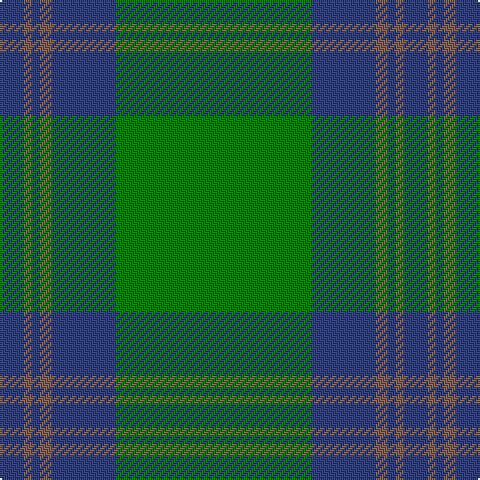

In pattern [BRBRBG](/stripes/brbrbg/).

This was sourced from weddslist.  It is a [6 stripe tartan](/stripes/stripes6/).

Original link http://www.weddslist.com/cgi-bin/tartans/pg.pl?source=sts

## Thread count
G/98 B32 LT6 B4 LT4 B/12

## Palette
Each colour and the base-6 reference it is a variant of.

| Colour | Shade | Base |
|---|---|---|
| B | <code style="background-color:#304080;">#304080</code> `oklch(39.4% 0.109 270.2)` <small>#304080</small> | B <code style="background-color:#2A418A;">#2A418A</code> |
| G | <code style="background-color:#008000;">#008000</code> `oklch(52.0% 0.177 142.5)` <small>#008000</small> | G <code style="background-color:#006100;">#006100</code> |
| LT | <code style="background-color:#806050;">#806050</code> `oklch(51.7% 0.049 47.8)` <small>#806050</small> | R <code style="background-color:#CC0000;">#CC0000</code> |

# Sample pattern

## Nearest tartans

The nearest existing variants by ΔTartan distance, with this tartan at the top so the swatches line up against it.

ΔTartan

Tartan

Sett

—

<a href="/ttd/edit/#slug=g49db16o3db2o2db6~x2">Royal and Ancient, The</a> <a class="nn-out" href="/setts/s6/g49db16o3db2o2db6~x2/" title="open its dictionary page">↗</a>

0.90

<a href="/ttd/edit/#slug=g49db16dy3db2dy2db6~x2">Royal and Ancient, The</a> <a class="nn-out" href="/setts/s6/g49db16dy3db2dy2db6~x2/" title="open its dictionary page">↗</a>

1.23

<a href="/ttd/edit/#slug=g44db9r2db9g2~x2">Tyrconnell (Personal)</a> <a class="nn-out" href="/setts/s5/g44db9r2db9g2~x2/" title="open its dictionary page">↗</a>

1.31

<a href="/ttd/edit/#slug=g50db20k3db2o2db5~x2">St Andrews Hotel, Golf Resort, and SPA</a> <a class="nn-out" href="/setts/s6/g50db20k3db2o2db5~x2/" title="open its dictionary page">↗</a>

1.32

<a href="/ttd/edit/#slug=g50db20k3db2dy2db5~x2">St Andrews Old Course Hotel Corporate Tartan Tartan Number: 2332. Earliest known date: 1994 St Andrews Old Course Hotel, Golf Resort, and SPA See products available Copyright © Blair Urquhart, Comrie, 2015</a> <a class="nn-out" href="/setts/s6/g50db20k3db2dy2db5~x2/" title="open its dictionary page">↗</a>

1.55

<a href="/ttd/edit/#slug=g16dg1lg4dg41lg1dg6g2dg2~x2">Semper</a> <a class="nn-out" href="/setts/s8/g16dg1lg4dg41lg1dg6g2dg2~x2/" title="open its dictionary page">↗</a>

1.60

<a href="/ttd/edit/#slug=dg32k6dg4k8r1k2~x4">Fife, Duke Of</a> <a class="nn-out" href="/setts/s6/dg32k6dg4k8r1k2~x4/" title="open its dictionary page">↗</a>

1.64

<a href="/ttd/edit/#slug=g44k2g2k2g3k12db10r3~x2">Celtic (New) Corporate Sport Tartan Tartan Number: 2232. Earliest known date: 1842 Should have a white line (?). See products available Copyright © Blair Urquhart, Comrie, 2015</a> <a class="nn-out" href="/setts/s8/g44k2g2k2g3k12db10r3~x2/" title="open its dictionary page">↗</a>

1.68

<a href="/ttd/edit/#slug=g16dg1y4dg41y1dg6g2dg2~x2">Semper</a> <a class="nn-out" href="/setts/s8/g16dg1y4dg41y1dg6g2dg2~x2/" title="open its dictionary page">↗</a>

1.78

<a href="/ttd/edit/#slug=g47r3g6db35ly3~x2">Gracie</a> <a class="nn-out" href="/setts/s5/g47r3g6db35ly3~x2/" title="open its dictionary page">↗</a>

1.79

<a href="/ttd/edit/#slug=r3g22db16g14r2g6ly1~x2">Scottish Scouts</a> <a class="nn-out" href="/setts/s7/r3g22db16g14r2g6ly1~x2/" title="open its dictionary page">↗</a>

## Neighbour map

Every grey dot is one of 14299 variants placed by the first two principal components of the ΔTartan feature space (44% of its variance). Red is this tartan; blue dots are its nearest — click one to open its page.

<svg viewBox="0 0 640 380" role="img" style="max-width:100%;height:auto;border:1px solid #e0e0e0;border-radius:4px;display:block" xmlns="http://www.w3.org/2000/svg"><image href="/nn/cloud.v1.png" width="640" height="380"/><a href="/setts/s6/g49db16dy3db2dy2db6~x2/"><circle cx="485.2" cy="209.5" r="4" fill="#3465a4"><title>Royal and Ancient, The</title></circle></a><a href="/setts/s5/g44db9r2db9g2~x2/"><circle cx="512.9" cy="221.1" r="4" fill="#3465a4"><title>Tyrconnell (Personal)</title></circle></a><a href="/setts/s6/g50db20k3db2o2db5~x2/"><circle cx="416.7" cy="173.4" r="4" fill="#3465a4"><title>St Andrews Hotel, Golf Resort, and SPA</title></circle></a><a href="/setts/s6/g50db20k3db2dy2db5~x2/"><circle cx="447.4" cy="189.0" r="4" fill="#3465a4"><title>St Andrews Old Course Hotel Corporate Tartan Tartan Number: 2332. Earliest known date: 1994 St Andrews Old Course Hotel, Golf Resort, and SPA See products available Copyright © Blair Urquhart, Comrie, 2015</title></circle></a><a href="/setts/s8/g16dg1lg4dg41lg1dg6g2dg2~x2/"><circle cx="503.7" cy="153.1" r="4" fill="#3465a4"><title>Semper</title></circle></a><a href="/setts/s6/dg32k6dg4k8r1k2~x4/"><circle cx="530.4" cy="208.9" r="4" fill="#3465a4"><title>Fife, Duke Of</title></circle></a><a href="/setts/s8/g44k2g2k2g3k12db10r3~x2/"><circle cx="419.8" cy="164.8" r="4" fill="#3465a4"><title>Celtic (New) Corporate Sport Tartan Tartan Number: 2232. Earliest known date: 1842 Should have a white line (?). See products available Copyright © Blair Urquhart, Comrie, 2015</title></circle></a><a href="/setts/s8/g16dg1y4dg41y1dg6g2dg2~x2/"><circle cx="512.8" cy="157.9" r="4" fill="#3465a4"><title>Semper</title></circle></a><a href="/setts/s5/g47r3g6db35ly3~x2/"><circle cx="364.4" cy="212.4" r="4" fill="#3465a4"><title>Gracie</title></circle></a><a href="/setts/s7/r3g22db16g14r2g6ly1~x2/"><circle cx="408.6" cy="202.2" r="4" fill="#3465a4"><title>Scottish Scouts</title></circle></a><circle cx="470.7" cy="201.6" r="5" fill="#c00000"/></svg>

ID: /setts/s6/g49db16o3db2o2db6~x2/
