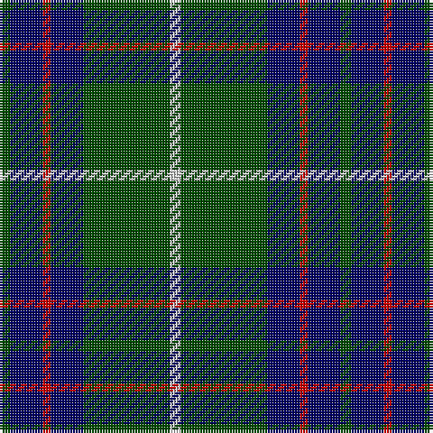

In pattern [GBRBGW](/patterns/gbrbgw/).

This was sourced from weddslist.  It is a [6 stripes tartan](/stripes/stripes6/).

Original link http://www.weddslist.com/cgi-bin/tartans/pg.pl?source=rb

## Thread count
G/4 DB12 R3 DB12 G32 N/4

## Palette
Each colour and its ΔE from the base-6 reference it is a variant of.

| Colour | Shade | Base | ΔE (OKLab) |
|---|---|---|---|
| DB | <code style="background-color:#000064;">#000064</code> `#000064` | B <code style="background-color:#2A418A;">#2A418A</code> | 0.18 |
| G | <code style="background-color:#004C00;">#004C00</code> `#004C00` | G <code style="background-color:#006100;">#006100</code> | 0.07 |
| N | <code style="background-color:#D0D0D0;">#D0D0D0</code> `#D0D0D0` | W <code style="background-color:#F7F7F7;">#F7F7F7</code> | 0.12 |
| R | <code style="background-color:#C80000;">#C80000</code> `#C80000` | R <code style="background-color:#CC0000;">#CC0000</code> | 0.01 |

# Sample pattern

## Nearest tartans

The nearest existing variants by ΔTartan distance.

1. [Heritage Tartan, The](/setts/s6/b8r4b24g35w4g8-b1c0070-g006818-r880000-wc0c0c0/) — ΔT 0.55
1. [MacIntyre LC](/setts/s6/g8b24r6b24g64y8-b000052-g11450d-raa0000-yaaaaaa/) — ΔT 0.70
1. [MacIntyre LC](/setts/s6/g4b12r3b12g32y4-b000052-g11450d-raa0000-yaaaaaa/) — ΔT 0.70
1. [MacIntyre Hunting (VS)](/setts/s6/g8b24r6b24g64w8-b202060-g006818-rc80000-wfcfcfc/) — ΔT 0.78
1. [Glen Esk](/setts/s8/g40r4g4r8g32b40g4y4-b0000b4-g004800-r9c0030-yfcc800/) — ΔT 0.81
1. [MacIntyre Hunting Clan Tartan Tartan Number: 743. Earliest known date: 1800 There is a doublet in Kingussie Museum dated 1800 in this tartan. It also appeared in the Vestiarium Scoticum (1842). See products available Copyright © Blair Urquhart, Comrie, 2015](/setts/s6/g8b24r6b24g64w8-b2c2c80-g006818-rc80000-we0e0e0/) — ΔT 0.87
1. [St. Andrews Old Course Hotel (Corp)](/setts/s6/g104b40k12b8ga8b40-b1c0070-g006818-ga604000-k101010/) — ΔT 0.89
1. [Connacht Irish District Tartan Tartan Number: 4485. Earliest known date: 1994 Phil Smith obtained in Perthshire from a swatch dated 1994 shown to him by Keith Lumsden of the Scottish Tartans Society. However www.uniq-orn.com shows this as Connaught Green. See products available Copyright © Blair Urquhart, Comrie, 2015](/setts/s6/r4b64g28b10g32w4-b202060-g288028-ra00000-we0e0e0/) — ΔT 0.91
1. [MacIntyre](/setts/s6/g8b24r6b24g64w8-b304080-g004010-rc00000-we0e0e0/) — ΔT 0.93
1. [Cameron Hunting](/setts/s7/r3g10r3g14b16g3y2-b000064-g004c00-rc80000-yffc800/) — ΔT 0.95

## Neighbour map

Every grey dot is one of 15726 variants placed by the first two principal components of the ΔTartan feature space (44% of its variance). Red is this tartan; blue dots are its nearest — click one to open its page.

<svg viewBox="0 0 640 380" role="img" style="max-width:100%;height:auto;border:1px solid #e0e0e0;border-radius:4px;display:block" xmlns="http://www.w3.org/2000/svg"><image href="/nn/cloud.v1.png" width="640" height="380"/><a href="/setts/s6/b8r4b24g35w4g8-b1c0070-g006818-r880000-wc0c0c0/"><circle cx="282.1" cy="225.7" r="4" fill="#3465a4"><title>Heritage Tartan, The</title></circle></a><a href="/setts/s6/g8b24r6b24g64y8-b000052-g11450d-raa0000-yaaaaaa/"><circle cx="319.1" cy="224.4" r="4" fill="#3465a4"><title>MacIntyre LC</title></circle></a><a href="/setts/s6/g4b12r3b12g32y4-b000052-g11450d-raa0000-yaaaaaa/"><circle cx="319.1" cy="224.4" r="4" fill="#3465a4"><title>MacIntyre LC</title></circle></a><a href="/setts/s6/g8b24r6b24g64w8-b202060-g006818-rc80000-wfcfcfc/"><circle cx="292.6" cy="209.1" r="4" fill="#3465a4"><title>MacIntyre Hunting (VS)</title></circle></a><a href="/setts/s8/g40r4g4r8g32b40g4y4-b0000b4-g004800-r9c0030-yfcc800/"><circle cx="321.6" cy="204.7" r="4" fill="#3465a4"><title>Glen Esk</title></circle></a><a href="/setts/s6/g8b24r6b24g64w8-b2c2c80-g006818-rc80000-we0e0e0/"><circle cx="303.6" cy="213.4" r="4" fill="#3465a4"><title>MacIntyre Hunting Clan Tartan Tartan Number: 743. Earliest known date: 1800 There is a doublet in Kingussie Museum dated 1800 in this tartan. It also appeared in the Vestiarium Scoticum (1842). See products available Copyright © Blair Urquhart, Comrie, 2015</title></circle></a><a href="/setts/s6/g104b40k12b8ga8b40-b1c0070-g006818-ga604000-k101010/"><circle cx="311.9" cy="212.9" r="4" fill="#3465a4"><title>St. Andrews Old Course Hotel (Corp)</title></circle></a><a href="/setts/s6/r4b64g28b10g32w4-b202060-g288028-ra00000-we0e0e0/"><circle cx="320.7" cy="199.6" r="4" fill="#3465a4"><title>Connacht Irish District Tartan Tartan Number: 4485. Earliest known date: 1994 Phil Smith obtained in Perthshire from a swatch dated 1994 shown to him by Keith Lumsden of the Scottish Tartans Society. However www.uniq-orn.com shows this as Connaught Green. See products available Copyright © Blair Urquhart, Comrie, 2015</title></circle></a><a href="/setts/s6/g8b24r6b24g64w8-b304080-g004010-rc00000-we0e0e0/"><circle cx="320.6" cy="221.8" r="4" fill="#3465a4"><title>MacIntyre</title></circle></a><a href="/setts/s7/r3g10r3g14b16g3y2-b000064-g004c00-rc80000-yffc800/"><circle cx="261.3" cy="227.6" r="4" fill="#3465a4"><title>Cameron Hunting</title></circle></a><circle cx="298.2" cy="215.7" r="5" fill="#c00000"/></svg>

ID: /setts/s6/g4b12r3b12g32w4-b000064-g004c00-rc80000-wd0d0d0/
