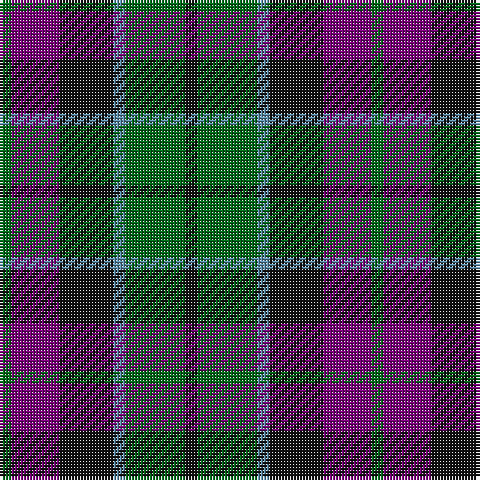

In pattern [GBKBGK](/patterns/gbkbgk/).

This was sourced from house-of-tartan.  It is a [6 stripes tartan](/stripes/stripes6/).

Original link http://www.house-of-tartan.scotland.net/house/TartanViewjs.asp?colr=Def&tnam=725

## Thread count
G/4 P16 K18 B4 G20 K/4

## Palette
Each colour and its ΔE from the base-6 reference it is a variant of.

| Colour | Shade | Base | ΔE (OKLab) |
|---|---|---|---|
| B | <code style="background-color:#5C8CA8;">#5C8CA8</code> `#5C8CA8` | B <code style="background-color:#2A418A;">#2A418A</code> | 0.23 |
| G | <code style="background-color:#006818;">#006818</code> `#006818` | G <code style="background-color:#006100;">#006100</code> | 0.02 |
| K | <code style="background-color:#101010;">#101010</code> `#101010` | K <code style="background-color:#000000;">#000000</code> | 0.17 |
| P | <code style="background-color:#780078;">#780078</code> `#780078` | B <code style="background-color:#2A418A;">#2A418A</code> | 0.17 |

# Sample pattern

## Nearest tartans

The nearest existing variants by ΔTartan distance.

1. [Gunn - 1810 (Clan)](/setts/s6/r8g24k24g4b24g6-b1c0070-g006818-k101010-rc80000/) — ΔT 0.55
1. [Wellington or Waterloo](/setts/s6/b6g24k28b22r6b6-b3c82af-g005020-k101010-rdc0000/) — ΔT 0.72
1. [Morrison Clan Tartan Tartan Number: 1083. Earliest known date: 1908 The Clan Morrison have strong links with the MacKays and this is evident in the similarity of the tartans. Morrison has an added red stripe. Lord Lyon recorded a new sett in 1968 based on a fragment of Morrison tartan dated 1747. See products available Copyright © Blair Urquhart, Comrie, 2015](/setts/s6/k6g28k28g4b28r6-b2c2c80-g006818-k101010-rc80000/) — ΔT 0.83
1. [Callum Beg (Fashion)](/setts/s6/g6b36k36g36r6g6-b2c2c80-g006818-k101010-rc80000/) — ΔT 0.85
1. [Waterloo](/setts/s6/g6ga12k12g8r2g2-g789484-ga003820-k101010-rc80000/) — ΔT 0.85
1. [Inneryne (Personal)](/setts/s7/b8k6b32k28g28r6g6-b2c2c80-g006818-k101010-rc80000/) — ΔT 0.87
1. [MacArthur of Milton Hunting Clan Tartan Tartan Number: 700. Earliest known date: 1823 This is the older of the two MacArthur setts, which links the clan with the Campbells. See products available Copyright © Blair Urquhart, Comrie, 2015](/setts/s6/g28b4g4k16ba18k4-b2c2c80-ba780078-g006818-k101010/) — ΔT 0.88
1. [Murray (Variation) Clan Tartan Tartan Number: 271. Earliest known date: 1810-15 A simplified version of the Murray of Atholl. The Cockburn collection housed in the Mitchell Library in Glasgow, is one of the earliest references for clan tartans. James Logan, in his book, The Scottish Gael (1831), wrote concerning the Black Watch, that "...a red stripe is often introduced", and this by Lord Murray who commanded the regiment. See products available Copyright © Blair Urquhart, Comrie, 2015](/setts/s6/b4k4b24k16g22r4-b2c2c80-g006818-k101010-rc80000/) — ΔT 0.90
1. [Daks (Navy)](/setts/s8/r6g12b4ba4b22g18b4r6-b202060-ba2c2c80-g006818-rc80000/) — ΔT 0.91
1. [Fletcher of Dunans](/setts/s7/b20k6b20k28r4g28r10-b1870a4-g006818-k101010-rc80000/) — ΔT 0.95

## Neighbour map

Every grey dot is one of 15726 variants placed by the first two principal components of the ΔTartan feature space (44% of its variance). Red is this tartan; blue dots are its nearest — click one to open its page.

<svg viewBox="0 0 640 380" role="img" style="max-width:100%;height:auto;border:1px solid #e0e0e0;border-radius:4px;display:block" xmlns="http://www.w3.org/2000/svg"><image href="/nn/cloud.v1.png" width="640" height="380"/><a href="/setts/s6/r8g24k24g4b24g6-b1c0070-g006818-k101010-rc80000/"><circle cx="164.8" cy="260.4" r="4" fill="#3465a4"><title>Gunn - 1810 (Clan)</title></circle></a><a href="/setts/s6/b6g24k28b22r6b6-b3c82af-g005020-k101010-rdc0000/"><circle cx="146.9" cy="261.8" r="4" fill="#3465a4"><title>Wellington or Waterloo</title></circle></a><a href="/setts/s6/k6g28k28g4b28r6-b2c2c80-g006818-k101010-rc80000/"><circle cx="179.8" cy="252.3" r="4" fill="#3465a4"><title>Morrison Clan Tartan Tartan Number: 1083. Earliest known date: 1908 The Clan Morrison have strong links with the MacKays and this is evident in the similarity of the tartans. Morrison has an added red stripe. Lord Lyon recorded a new sett in 1968 based on a fragment of Morrison tartan dated 1747. See products available Copyright © Blair Urquhart, Comrie, 2015</title></circle></a><a href="/setts/s6/g6b36k36g36r6g6-b2c2c80-g006818-k101010-rc80000/"><circle cx="194.5" cy="255.7" r="4" fill="#3465a4"><title>Callum Beg (Fashion)</title></circle></a><a href="/setts/s6/g6ga12k12g8r2g2-g789484-ga003820-k101010-rc80000/"><circle cx="155.3" cy="252.6" r="4" fill="#3465a4"><title>Waterloo</title></circle></a><a href="/setts/s7/b8k6b32k28g28r6g6-b2c2c80-g006818-k101010-rc80000/"><circle cx="176.1" cy="255.0" r="4" fill="#3465a4"><title>Inneryne (Personal)</title></circle></a><a href="/setts/s6/g28b4g4k16ba18k4-b2c2c80-ba780078-g006818-k101010/"><circle cx="218.8" cy="242.0" r="4" fill="#3465a4"><title>MacArthur of Milton Hunting Clan Tartan Tartan Number: 700. Earliest known date: 1823 This is the older of the two MacArthur setts, which links the clan with the Campbells. See products available Copyright © Blair Urquhart, Comrie, 2015</title></circle></a><a href="/setts/s6/b4k4b24k16g22r4-b2c2c80-g006818-k101010-rc80000/"><circle cx="194.7" cy="257.1" r="4" fill="#3465a4"><title>Murray (Variation) Clan Tartan Tartan Number: 271. Earliest known date: 1810-15 A simplified version of the Murray of Atholl. The Cockburn collection housed in the Mitchell Library in Glasgow, is one of the earliest references for clan tartans. James Logan, in his book, The Scottish Gael (1831), wrote concerning the Black Watch, that &quot;...a red stripe is often introduced&quot;, and this by Lord Murray who commanded the regiment. See products available Copyright © Blair Urquhart, Comrie, 2015</title></circle></a><a href="/setts/s8/r6g12b4ba4b22g18b4r6-b202060-ba2c2c80-g006818-rc80000/"><circle cx="198.0" cy="243.6" r="4" fill="#3465a4"><title>Daks (Navy)</title></circle></a><a href="/setts/s7/b20k6b20k28r4g28r10-b1870a4-g006818-k101010-rc80000/"><circle cx="138.8" cy="247.8" r="4" fill="#3465a4"><title>Fletcher of Dunans</title></circle></a><circle cx="163.2" cy="259.2" r="5" fill="#c00000"/></svg>

ID: /setts/s6/g4b16k18ba4g20k4-b780078-ba5c8ca8-g006818-k101010/
