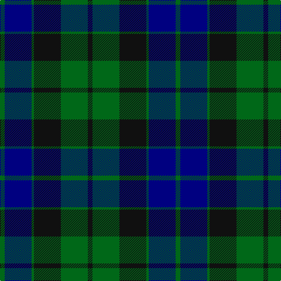

In pattern [GBGKGK](/patterns/gbgkgk/).

This was sourced from register-of-tartans.  It is a [6 stripes tartan](/stripes/stripes6/).

Original link https://www.tartanregister.gov.uk/tartanDetails.aspx?ref=2500

## Thread count
G/8 DB46 G4 K46 G46 K/8

## Palette
Each colour and its ΔE from the base-6 reference it is a variant of.

| Colour | Shade | Base | ΔE (OKLab) |
|---|---|---|---|
| DB | <code style="background-color:#000080;">#000080</code> `#000080` | B <code style="background-color:#2A418A;">#2A418A</code> | 0.14 |
| G | <code style="background-color:#006818;">#006818</code> `#006818` | G <code style="background-color:#006100;">#006100</code> | 0.02 |
| K | <code style="background-color:#101010;">#101010</code> `#101010` | K <code style="background-color:#000000;">#000000</code> | 0.17 |

# Sample pattern

## Nearest tartans

The nearest existing variants by ΔTartan distance.

1. [Gunn](/setts/s6/g2b12g1k12g12r2x2~b1c0070-g006400-k101010-rc80000/) — ΔT 1.05
1. [Mowat (Clans Originaux)](/setts/s7/b24k3b5k23y2k11g22x2~b2c2c80-g006818-k101010-ye8c000/) — ΔT 1.12
1. [Gunn Clan Tartan Tartan Number: 708. Earliest known date: c.1810-15 The Cockburn collection, housed in the Mitchell library in Glasgow, contains some of the oldest actual specimens of clan tartans in existance today. James Logan recorded the sett in his book 'The Scottish Gael' in 1831. The central blue stripes are often reproduced in black or very dark blue, giving the impression of four equally toned stripes. See products available Copyright © Blair Urquhart, Comrie, 2015](/setts/s6/r2g12k12g1b12g1x2~b2c2c80-g006818-k101010-rc80000/) — ΔT 1.14
1. [Graham of Menteith](/setts/s6/g8b1g1k6ba6k1x4~b2474e8-ba28287c-g006c3c-k101010/) — ΔT 1.15
1. [MacKay - 1800 (Clan)](/setts/s6/g4b23g2k23g23k4x2~b506878-g006818-k101010/) — ΔT 1.15
1. [Reid and Taylor](/setts/s7/b2k1r1b9k9g10k2x2~b2c2c80-g006818-k101010-rc80000/) — ΔT 1.15
1. [MacKirdy Family Tartan Tartan Number: 1092. Earliest known date: 1930-50 This sample comes from the MacGregor-Hastie collection which forms the basis of the cloth archive of the Scottish Tartans Society. MacGregor-Hastie noted, "A pattern seen at Andersons, Edinburgh, was labelled 'MacKirdy'. It is a simple green tartan. The family are usually given as a sept of the Stuarts of Bute. The tartan is modern". One can assume that the sample dates between 1930 and 1950. At a very early period the larger part of the Island of Bute belonged to the Mackuerdys, which was leased to them by King James IV in 1489. Later Bute became the stronghold of the Stuarts of Bute. See products available Copyright © Blair Urquhart, Comrie, 2015](/setts/s5/k2g12k11b12w1x2~b2c2c80-g006818-k101010-we0e0e0/) — ΔT 1.15
1. [Graham of Montrose](/setts/s6/g4b15w2k16g19k4x2~b2c4084-g005020-k101010-we0e0e0/) — ΔT 1.16
1. [National Galleries of Scotland](/setts/s7/k7g22k22b6r2b15r2x2~b1c0070-g006818-k101010-rc80000/) — ΔT 1.17
1. [Graham of Menteith (Clan)](/setts/s6/g8b1g1k6ba6k1x4~b5c8ca8-ba2c2c80-g006818-k101010/) — ΔT 1.18

## Neighbour map

Every grey dot is one of 15726 variants placed by the first two principal components of the ΔTartan feature space (44% of its variance). Red is this tartan; blue dots are its nearest — click one to open its page.

<svg viewBox="0 0 640 380" role="img" style="max-width:100%;height:auto;border:1px solid #e0e0e0;border-radius:4px;display:block" xmlns="http://www.w3.org/2000/svg"><image href="/nn/cloud.v1.png" width="640" height="380"/><a href="/setts/s6/g2b12g1k12g12r2x2~b1c0070-g006400-k101010-rc80000/"><circle cx="213.2" cy="226.2" r="4" fill="#3465a4"><title>Gunn</title></circle></a><a href="/setts/s7/b24k3b5k23y2k11g22x2~b2c2c80-g006818-k101010-ye8c000/"><circle cx="235.3" cy="226.9" r="4" fill="#3465a4"><title>Mowat (Clans Originaux)</title></circle></a><a href="/setts/s6/r2g12k12g1b12g1x2~b2c2c80-g006818-k101010-rc80000/"><circle cx="216.5" cy="222.8" r="4" fill="#3465a4"><title>Gunn Clan Tartan Tartan Number: 708. Earliest known date: c.1810-15 The Cockburn collection, housed in the Mitchell library in Glasgow, contains some of the oldest actual specimens of clan tartans in existance today. James Logan recorded the sett in his book 'The Scottish Gael' in 1831. The central blue stripes are often reproduced in black or very dark blue, giving the impression of four equally toned stripes. See products available Copyright © Blair Urquhart, Comrie, 2015</title></circle></a><a href="/setts/s6/g8b1g1k6ba6k1x4~b2474e8-ba28287c-g006c3c-k101010/"><circle cx="217.0" cy="244.6" r="4" fill="#3465a4"><title>Graham of Menteith</title></circle></a><a href="/setts/s6/g4b23g2k23g23k4x2~b506878-g006818-k101010/"><circle cx="249.1" cy="249.5" r="4" fill="#3465a4"><title>MacKay - 1800 (Clan)</title></circle></a><a href="/setts/s7/b2k1r1b9k9g10k2x2~b2c2c80-g006818-k101010-rc80000/"><circle cx="218.0" cy="225.9" r="4" fill="#3465a4"><title>Reid and Taylor</title></circle></a><a href="/setts/s5/k2g12k11b12w1x2~b2c2c80-g006818-k101010-we0e0e0/"><circle cx="199.5" cy="242.4" r="4" fill="#3465a4"><title>MacKirdy Family Tartan Tartan Number: 1092. Earliest known date: 1930-50 This sample comes from the MacGregor-Hastie collection which forms the basis of the cloth archive of the Scottish Tartans Society. MacGregor-Hastie noted, &quot;A pattern seen at Andersons, Edinburgh, was labelled 'MacKirdy'. It is a simple green tartan. The family are usually given as a sept of the Stuarts of Bute. The tartan is modern&quot;. One can assume that the sample dates between 1930 and 1950. At a very early period the larger part of the Island of Bute belonged to the Mackuerdys, which was leased to them by King James IV in 1489. Later Bute became the stronghold of the Stuarts of Bute. See products available Copyright © Blair Urquhart, Comrie, 2015</title></circle></a><a href="/setts/s6/g4b15w2k16g19k4x2~b2c4084-g005020-k101010-we0e0e0/"><circle cx="219.8" cy="248.1" r="4" fill="#3465a4"><title>Graham of Montrose</title></circle></a><a href="/setts/s7/k7g22k22b6r2b15r2x2~b1c0070-g006818-k101010-rc80000/"><circle cx="215.2" cy="224.7" r="4" fill="#3465a4"><title>National Galleries of Scotland</title></circle></a><a href="/setts/s6/g8b1g1k6ba6k1x4~b5c8ca8-ba2c2c80-g006818-k101010/"><circle cx="214.6" cy="243.5" r="4" fill="#3465a4"><title>Graham of Menteith (Clan)</title></circle></a><circle cx="241.0" cy="250.6" r="5" fill="#c00000"/></svg>

ID: /setts/s6/g4b23g2k23g23k4x2~b000080-g006818-k101010/
