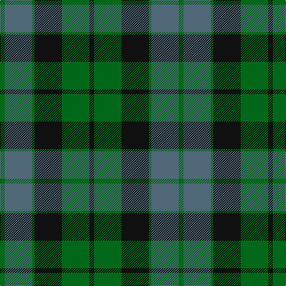

In pattern [GBGKGK](/patterns/gbgkgk/).

This was sourced from tartans-authority.  It is a [6 stripes tartan](/stripes/stripes6/).

Original link http://www.tartansauthority.com/tartan-ferret/display/703/

## Thread count
G/8 N46 G4 K46 G46 K/8

## Palette
Each colour and its ΔE from the base-6 reference it is a variant of.

| Colour | Shade | Base | ΔE (OKLab) |
|---|---|---|---|
| G | <code style="background-color:#006818;">#006818</code> `#006818` | G <code style="background-color:#006100;">#006100</code> | 0.02 |
| K | <code style="background-color:#101010;">#101010</code> `#101010` | K <code style="background-color:#000000;">#000000</code> | 0.17 |
| N | <code style="background-color:#506878;">#506878</code> `#506878` | B <code style="background-color:#2A418A;">#2A418A</code> | 0.14 |

# Sample pattern

## Nearest tartans

The nearest existing variants by ΔTartan distance.

1. [MacKay Clan Tartan Tartan Number: 703. Earliest known date: 1816 Wilson's of Bannockburn (1819) record the same sett with blue changed to purple. Logan calls the colour 'corbeau' which is in fact a dark shade of green. The pattern shows a marked similarity to the Gunn tartan in all but colour, suggesting a territorial origin for both. Recently historians of Scottish dress have tended to stress the geographical sources, rather than the clan associations of the earliest Highland tartans. A sample was signed and sealed by the Chief for Highland Society of London in 1816. See products available Copyright © Blair Urquhart, Comrie, 2015](/setts/s6/g3b14g2k14g14k3~b003c64-g006818-k101010~x2/) — ΔT 1.12
1. [Graham of Menteith Clan Tartan Tartan Number: 698. Earliest known date: 1831 Logan describes the broad blue stripe as 'smalt', in his book, 'The Scottish Gael' published in 1831. Smibert also records this sett in 1850. However, in the text for McIan's Costume of the Clans (1845-47), Logan admits that this sett's antiquity is questionable. Menteith is the name given to the western branch of the Graham family. The Menteith District tartan is similar but the azure stripe is white. (See also Montrose, Menteith.) See products available Copyright © Blair Urquhart, Comrie, 2015](/setts/s6/g18b2g4k14ba12k3~b5c8ca8-ba2c2c80-g006818-k101010~x2/) — ΔT 1.14
1. [MacKay (Logan)](/setts/s6/g4b23g2k23g23k4~b000080-g006818-k101010~x2/) — ΔT 1.15
1. [Graham of Menteith (Clan)](/setts/s6/g8b1g1k6ba6k1~b5c8ca8-ba2c2c80-g006818-k101010~x4/) — ΔT 1.22
1. [Graham of Montrose](/setts/s6/g4b15w2k16g19k4~b2c4084-g005020-k101010-we0e0e0~x2/) — ΔT 1.22
1. [Coburg](/setts/s6/g18b2g4k14ba12k3~b5c8ca8-ba440044-g006818-k101010~x2/) — ΔT 1.23
1. [Gunn Clan Tartan Tartan Number: 708. Earliest known date: c.1810-15 The Cockburn collection, housed in the Mitchell library in Glasgow, contains some of the oldest actual specimens of clan tartans in existance today. James Logan recorded the sett in his book 'The Scottish Gael' in 1831. The central blue stripes are often reproduced in black or very dark blue, giving the impression of four equally toned stripes. See products available Copyright © Blair Urquhart, Comrie, 2015](/setts/s6/r2g12k12g1b12g1~b2c2c80-g006818-k101010-rc80000~x2/) — ΔT 1.25
1. [Blaylock Annandale (Name)](/setts/s7/g24b6ba3k6b12k15g4~b2c2c80-ba5c8ca8-g006818-k101010~x2/) — ΔT 1.27
1. [Ferguson of Balquhidder #2](/setts/s6/g4b24r3k24g25k4~b2c2c80-g006818-k101010-rc80000~x2/) — ΔT 1.30
1. [Strange of Balcaskie (Clan)](/setts/s7/g32ga7g7ga16b32y3ga8~b2c2c80-g006818-ga604000-ye8c000~x2/) — ΔT 1.30

## Neighbour map

Every grey dot is one of 15726 variants placed by the first two principal components of the ΔTartan feature space (44% of its variance). Red is this tartan; blue dots are its nearest — click one to open its page.

<svg viewBox="0 0 640 380" role="img" style="max-width:100%;height:auto;border:1px solid #e0e0e0;border-radius:4px;display:block" xmlns="http://www.w3.org/2000/svg"><image href="/nn/cloud.v1.png" width="640" height="380"/><a href="/setts/s6/g3b14g2k14g14k3~b003c64-g006818-k101010~x2/"><circle cx="247.5" cy="284.2" r="4" fill="#3465a4"><title>MacKay Clan Tartan Tartan Number: 703. Earliest known date: 1816 Wilson's of Bannockburn (1819) record the same sett with blue changed to purple. Logan calls the colour 'corbeau' which is in fact a dark shade of green. The pattern shows a marked similarity to the Gunn tartan in all but colour, suggesting a territorial origin for both. Recently historians of Scottish dress have tended to stress the geographical sources, rather than the clan associations of the earliest Highland tartans. A sample was signed and sealed by the Chief for Highland Society of London in 1816. See products available Copyright © Blair Urquhart, Comrie, 2015</title></circle></a><a href="/setts/s6/g18b2g4k14ba12k3~b5c8ca8-ba2c2c80-g006818-k101010~x2/"><circle cx="224.8" cy="246.5" r="4" fill="#3465a4"><title>Graham of Menteith Clan Tartan Tartan Number: 698. Earliest known date: 1831 Logan describes the broad blue stripe as 'smalt', in his book, 'The Scottish Gael' published in 1831. Smibert also records this sett in 1850. However, in the text for McIan's Costume of the Clans (1845-47), Logan admits that this sett's antiquity is questionable. Menteith is the name given to the western branch of the Graham family. The Menteith District tartan is similar but the azure stripe is white. (See also Montrose, Menteith.) See products available Copyright © Blair Urquhart, Comrie, 2015</title></circle></a><a href="/setts/s6/g4b23g2k23g23k4~b000080-g006818-k101010~x2/"><circle cx="241.0" cy="250.6" r="4" fill="#3465a4"><title>MacKay (Logan)</title></circle></a><a href="/setts/s6/g8b1g1k6ba6k1~b5c8ca8-ba2c2c80-g006818-k101010~x4/"><circle cx="214.6" cy="243.5" r="4" fill="#3465a4"><title>Graham of Menteith (Clan)</title></circle></a><a href="/setts/s6/g4b15w2k16g19k4~b2c4084-g005020-k101010-we0e0e0~x2/"><circle cx="219.8" cy="248.1" r="4" fill="#3465a4"><title>Graham of Montrose</title></circle></a><a href="/setts/s6/g18b2g4k14ba12k3~b5c8ca8-ba440044-g006818-k101010~x2/"><circle cx="226.7" cy="244.2" r="4" fill="#3465a4"><title>Coburg</title></circle></a><a href="/setts/s6/r2g12k12g1b12g1~b2c2c80-g006818-k101010-rc80000~x2/"><circle cx="216.5" cy="222.8" r="4" fill="#3465a4"><title>Gunn Clan Tartan Tartan Number: 708. Earliest known date: c.1810-15 The Cockburn collection, housed in the Mitchell library in Glasgow, contains some of the oldest actual specimens of clan tartans in existance today. James Logan recorded the sett in his book 'The Scottish Gael' in 1831. The central blue stripes are often reproduced in black or very dark blue, giving the impression of four equally toned stripes. See products available Copyright © Blair Urquhart, Comrie, 2015</title></circle></a><a href="/setts/s7/g24b6ba3k6b12k15g4~b2c2c80-ba5c8ca8-g006818-k101010~x2/"><circle cx="209.5" cy="242.8" r="4" fill="#3465a4"><title>Blaylock Annandale (Name)</title></circle></a><a href="/setts/s6/g4b24r3k24g25k4~b2c2c80-g006818-k101010-rc80000~x2/"><circle cx="201.1" cy="243.1" r="4" fill="#3465a4"><title>Ferguson of Balquhidder #2</title></circle></a><a href="/setts/s7/g32ga7g7ga16b32y3ga8~b2c2c80-g006818-ga604000-ye8c000~x2/"><circle cx="241.4" cy="232.5" r="4" fill="#3465a4"><title>Strange of Balcaskie (Clan)</title></circle></a><circle cx="249.1" cy="249.5" r="5" fill="#c00000"/></svg>

ID: /setts/s6/g4b23g2k23g23k4~b506878-g006818-k101010~x2/
