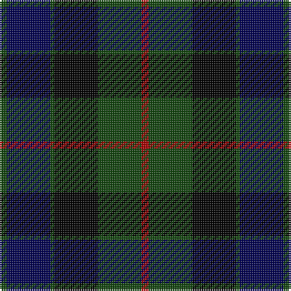

In pattern [GBGKGR](/patterns/gbgkgr/).

This was sourced from weddslist.  It is a [6 stripes tartan](/stripes/stripes6/).

Original link http://www.weddslist.com/cgi-bin/tartans/pg.pl?source=tinsel

## Attestations

This cloth appears in 2 source records; the oldest owns this page.

- undated — Gunn (weddslist, [record](http://www.weddslist.com/cgi-bin/tartans/pg.pl?source=tinsel))
- undated — Gunn (weddslist, [record](http://www.weddslist.com/cgi-bin/tartans/pg.pl?source=x))

## Thread count
DG/4 DB24 DG2 K24 DG24 DR/4

## Palette
Each colour and its ΔE from the base-6 reference it is a variant of.

| Colour | Shade | Base | ΔE (OKLab) |
|---|---|---|---|
| DB | <code style="background-color:#000052;">#000052</code> `#000052` | B <code style="background-color:#2C4084;">#2C4084</code> | 0.20 |
| DG | <code style="background-color:#11450D;">#11450D</code> `#11450D` | G <code style="background-color:#006400;">#006400</code> | 0.10 |
| DR | <code style="background-color:#AA0000;">#AA0000</code> `#AA0000` | R <code style="background-color:#C80000;">#C80000</code> | 0.06 |
| K | <code style="background-color:#000000;">#000000</code> `#000000` | K <code style="background-color:#000000;">#000000</code> | 0.00 |

# Sample pattern

## Nearest tartans

The nearest existing variants by ΔTartan distance.

1. [Ferguson of Balquhidder](/setts/s6/g4b24r2k24g24k4-b000052-g11450d-k000000-raa0000/) — ΔT 0.31
1. [Ferguson of Balquhidder](/setts/s6/g2b12r1k12g12k2-b000052-g11450d-k000000-raa0000/) — ΔT 0.31
1. [Ferguson of Balquhidder](/setts/s6/g2b12r1k12g12k2-b00004c-g004c00-k000000-rc80000/) — ΔT 0.35
1. [Gunn](/setts/s6/g4b24g2k24g24r4-b000064-g004c00-k000000-rc80000/) — ΔT 0.49
1. [Graham of Menteith](/setts/s6/g32b4g2k24ba24k2-b4367ae-ba000052-g11450d-k000000/) — ΔT 0.60
1. [Coarse Kilt](/setts/s7/r6k4b50k56g50k4r6-b000048-g044028-k000000-rc80000/) — ΔT 0.83
1. [National Galleries of Scotland](/setts/s7/k14g44k44b12r4b30r4-b1c0070-g006818-k101010-rc80000/) — ΔT 0.88
1. [Gunn](/setts/s6/g4b24g2k24g24r4-b1c0070-g006400-k101010-rc80000/) — ΔT 0.91
1. [Morrison](/setts/s6/k6g28k28g4b28r6-b000052-g11450d-k000000-raa0000/) — ΔT 0.91
1. [Morrison](/setts/s6/k3g14k14g2b14r3-b000052-g11450d-k000000-raa0000/) — ΔT 0.91

## Neighbour map

Every grey dot is one of 15726 variants placed by the first two principal components of the ΔTartan feature space (44% of its variance). Red is this tartan; blue dots are its nearest — click one to open its page.

<svg viewBox="0 0 640 380" role="img" style="max-width:100%;height:auto;border:1px solid #e0e0e0;border-radius:4px;display:block" xmlns="http://www.w3.org/2000/svg"><image href="/nn/cloud.v1.png" width="640" height="380"/><a href="/setts/s6/g4b24r2k24g24k4-b000052-g11450d-k000000-raa0000/"><circle cx="214.2" cy="234.1" r="4" fill="#3465a4"><title>Ferguson of Balquhidder</title></circle></a><a href="/setts/s6/g2b12r1k12g12k2-b000052-g11450d-k000000-raa0000/"><circle cx="214.2" cy="234.1" r="4" fill="#3465a4"><title>Ferguson of Balquhidder</title></circle></a><a href="/setts/s6/g2b12r1k12g12k2-b00004c-g004c00-k000000-rc80000/"><circle cx="205.4" cy="230.6" r="4" fill="#3465a4"><title>Ferguson of Balquhidder</title></circle></a><a href="/setts/s6/g4b24g2k24g24r4-b000064-g004c00-k000000-rc80000/"><circle cx="199.4" cy="224.6" r="4" fill="#3465a4"><title>Gunn</title></circle></a><a href="/setts/s6/g32b4g2k24ba24k2-b4367ae-ba000052-g11450d-k000000/"><circle cx="238.2" cy="214.8" r="4" fill="#3465a4"><title>Graham of Menteith</title></circle></a><a href="/setts/s7/r6k4b50k56g50k4r6-b000048-g044028-k000000-rc80000/"><circle cx="226.0" cy="203.5" r="4" fill="#3465a4"><title>Coarse Kilt</title></circle></a><a href="/setts/s7/k14g44k44b12r4b30r4-b1c0070-g006818-k101010-rc80000/"><circle cx="214.5" cy="224.8" r="4" fill="#3465a4"><title>National Galleries of Scotland</title></circle></a><a href="/setts/s6/g4b24g2k24g24r4-b1c0070-g006400-k101010-rc80000/"><circle cx="212.6" cy="226.2" r="4" fill="#3465a4"><title>Gunn</title></circle></a><a href="/setts/s6/k6g28k28g4b28r6-b000052-g11450d-k000000-raa0000/"><circle cx="174.4" cy="255.5" r="4" fill="#3465a4"><title>Morrison</title></circle></a><a href="/setts/s6/k3g14k14g2b14r3-b000052-g11450d-k000000-raa0000/"><circle cx="174.4" cy="255.5" r="4" fill="#3465a4"><title>Morrison</title></circle></a><circle cx="213.7" cy="230.7" r="5" fill="#c00000"/></svg>

ID: /setts/s6/g4b24g2k24g24r4-b000052-g11450d-k000000-raa0000/
