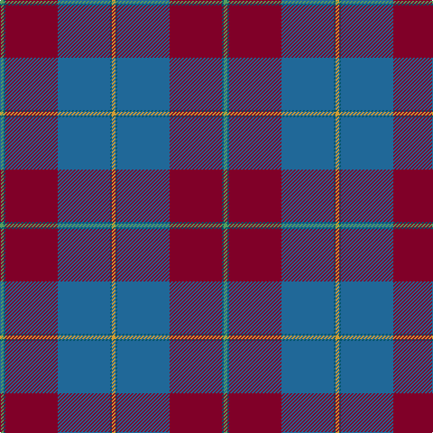

In pattern [GBRBBY](/patterns/gbrbby/).

This was sourced from register-of-tartans.  It is a [6 stripes tartan](/stripes/stripes6/).

Original link https://www.tartanregister.gov.uk/tartanDetails.aspx?ref=3471

## Attestations

This cloth appears in 2 source records; the oldest owns this page.

- 01/01/2005 — Reagan (register-of-tartans, [record](https://www.tartanregister.gov.uk/tartanDetails.aspx?ref=3471))
- 2005 Jan — Reagan (Clan?) (tartans-authority, [record](http://www.tartansauthority.com/tartan-ferret/display/6427/))

## Thread count
LG/4 DB2 DR58 B58 DB2 O/4

## Palette
Each colour and its ΔE from the base-6 reference it is a variant of.

| Colour | Shade | Base | ΔE (OKLab) |
|---|---|---|---|
| B | <code style="background-color:#206898;">#206898</code> `#206898` | B <code style="background-color:#2C4084;">#2C4084</code> | 0.11 |
| DB | <code style="background-color:#00546C;">#00546C</code> `#00546C` | B <code style="background-color:#2C4084;">#2C4084</code> | 0.08 |
| DR | <code style="background-color:#800028;">#800028</code> `#800028` | R <code style="background-color:#C80000;">#C80000</code> | 0.16 |
| LG | <code style="background-color:#589C5C;">#589C5C</code> `#589C5C` | G <code style="background-color:#006400;">#006400</code> | 0.20 |
| O | <code style="background-color:#D09C34;">#D09C34</code> `#D09C34` | Y <code style="background-color:#E8C000;">#E8C000</code> | 0.11 |

# Sample pattern

## Nearest tartans

The nearest existing variants by ΔTartan distance.

1. [Reagan Clan Tartan Tartan Number: 6427. Earliest known date: 2004 Clan na Ua Riagain Debby Reagan, Secretary, 11 Bennett St., Sanford, ME 04073 U.S.A. See products available Copyright © Blair Urquhart, Comrie, 2015](/setts/s10/g4b2r58ba58b2y4b2ba58r58b2-b00546c-ba206898-g008c94-r800028-yd09c34/) — ΔT 1.16
1. [Highland Prince (Fashion)](/setts/s7/r64ra4g4b60r2b4y2-b202060-g006818-r880000-rac80000-yfccc00/) — ΔT 1.23
1. [Murdoch](/setts/s6/k8r4b68r68ba4y8-b304080-ba102040-k000000-r802040-yf0c000/) — ΔT 1.24
1. [Scotland 2000](/setts/s8/r10y4r70g12r4g12b76w8-b304080-g008000-r802040-we0e0e0-yf0c000/) — ΔT 1.25
1. [Murdoch (Geoffrey)](/setts/s6/k8b4ba68b68bb4y8-b680028-ba003c64-bb202060-k101010-ye8c000/) — ΔT 1.28
1. [British Judo Association](/setts/s6/r56ra2b36y4g12b36-b1870a4-g608c28-r780028-rac80000-ye8c000/) — ΔT 1.42
1. [Deeside, Royal](/setts/s6/w8g4b8g70ba54r6-b280032-ba07648c-g503c14-rdc0000-wc49cd8/) — ΔT 1.43
1. [Heather Mead (Personal)](/setts/s8/r26g32ga8b8ga8b68y2b2-b440044-g003820-ga005020-r9c68a4-ya08858/) — ΔT 1.44
1. [U.S. Merchant Marine Academy (Corpo](/setts/s7/r74y4ra12y4r16b98r6-b2c2c80-r888888-ra901c38-ybc8c00/) — ΔT 1.48
1. [21st Century (Fashion)](/setts/s8/w8b76g12r4g12r76y4r6-b003c64-g006818-r880000-we0e0e0-ybc8c00/) — ΔT 1.52

## Neighbour map

Every grey dot is one of 15726 variants placed by the first two principal components of the ΔTartan feature space (44% of its variance). Red is this tartan; blue dots are its nearest — click one to open its page.

<svg viewBox="0 0 640 380" role="img" style="max-width:100%;height:auto;border:1px solid #e0e0e0;border-radius:4px;display:block" xmlns="http://www.w3.org/2000/svg"><image href="/nn/cloud.v1.png" width="640" height="380"/><a href="/setts/s10/g4b2r58ba58b2y4b2ba58r58b2-b00546c-ba206898-g008c94-r800028-yd09c34/"><circle cx="364.5" cy="138.2" r="4" fill="#3465a4"><title>Reagan Clan Tartan Tartan Number: 6427. Earliest known date: 2004 Clan na Ua Riagain Debby Reagan, Secretary, 11 Bennett St., Sanford, ME 04073 U.S.A. See products available Copyright © Blair Urquhart, Comrie, 2015</title></circle></a><a href="/setts/s7/r64ra4g4b60r2b4y2-b202060-g006818-r880000-rac80000-yfccc00/"><circle cx="383.8" cy="131.5" r="4" fill="#3465a4"><title>Highland Prince (Fashion)</title></circle></a><a href="/setts/s6/k8r4b68r68ba4y8-b304080-ba102040-k000000-r802040-yf0c000/"><circle cx="311.2" cy="168.0" r="4" fill="#3465a4"><title>Murdoch</title></circle></a><a href="/setts/s8/r10y4r70g12r4g12b76w8-b304080-g008000-r802040-we0e0e0-yf0c000/"><circle cx="283.5" cy="144.6" r="4" fill="#3465a4"><title>Scotland 2000</title></circle></a><a href="/setts/s6/k8b4ba68b68bb4y8-b680028-ba003c64-bb202060-k101010-ye8c000/"><circle cx="324.3" cy="178.1" r="4" fill="#3465a4"><title>Murdoch (Geoffrey)</title></circle></a><a href="/setts/s6/r56ra2b36y4g12b36-b1870a4-g608c28-r780028-rac80000-ye8c000/"><circle cx="315.9" cy="169.0" r="4" fill="#3465a4"><title>British Judo Association</title></circle></a><a href="/setts/s6/w8g4b8g70ba54r6-b280032-ba07648c-g503c14-rdc0000-wc49cd8/"><circle cx="334.3" cy="182.3" r="4" fill="#3465a4"><title>Deeside, Royal</title></circle></a><a href="/setts/s8/r26g32ga8b8ga8b68y2b2-b440044-g003820-ga005020-r9c68a4-ya08858/"><circle cx="338.2" cy="137.7" r="4" fill="#3465a4"><title>Heather Mead (Personal)</title></circle></a><a href="/setts/s7/r74y4ra12y4r16b98r6-b2c2c80-r888888-ra901c38-ybc8c00/"><circle cx="342.8" cy="157.9" r="4" fill="#3465a4"><title>U.S. Merchant Marine Academy (Corpo</title></circle></a><a href="/setts/s8/w8b76g12r4g12r76y4r6-b003c64-g006818-r880000-we0e0e0-ybc8c00/"><circle cx="288.0" cy="141.8" r="4" fill="#3465a4"><title>21st Century (Fashion)</title></circle></a><circle cx="358.9" cy="147.1" r="5" fill="#c00000"/></svg>

ID: /setts/s6/g4b2r58ba58b2y4-b00546c-ba206898-g589c5c-r800028-yd09c34/
