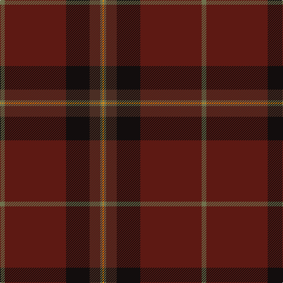

In pattern [GBKBGY](/patterns/gbkbgy/).

This was sourced from register-of-tartans.  It is a [6 stripes tartan](/stripes/stripes6/).

Original link https://www.tartanregister.gov.uk/tartanDetails.aspx?ref=10719

## Attestations

This cloth appears in 2 source records; the oldest owns this page.

- 01/09/2012 — Jack, John (Fife) (Personal) (register-of-tartans, [record](https://www.tartanregister.gov.uk/tartanDetails.aspx?ref=10719))
- undated — Jack, John (Fife) Name Tartan Tartan Number: 10719. Earliest known date: 22 October 2012 Designed for members of Mr Jack's extended family who bear the surname Jack, to use at family gatherings. See products available Copyright © Blair Urquhart, Comrie, 2015 (house-of-tartan, [record](http://www.house-of-tartan.scotland.net/house/TartanViewjs.asp?colr=Def&tnam=10719))

## Register references

External register numbers recorded for this tartan.

- Scottish Register of Tartans: [10719](https://www.tartanregister.gov.uk/tartanDetails.aspx?ref=10719)

## Thread count
G/8 DR104 K40 T18 G4 O/2

## Palette
Each colour and its ΔE from the base-6 reference it is a variant of.

| Colour | Shade | Base | ΔE (OKLab) |
|---|---|---|---|
| DR | <code style="background-color:#5D1913;">#5D1913</code> `#5D1913` | B <code style="background-color:#2A418A;">#2A418A</code> | 0.21 |
| G | <code style="background-color:#70714D;">#70714D</code> `#70714D` | G <code style="background-color:#006100;">#006100</code> | 0.15 |
| K | <code style="background-color:#120D0D;">#120D0D</code> `#120D0D` | K <code style="background-color:#000000;">#000000</code> | 0.17 |
| O | <code style="background-color:#EF8F06;">#EF8F06</code> `#EF8F06` | Y <code style="background-color:#F2BF00;">#F2BF00</code> | 0.12 |
| T | <code style="background-color:#4B2E24;">#4B2E24</code> `#4B2E24` | B <code style="background-color:#2A418A;">#2A418A</code> | 0.17 |

# Sample pattern

## Nearest tartans

The nearest existing variants by ΔTartan distance.

1. [Isaia](/setts/s7/r80b8r4k4g4k45ba8~b430506-ba42333a-g6c6964-k2f0200-r76333a/) — ΔT 1.55
1. [Mead (Tennessee) Hunting (Personal)](/setts/s10/g36k3r6k3b10r5b3y4k1g2~b4b2e24-g4e3d20-k120a01-ra5422f-yc5831b~x2/) — ΔT 1.77
1. [Llewellen of Wales](/setts/s9/b74k4b7k4b9k40w2k4r2~b541020-k101010-r888888-we0e0e0/) — ΔT 1.79
1. [McBrayer Htg (Personal)](/setts/s8/r50k1ra14w1g14ra14w1ra2~g285800-k101010-r98481c-ra880000-wc0c0c0~x4/) — ΔT 1.87
1. [MacWilliam Htg](/setts/s7/g2ga32ga12k10r1b16r2~b2c2c80-g285800-ga604000-k101010-rc80000~x2/) — ΔT 1.97
1. [MacByrd (Personal)](/setts/s8/g50k1r12w1ga12r14w1r2~g8c7038-ga5c6428-k101010-r880000-wc0c0c0~x4/) — ΔT 2.04
1. [Jack (Personal)](/setts/s6/g4r52k20ga9g2y1~g408060-ga604000-k101010-r880000-ybc8c00~x2/) — ΔT 2.05
1. [Ata?, H.M. & I.C. (Personal)](/setts/s8/k9g5w1g15ka2g1ka44r1~g003820-k00002c-ka101010-rc80000-we0e0e0~x2/) — ΔT 2.10
1. [Bell, John](/setts/s10/b7r4b4r25ba1g32ba4g2w2g5~b401000-ba800080-g505020-r802040-we0e0e0~x2/) — ΔT 2.11
1. [Potts (Personal)](/setts/s6/g1b36ba28b3g3k1~b202060-ba441800-g74846c-k000000~x2/) — ΔT 2.13

## Neighbour map

Every grey dot is one of 15726 variants placed by the first two principal components of the ΔTartan feature space (44% of its variance). Red is this tartan; blue dots are its nearest — click one to open its page.

<svg viewBox="0 0 640 380" role="img" style="max-width:100%;height:auto;border:1px solid #e0e0e0;border-radius:4px;display:block" xmlns="http://www.w3.org/2000/svg"><image href="/nn/cloud.v1.png" width="640" height="380"/><a href="/setts/s7/r80b8r4k4g4k45ba8~b430506-ba42333a-g6c6964-k2f0200-r76333a/"><circle cx="445.0" cy="179.1" r="4" fill="#3465a4"><title>Isaia</title></circle></a><a href="/setts/s10/g36k3r6k3b10r5b3y4k1g2~b4b2e24-g4e3d20-k120a01-ra5422f-yc5831b~x2/"><circle cx="412.8" cy="134.3" r="4" fill="#3465a4"><title>Mead (Tennessee) Hunting (Personal)</title></circle></a><a href="/setts/s9/b74k4b7k4b9k40w2k4r2~b541020-k101010-r888888-we0e0e0/"><circle cx="534.1" cy="159.1" r="4" fill="#3465a4"><title>Llewellen of Wales</title></circle></a><a href="/setts/s8/r50k1ra14w1g14ra14w1ra2~g285800-k101010-r98481c-ra880000-wc0c0c0~x4/"><circle cx="461.5" cy="134.7" r="4" fill="#3465a4"><title>McBrayer Htg (Personal)</title></circle></a><a href="/setts/s7/g2ga32ga12k10r1b16r2~b2c2c80-g285800-ga604000-k101010-rc80000~x2/"><circle cx="411.9" cy="171.4" r="4" fill="#3465a4"><title>MacWilliam Htg</title></circle></a><a href="/setts/s8/g50k1r12w1ga12r14w1r2~g8c7038-ga5c6428-k101010-r880000-wc0c0c0~x4/"><circle cx="451.4" cy="124.7" r="4" fill="#3465a4"><title>MacByrd (Personal)</title></circle></a><a href="/setts/s6/g4r52k20ga9g2y1~g408060-ga604000-k101010-r880000-ybc8c00~x2/"><circle cx="447.3" cy="132.6" r="4" fill="#3465a4"><title>Jack (Personal)</title></circle></a><a href="/setts/s8/k9g5w1g15ka2g1ka44r1~g003820-k00002c-ka101010-rc80000-we0e0e0~x2/"><circle cx="487.1" cy="156.1" r="4" fill="#3465a4"><title>Ata?, H.M. &amp; I.C. (Personal)</title></circle></a><a href="/setts/s10/b7r4b4r25ba1g32ba4g2w2g5~b401000-ba800080-g505020-r802040-we0e0e0~x2/"><circle cx="363.6" cy="136.3" r="4" fill="#3465a4"><title>Bell, John</title></circle></a><a href="/setts/s6/g1b36ba28b3g3k1~b202060-ba441800-g74846c-k000000~x2/"><circle cx="471.4" cy="188.0" r="4" fill="#3465a4"><title>Potts (Personal)</title></circle></a><circle cx="491.6" cy="159.0" r="5" fill="#c00000"/></svg>

ID: /setts/s6/g4b52k20ba9g2y1~b5d1913-ba4b2e24-g70714d-k120d0d-yef8f06~x2/
