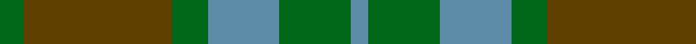
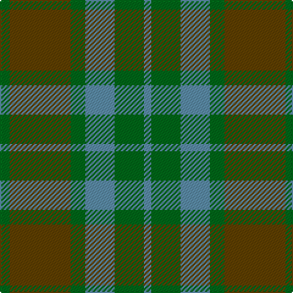

**Bands:** [GGGBGB](/stripes/gggbgb/) · **Stripes:** [G DY G T G T](/stripes/stripes6/) G DY G T G T

This was sourced from register-of-tartans.  It is a [6 band tartan](/bands/bands6/).

Original link https://www.tartanregister.gov.uk/tartanDetails.aspx?ref=547

## Attestations

This cloth appears in 2 source records; the oldest owns this page.

- 01/01/1970 — Canadian Fancy (register-of-tartans, [record](https://www.tartanregister.gov.uk/tartanDetails.aspx?ref=547))
- circa 1970 — Canadian Fancy (Fashion) (tartans-authority, [record](http://www.tartansauthority.com/tartan-ferret/display/124/))

## Register references

External register numbers recorded for this tartan.

- Scottish Register of Tartans: [547](https://www.tartanregister.gov.uk/tartanDetails.aspx?ref=547)
- Scottish Tartans Authority (ITI): 124
- Scottish Tartans World Register: 124

## Thread count
G/8 T50 G12 B24 G24 B/6

## Palette
Each colour and its ΔE from the base-6 reference it is a variant of.

| Colour | Shade | Base | ΔE (OKLab) |
|---|---|---|---|
| B | <code style="background-color:#5C8CA8;">#5C8CA8</code> `#5C8CA8` | B <code style="background-color:#2A418A;">#2A418A</code> | 0.23 |
| G | <code style="background-color:#006818;">#006818</code> `#006818` | G <code style="background-color:#006100;">#006100</code> | 0.02 |
| T | <code style="background-color:#604000;">#604000</code> `#604000` | G <code style="background-color:#006100;">#006100</code> | 0.14 |

# Sample pattern

## Nearest tartans

The nearest existing variants by ΔTartan distance.

1. [Canadian Fancy](/setts/s6/g4o25g6t12g12t3~x2/) — ΔT 0.88
1. [Dewar (WCWM)](/setts/s6/dt1dy1dt7dy5y7lr1~x4/) — ΔT 1.23
1. [Bright of Garth (Personal)](/setts/s5/g7dy6dt7dy1dt2~x6/) — ΔT 1.34
1. [Bright of Garth (Personal)](/setts/s5/g7y6n7y1n2~x6/) — ΔT 1.36
1. [Ancient Universal (Fashion?)](/setts/s8/y12dg2y2dg2y2dy8y8dy1~x2/) — ΔT 1.47
1. [Daks (Loden)](/setts/s8/db3dy7g2y2g14dy2g2db3~x2/) — ΔT 1.58
1. [Rob Roy (Film) (Corporate)](/setts/s6/t3dg1t10dg4dy10t2~x4/) — ΔT 1.61
1. [MacKinnon Hunting Clan Tartan Tartan Number: 917. Earliest known date: 1960 The modern hunting MacKinnon is based on the sett published in the Vestiarium Scoticum in 1842. The change is simply from red in the V.S. to brown in the modern version. The result was registered with Lord Lyon in 1960. See products available Copyright © Blair Urquhart, Comrie, 2015](/setts/s7/g1dy8g8r1g8dy8w1~x2/) — ΔT 1.65
1. [MacKinnon, hunting](/setts/s7/g1o8g8r1g8o8w1~x4/) — ΔT 1.65
1. [John Telfar Dunbar/Hunting Tartan Tartan Number: 776. Earliest known date: pre 2003 Check this entry... See products available Copyright © Blair Urquhart, Comrie, 2015](/setts/s7/g5k2g28k10dy26db4g4~x2/) — ΔT 1.66

## Neighbour map

Every grey dot is one of 14299 variants placed by the first two principal components of the ΔTartan feature space (44% of its variance). Red is this tartan; blue dots are its nearest — click one to open its page.

<svg viewBox="0 0 640 380" role="img" style="max-width:100%;height:auto;border:1px solid #e0e0e0;border-radius:4px;display:block" xmlns="http://www.w3.org/2000/svg"><image href="/nn/cloud.v1.png" width="640" height="380"/><a href="/setts/s6/g4o25g6t12g12t3~x2/"><circle cx="315.3" cy="294.4" r="4" fill="#3465a4"><title>Canadian Fancy</title></circle></a><a href="/setts/s6/dt1dy1dt7dy5y7lr1~x4/"><circle cx="256.2" cy="272.5" r="4" fill="#3465a4"><title>Dewar (WCWM)</title></circle></a><a href="/setts/s5/g7dy6dt7dy1dt2~x6/"><circle cx="292.3" cy="332.0" r="4" fill="#3465a4"><title>Bright of Garth (Personal)</title></circle></a><a href="/setts/s5/g7y6n7y1n2~x6/"><circle cx="301.9" cy="334.8" r="4" fill="#3465a4"><title>Bright of Garth (Personal)</title></circle></a><a href="/setts/s8/y12dg2y2dg2y2dy8y8dy1~x2/"><circle cx="283.5" cy="227.2" r="4" fill="#3465a4"><title>Ancient Universal (Fashion?)</title></circle></a><a href="/setts/s8/db3dy7g2y2g14dy2g2db3~x2/"><circle cx="329.4" cy="256.1" r="4" fill="#3465a4"><title>Daks (Loden)</title></circle></a><a href="/setts/s6/t3dg1t10dg4dy10t2~x4/"><circle cx="334.4" cy="265.5" r="4" fill="#3465a4"><title>Rob Roy (Film) (Corporate)</title></circle></a><a href="/setts/s7/g1dy8g8r1g8dy8w1~x2/"><circle cx="353.1" cy="281.6" r="4" fill="#3465a4"><title>MacKinnon Hunting Clan Tartan Tartan Number: 917. Earliest known date: 1960 The modern hunting MacKinnon is based on the sett published in the Vestiarium Scoticum in 1842. The change is simply from red in the V.S. to brown in the modern version. The result was registered with Lord Lyon in 1960. See products available Copyright © Blair Urquhart, Comrie, 2015</title></circle></a><a href="/setts/s7/g1o8g8r1g8o8w1~x4/"><circle cx="335.1" cy="268.0" r="4" fill="#3465a4"><title>MacKinnon, hunting</title></circle></a><a href="/setts/s7/g5k2g28k10dy26db4g4~x2/"><circle cx="333.4" cy="234.2" r="4" fill="#3465a4"><title>John Telfar Dunbar/Hunting Tartan Tartan Number: 776. Earliest known date: pre 2003 Check this entry... See products available Copyright © Blair Urquhart, Comrie, 2015</title></circle></a><circle cx="302.3" cy="289.1" r="5" fill="#c00000"/></svg>

ID: /setts/s6/g4dy25g6t12g12t3~x2/
