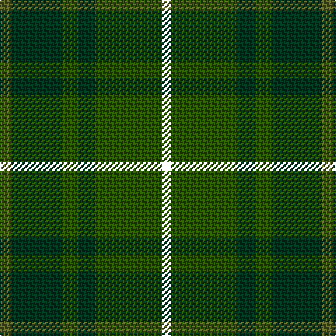

In pattern [GGGGGK](/patterns/gggggk/).

This was sourced from register-of-tartans.  It is a [6 stripes tartan](/stripes/stripes6/).

Original link https://www.tartanregister.gov.uk/tartanDetails.aspx?ref=3291

## Register references

External register numbers recorded for this tartan.

- Scottish Register of Tartans: [3291](https://www.tartanregister.gov.uk/tartanDetails.aspx?ref=3291)
- Scottish Tartans Authority (ITI): 5519

## Thread count
Ga/8 DG36 G12 DG12 G48 YY/6

## Palette
Each colour and its ΔE from the base-6 reference it is a variant of.

| Colour | Shade | Base | ΔE (OKLab) |
|---|---|---|---|
| DG | <code style="background-color:#003820;">#003820</code> `#003820` | G <code style="background-color:#006100;">#006100</code> | 0.15 |
| G | <code style="background-color:#285800;">#285800</code> `#285800` | G <code style="background-color:#006100;">#006100</code> | 0.03 |
| Ga | <code style="background-color:#5C6428;">#5C6428</code> `#5C6428` | G <code style="background-color:#006100;">#006100</code> | 0.10 |

# Sample pattern

## Nearest tartans

The nearest existing variants by ΔTartan distance.

1. [Park (Estate Check)](/setts/s6/g4ga18gb6ga6gb24y3~g5c6428-ga003820-gb285800-yb8a040~x2/) — ΔT 0.45
1. [MacKinnon Hunting](/setts/s7/g1ga8g8r1g8ga8w1~g005020-ga503c14-rdc0000-we0e0e0~x2/) — ΔT 1.11
1. [John Telfar Dunbar Hunting](/setts/s7/g5k2g28k10ga26b4g4~b2c4084-g005020-ga503c14-k101010~x2/) — ΔT 1.48
1. [MacKinnon Hunting Clan Tartan Tartan Number: 917. Earliest known date: 1960 The modern hunting MacKinnon is based on the sett published in the Vestiarium Scoticum in 1842. The change is simply from red in the V.S. to brown in the modern version. The result was registered with Lord Lyon in 1960. See products available Copyright © Blair Urquhart, Comrie, 2015](/setts/s7/g1ga8g8r1g8ga8w1~g006818-ga604000-rc80000-we0e0e0~x2/) — ΔT 1.56
1. [Armagh, County](/setts/s9/g4y2g17ga2r4ga2g3ga11g2~g005448-ga003820-r880000-yc4bc68~x2/) — ΔT 1.58
1. [Calais (Fashion)](/setts/s7/g11b4g6ga11b1k1ga4~b306084-g085454-ga604000-k000000~x4/) — ΔT 1.75
1. [Daks (Loden)](/setts/s8/b3g7ga2gb2ga14g2ga2b3~b2c2c80-g604000-ga006818-gb808080~x2/) — ΔT 1.84
1. [Dunbar Hunting](/setts/s6/g4k2g28k8ga21g3~g006818-ga003820-k101010~x2/) — ΔT 1.85
1. [Galloway District Tartan Tartan Number: 1469. Earliest known date: 1950 In contemporary correspondence Mr Hannay said that the Galloway 'everyday' tartan was 'in four shades of green with yellow and red stripe'. Cree Mills of Newton-Stewart, however, used only two shades in the manufacture on Mr Hannay's behalf. MacGregor Hastie's collection includes this sett with the pale yellow rendered in white and called Galloway Hunting. See products available Copyright © Blair Urquhart, Comrie, 2015](/setts/s11/g20ga2y3ga2g32ga32g2r3g2ga32g12~g003820-ga285800-rc80000-yc4bc68~x2/) — ΔT 1.88
1. [Scottish Pup](/setts/s8/g8b2g13ba4g12bb22g5y3~b412719-ba373875-bb486373-g1e492b-yd9c341~x2/) — ΔT 1.95

## Neighbour map

Every grey dot is one of 15726 variants placed by the first two principal components of the ΔTartan feature space (44% of its variance). Red is this tartan; blue dots are its nearest — click one to open its page.

<svg viewBox="0 0 640 380" role="img" style="max-width:100%;height:auto;border:1px solid #e0e0e0;border-radius:4px;display:block" xmlns="http://www.w3.org/2000/svg"><image href="/nn/cloud.v1.png" width="640" height="380"/><a href="/setts/s6/g4ga18gb6ga6gb24y3~g5c6428-ga003820-gb285800-yb8a040~x2/"><circle cx="376.0" cy="287.4" r="4" fill="#3465a4"><title>Park (Estate Check)</title></circle></a><a href="/setts/s7/g1ga8g8r1g8ga8w1~g005020-ga503c14-rdc0000-we0e0e0~x2/"><circle cx="370.5" cy="282.1" r="4" fill="#3465a4"><title>MacKinnon Hunting</title></circle></a><a href="/setts/s7/g5k2g28k10ga26b4g4~b2c4084-g005020-ga503c14-k101010~x2/"><circle cx="390.9" cy="251.5" r="4" fill="#3465a4"><title>John Telfar Dunbar Hunting</title></circle></a><a href="/setts/s7/g1ga8g8r1g8ga8w1~g006818-ga604000-rc80000-we0e0e0~x2/"><circle cx="352.2" cy="270.9" r="4" fill="#3465a4"><title>MacKinnon Hunting Clan Tartan Tartan Number: 917. Earliest known date: 1960 The modern hunting MacKinnon is based on the sett published in the Vestiarium Scoticum in 1842. The change is simply from red in the V.S. to brown in the modern version. The result was registered with Lord Lyon in 1960. See products available Copyright © Blair Urquhart, Comrie, 2015</title></circle></a><a href="/setts/s9/g4y2g17ga2r4ga2g3ga11g2~g005448-ga003820-r880000-yc4bc68~x2/"><circle cx="384.3" cy="243.3" r="4" fill="#3465a4"><title>Armagh, County</title></circle></a><a href="/setts/s7/g11b4g6ga11b1k1ga4~b306084-g085454-ga604000-k000000~x4/"><circle cx="368.7" cy="274.8" r="4" fill="#3465a4"><title>Calais (Fashion)</title></circle></a><a href="/setts/s8/b3g7ga2gb2ga14g2ga2b3~b2c2c80-g604000-ga006818-gb808080~x2/"><circle cx="327.7" cy="245.4" r="4" fill="#3465a4"><title>Daks (Loden)</title></circle></a><a href="/setts/s6/g4k2g28k8ga21g3~g006818-ga003820-k101010~x2/"><circle cx="400.0" cy="260.1" r="4" fill="#3465a4"><title>Dunbar Hunting</title></circle></a><a href="/setts/s11/g20ga2y3ga2g32ga32g2r3g2ga32g12~g003820-ga285800-rc80000-yc4bc68~x2/"><circle cx="426.6" cy="224.4" r="4" fill="#3465a4"><title>Galloway District Tartan Tartan Number: 1469. Earliest known date: 1950 In contemporary correspondence Mr Hannay said that the Galloway 'everyday' tartan was 'in four shades of green with yellow and red stripe'. Cree Mills of Newton-Stewart, however, used only two shades in the manufacture on Mr Hannay's behalf. MacGregor Hastie's collection includes this sett with the pale yellow rendered in white and called Galloway Hunting. See products available Copyright © Blair Urquhart, Comrie, 2015</title></circle></a><a href="/setts/s8/g8b2g13ba4g12bb22g5y3~b412719-ba373875-bb486373-g1e492b-yd9c341~x2/"><circle cx="356.7" cy="237.4" r="4" fill="#3465a4"><title>Scottish Pup</title></circle></a><circle cx="368.4" cy="286.0" r="5" fill="#c00000"/></svg>

ID: /setts/s6/g4ga18gb6ga6gb24k3~g5c6428-ga003820-gb285800-k000000~x2/
