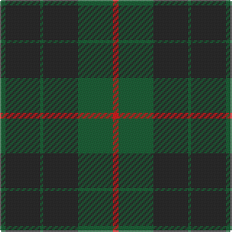

In pattern [GKGKGR](/patterns/gkgkgr/).

This was sourced from register-of-tartans.  It is a [6 stripes tartan](/stripes/stripes6/).

Original link https://www.tartanregister.gov.uk/tartanDetails.aspx?ref=1561

## Thread count
G/4 K24 G2 K24 G24 R/4

## Palette
Each colour and its ΔE from the base-6 reference it is a variant of.

| Colour | Shade | Base | ΔE (OKLab) |
|---|---|---|---|
| G | <code style="background-color:#005020;">#005020</code> `#005020` | G <code style="background-color:#006100;">#006100</code> | 0.07 |
| K | <code style="background-color:#101010;">#101010</code> `#101010` | K <code style="background-color:#000000;">#000000</code> | 0.17 |
| R | <code style="background-color:#DC0000;">#DC0000</code> `#DC0000` | R <code style="background-color:#CC0000;">#CC0000</code> | 0.03 |

# Sample pattern

## Nearest tartans

The nearest existing variants by ΔTartan distance.

1. [Campbell of Lochawe Clan Tartan Tartan Number: 1038. Earliest known date: pre 2003 MacKinlay strip. Sample in STS collection. See products available Copyright © Blair Urquhart, Comrie, 2015](/setts/s5/k4b22k52g22k4-b2c2c80-g006818-k101010/) — ΔT 1.08
1. [Menez Du](/setts/s9/b10k18g14k6g14k6g14k50g6-b202060-g006818-k101010/) — ΔT 1.20
1. [Black Watch (variation)](/setts/s6/k10g46k36b42k66b6-b202060-g006818-k101010/) — ΔT 1.27
1. [London Community Gospel Choir, The](/setts/s7/k50y10k10g50k50b6k20-b2c4084-g003c14-k101010-yc89600/) — ΔT 1.36
1. [Forbes #6](/setts/s6/r2g32k16g8k8y2-g005020-k101010-rdc0000-ye8c000/) — ΔT 1.42
1. [Green Highland, The (Fashion)](/setts/s6/b8g60ba12b28g28b8-b000088-ba381c0c-g004800/) — ΔT 1.42
1. [Perthshire Tourist Board](/setts/s6/k52r12g32k16g6r4-g003c00-k20001c-r880000/) — ΔT 1.45
1. [MacHardy (Clan)](/setts/s8/b12r6g52b52w4b54r10g10-b14283c-g006428-rc80000-we0e0e0/) — ΔT 1.51
1. [MacArthur-Fox Family Tartan Tartan Number: 1088. Earliest known date: 1986 This is the older of the two MacArthur setts, which links the clan with the Campbells. See products available Copyright © Blair Urquhart, Comrie, 2015](/setts/s5/k19g8k10g31r3-g006818-k101010-rc80000/) — ΔT 1.54
1. [Grey Spirit (Fashion)](/setts/s6/b12k34b12k34b90k8-b5c5c5c-k101010/) — ΔT 1.57

## Neighbour map

Every grey dot is one of 15726 variants placed by the first two principal components of the ΔTartan feature space (44% of its variance). Red is this tartan; blue dots are its nearest — click one to open its page.

<svg viewBox="0 0 640 380" role="img" style="max-width:100%;height:auto;border:1px solid #e0e0e0;border-radius:4px;display:block" xmlns="http://www.w3.org/2000/svg"><image href="/nn/cloud.v1.png" width="640" height="380"/><a href="/setts/s5/k4b22k52g22k4-b2c2c80-g006818-k101010/"><circle cx="383.0" cy="255.7" r="4" fill="#3465a4"><title>Campbell of Lochawe Clan Tartan Tartan Number: 1038. Earliest known date: pre 2003 MacKinlay strip. Sample in STS collection. See products available Copyright © Blair Urquhart, Comrie, 2015</title></circle></a><a href="/setts/s9/b10k18g14k6g14k6g14k50g6-b202060-g006818-k101010/"><circle cx="362.9" cy="246.0" r="4" fill="#3465a4"><title>Menez Du</title></circle></a><a href="/setts/s6/k10g46k36b42k66b6-b202060-g006818-k101010/"><circle cx="344.5" cy="282.4" r="4" fill="#3465a4"><title>Black Watch (variation)</title></circle></a><a href="/setts/s7/k50y10k10g50k50b6k20-b2c4084-g003c14-k101010-yc89600/"><circle cx="407.1" cy="266.8" r="4" fill="#3465a4"><title>London Community Gospel Choir, The</title></circle></a><a href="/setts/s6/r2g32k16g8k8y2-g005020-k101010-rdc0000-ye8c000/"><circle cx="386.2" cy="216.9" r="4" fill="#3465a4"><title>Forbes #6</title></circle></a><a href="/setts/s6/b8g60ba12b28g28b8-b000088-ba381c0c-g004800/"><circle cx="387.2" cy="283.6" r="4" fill="#3465a4"><title>Green Highland, The (Fashion)</title></circle></a><a href="/setts/s6/k52r12g32k16g6r4-g003c00-k20001c-r880000/"><circle cx="403.7" cy="254.9" r="4" fill="#3465a4"><title>Perthshire Tourist Board</title></circle></a><a href="/setts/s8/b12r6g52b52w4b54r10g10-b14283c-g006428-rc80000-we0e0e0/"><circle cx="362.8" cy="211.2" r="4" fill="#3465a4"><title>MacHardy (Clan)</title></circle></a><a href="/setts/s5/k19g8k10g31r3-g006818-k101010-rc80000/"><circle cx="346.1" cy="267.9" r="4" fill="#3465a4"><title>MacArthur-Fox Family Tartan Tartan Number: 1088. Earliest known date: 1986 This is the older of the two MacArthur setts, which links the clan with the Campbells. See products available Copyright © Blair Urquhart, Comrie, 2015</title></circle></a><a href="/setts/s6/b12k34b12k34b90k8-b5c5c5c-k101010/"><circle cx="433.2" cy="257.4" r="4" fill="#3465a4"><title>Grey Spirit (Fashion)</title></circle></a><circle cx="401.9" cy="263.2" r="5" fill="#c00000"/></svg>

ID: /setts/s6/g4k24g2k24g24r4-g005020-k101010-rdc0000/
