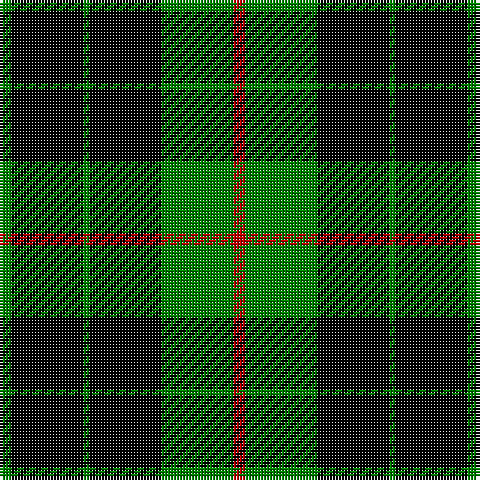

In pattern [GKGKGR](/patterns/gkgkgr/).

This was sourced from weddslist.  It is a [6 stripes tartan](/stripes/stripes6/).

Original link http://www.weddslist.com/cgi-bin/tartans/pg.pl?source=sts

## Thread count
G/4 K24 G2 K24 G24 R/4

## Palette
Each colour and its ΔE from the base-6 reference it is a variant of.

| Colour | Shade | Base | ΔE (OKLab) |
|---|---|---|---|
| G | <code style="background-color:#008000;">#008000</code> `#008000` | G <code style="background-color:#006100;">#006100</code> | 0.10 |
| K | <code style="background-color:#000000;">#000000</code> `#000000` | K <code style="background-color:#000000;">#000000</code> | 0.00 |
| R | <code style="background-color:#C00000;">#C00000</code> `#C00000` | R <code style="background-color:#CC0000;">#CC0000</code> | 0.03 |

# Sample pattern

## Nearest tartans

The nearest existing variants by ΔTartan distance.

1. [MacArthur](/setts/s5/k32g6k12g30y3-g004c00-k000000-yffff00/) — ΔT 0.74
1. [MacArthur](/setts/s5/k32g6k12g30y3-g008000-k000000-yf0c000/) — ΔT 0.83
1. [MacArthur](/setts/s5/k64g12k24g60y6-g11450d-k000000-yaaaa00/) — ΔT 1.14
1. [MacArthur](/setts/s5/k32g6k12g30y3-g11450d-k000000-yaaaa00/) — ΔT 1.14
1. [Wilson's, No 167](/setts/s6/k40b4k12g32ba8k18-b5480b0-ba800080-g008000-k000000/) — ΔT 1.14
1. [MacArthur-Fox](/setts/s5/k19g8k10g31r3-g008000-k000000-rc00000/) — ΔT 1.19
1. [MacAuley, hunting](/setts/s8/g12k32w2k32g16k8g24r4-g008000-k000000-rc00000-we0e0e0/) — ΔT 1.21
1. [Wallace Hunting](/setts/s6/g32k32y4k32g32k4-g006818-k000000-ydcbc00/) — ΔT 1.21
1. [Campbell of Lochawe](/setts/s5/k4b22k52g22k4-b304080-g008000-k000000/) — ΔT 1.25
1. [Douglas, (Black)](/setts/s5/k24b6g46k46r6-b304080-g008000-k000000-rc00000/) — ΔT 1.28

## Neighbour map

Every grey dot is one of 15726 variants placed by the first two principal components of the ΔTartan feature space (44% of its variance). Red is this tartan; blue dots are its nearest — click one to open its page.

<svg viewBox="0 0 640 380" role="img" style="max-width:100%;height:auto;border:1px solid #e0e0e0;border-radius:4px;display:block" xmlns="http://www.w3.org/2000/svg"><image href="/nn/cloud.v1.png" width="640" height="380"/><a href="/setts/s5/k32g6k12g30y3-g004c00-k000000-yffff00/"><circle cx="309.4" cy="253.3" r="4" fill="#3465a4"><title>MacArthur</title></circle></a><a href="/setts/s5/k32g6k12g30y3-g008000-k000000-yf0c000/"><circle cx="291.2" cy="245.2" r="4" fill="#3465a4"><title>MacArthur</title></circle></a><a href="/setts/s5/k64g12k24g60y6-g11450d-k000000-yaaaa00/"><circle cx="326.1" cy="259.7" r="4" fill="#3465a4"><title>MacArthur</title></circle></a><a href="/setts/s5/k32g6k12g30y3-g11450d-k000000-yaaaa00/"><circle cx="326.1" cy="259.7" r="4" fill="#3465a4"><title>MacArthur</title></circle></a><a href="/setts/s6/k40b4k12g32ba8k18-b5480b0-ba800080-g008000-k000000/"><circle cx="297.5" cy="231.7" r="4" fill="#3465a4"><title>Wilson's, No 167</title></circle></a><a href="/setts/s5/k19g8k10g31r3-g008000-k000000-rc00000/"><circle cx="293.5" cy="248.7" r="4" fill="#3465a4"><title>MacArthur-Fox</title></circle></a><a href="/setts/s8/g12k32w2k32g16k8g24r4-g008000-k000000-rc00000-we0e0e0/"><circle cx="284.2" cy="200.5" r="4" fill="#3465a4"><title>MacAuley, hunting</title></circle></a><a href="/setts/s6/g32k32y4k32g32k4-g006818-k000000-ydcbc00/"><circle cx="264.0" cy="267.6" r="4" fill="#3465a4"><title>Wallace Hunting</title></circle></a><a href="/setts/s5/k4b22k52g22k4-b304080-g008000-k000000/"><circle cx="321.1" cy="232.6" r="4" fill="#3465a4"><title>Campbell of Lochawe</title></circle></a><a href="/setts/s5/k24b6g46k46r6-b304080-g008000-k000000-rc00000/"><circle cx="257.3" cy="244.4" r="4" fill="#3465a4"><title>Douglas, (Black)</title></circle></a><circle cx="322.5" cy="233.2" r="5" fill="#c00000"/></svg>

ID: /setts/s6/g4k24g2k24g24r4-g008000-k000000-rc00000/
